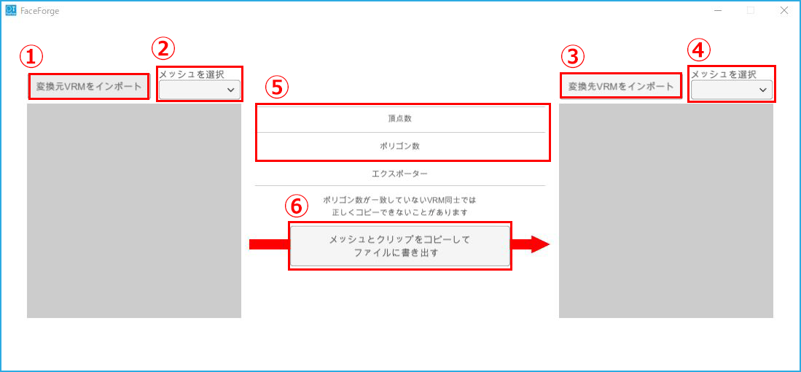

## FaceForge について

### 概要

>3tenePRO (+Live2D 含む) v2.0.8 以降に付属しています。

>このソフトウェアは元となる VRM からシェイプキーと表情クリップを
>一括でコピー先の VRM に追加する事を目的としています。

>VRM はコピー元とコピー先で２つ必要になります。
>コピー元とコピー先は互換性のあるモデルデータ(※後述)である必要があります。

### モデルに関する注意事項

>最悪の場合、VRM のファイルを壊してしまう可能性があるので
>出力でコピー元の VRM ファイルを上書きしないようにしてください。

### VRM の互換性

>基本的には VRoidStudio の同じバージョンで出力された VRM でしか
>表情のコピーは成功しません。

>異なるバージョンの VRoidStudio で出力された VRM でコピーを行うと
>コピーに失敗するか、成功しても表情が正常に動作しない VRM が出力されます。

>・VRoidStudio 0.11.2 モデル → VRoidStudio 0.11.2 モデル ： 正常に動作
>・VRoidStudio 0.11.3 モデル → VRoidStudio 0.11.3 モデル ： 正常に動作
>・VRoidStudio 0.11.2 モデル → VRoidStudio 0.11.3 モデル ： コピーは成功するが正常動作しない。
>・VRoidStudio 1.0.2 モデル → VRoidStudio 1.0.2 モデル ： 正常に動作
　※エクスポートの「ポリゴンの削減」の「透明メッシュを削除する」のチェック有無が異なると、
　コピーは成功しても正常動作しません。

>・Blender モデル → VRoidStudio 0.11.2 モデル ： コピーに失敗。
>・VRoidStudio 0.11.2 モデル → Blender モデル ： コピーに失敗。

### シェイプキーと表情クリップのコピー後のモデルについて

>著作権や配布可否は元の VRM に準じます。
>修正が許可されている VRM に対してこのツールを使ってください。

### 使い方

>

1. **コピー元VRMをインポート**

    画面左上の[変換元VRMをインポート]を押下し、コピー元のVRMファイルを選択します。

2. **コピー元のメッシュを選択する**

    画面左上のドロップダウン[メッシュを選択]から顔の頂点情報を持つメッシュを選択します。

    一般的に[Face]という名称になっている事が多いです。

3. **コピー先VRMをインポート**

    画面右上の[変換先VRMをインポート]を押下し、コピー先のVRMファイルを選択してください。

4. **コピー先のメッシュを選択する**

    画面右上のドロップダウン[メッシュを選択]から顔の頂点情報を持つメッシュを選択します。

    一般的に[Face]という名称になっている事が多いです。

5. **頂点数とポリゴン数が一致していることを確認する**

    画面中央の表示から頂点数とポリゴン数を確認してください。

    頂点数とポリゴン数が一致しているVRM同士であればコピーに成功する確率が高く、

    失敗した場合は顔の可動位置にズレが生じ正しく動作しないことがあります。

6. **メッシュとクリップをコピーしてファイルに書き出す**

    画面中央下の[メッシュとクリップをコピーしてファイルに書き出す]を押下し、

    ファイル保存ダイアログが表示されるので、変換後のVRMを保存するフォルダを選択してください。

    書き出しに成功すると画面中央に書き出しが完了した旨を示すテキストが表示されます。

