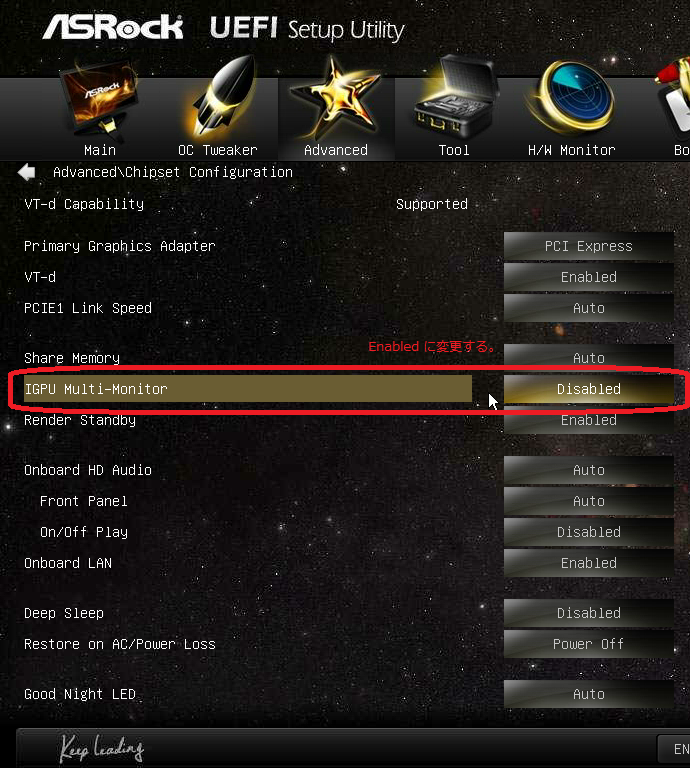
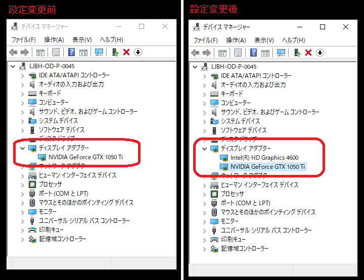
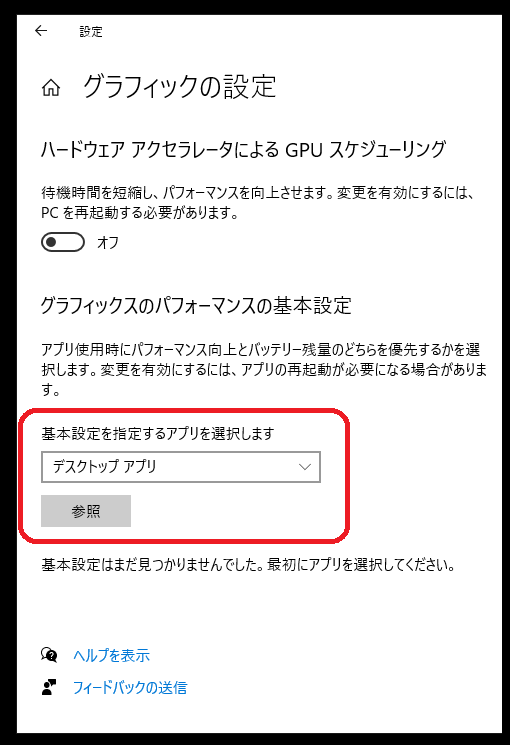
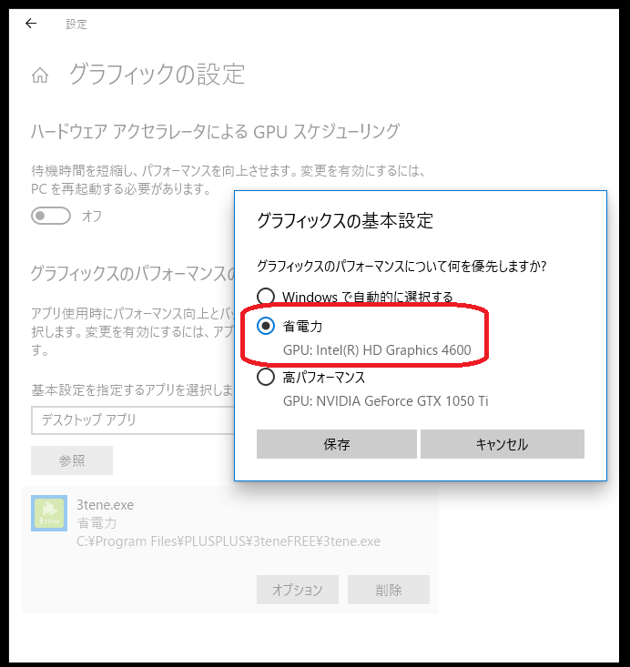
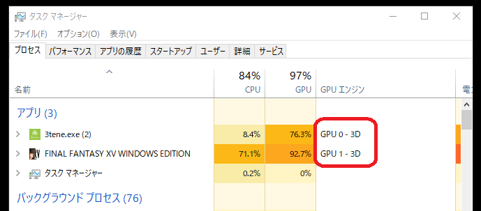
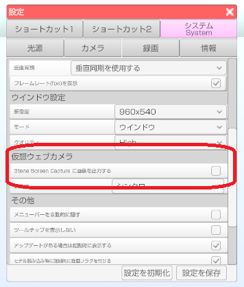

## ゲーム実況について

>Windows 環境で 3tene とゲーム等の別アプリを組み合わせて実況を行う場合の設定です。

>ゲームは処理負荷が高い物が多いのでグラフィックボード(GPU) が
>追加されているのを前提とします。

>※上級者レベルのＰＣ知識が必要となりますので注意してください。
>　設定の変更は自己責任でお願いします。

### 発生する問題

>Direct3D を使うアプリ（3teneやゲーム）を複数起動すると
>ウインドウがアクティブなアプリが優先して処理される為、
>リアルタイムのゲーム実況では 3tene のフレームレートが低下する場合が
>ほとんどだと思います。

>設定変更で 3tene のフレームレート低下を最低限に抑えます。

### GPU 設定の変更

>追加されたグラフィックボード(GPU) だけでなく、ＣＰＵに内蔵されたＧＰＵも使用します。

>ＣＰＵに内蔵されたＧＰＵ (iGPU) はグラフィックボードを追加すると
>無効になってしまうので UEFI (BIOS) で無効にならないように変更する必要があります。

>※メーカーやマザーボードによっては UEFI に該当する項目が無かったり
>　名称が異なっている場合があるのでしっかり確認してください。

>

>UEFI の設定が正しく行われるとデバイスマネージャーの
>「ディスプレイ アダプター」に両方の GPU が表示されます。

>

### アプリ設定

>Windows7 や古いバージョンの Windows 10 は対象外となります。

>※3tene を起動している場合は必ず終了してから行ってください。

>デスクトップを右クリックして「ディスプレイ設定」をクリック。
>下にスクロールして「グラフィックの設定」をクリック。

>「基本設定を指定するアプリを選択します」を「デスクトップ アプリ」に設定。
>「参照」をクリックしてインストールされた 3tene を選択します。

>

>追加された 3tene.exe の「オプション」を選択します。
>「省電力」を選択します。(iGPU を選択する。)
>※「高パフォーマンス」は追加したグラフィックボードになっているハズです。

>

>この状態で 3tene と組み合わせたいゲームを起動して
>3tene は GPU 0 → ＣＰＵに内蔵されたＧＰＵ (iGPU)
>ゲームは GPU 1 → グラフィックボード (GPU)
>となっているかをタスクマネージャーで確認します。

>

>スクウェア・エニックス様の
><a href="http://benchmark.finalfantasyxv.com/jp/" target="_blank">FINAL FANTASY XV BENCHMARK</a>
>を使用させて頂きました。

### OBS の設定

>処理する GPU を分けるとゲームキャプチャで
>両方の画面をキャプチャできなくなるようなので

>3tene → ウインドウキャプチャ
>ゲーム → ゲームキャプチャ

>のように設定を行います。

>3tene の映像キャプチャ（仮想ウェブカメラ）でも動作しますがフレームレートの落ちが激しいので
>「3tene Screen Caputure に映像を出力する」をオフにした後に
>PC (3tene だけではダメ) を再起動してから「ウインドウキャプチャ」にします。

>

>この状態だとゲームがアクティブなっていても 3tene のフレームレートは
>ほぼ下がらなくなります。
>※ただしＣＰＵに内蔵されたＧＰＵ (iGPU)の性能に依存します。

### FINAL FANTASY XV BENCHMARK の数値 (参考)

>ベンチマーク設定：軽量品質、1280x720、ウインドウ
>PC：Core i7-4770 + GeForce GTX 1050 Ti
>※BENCHMARK のウインドウをアクティブにして測定。

>BENCHMARK のみ実行 → 7550 快適
>BENCHMARK + 3teneFREE + OBS を実行 → 6817 快適 (3tene は 57～60 fps)

