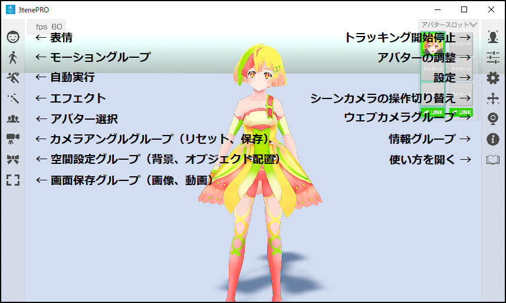
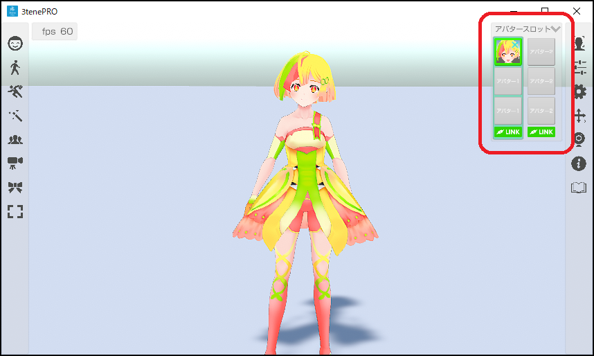
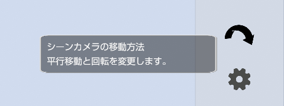

## メニューについて

### メニューアイコンの説明

>※3teneFREE では搭載されていない機能のアイコンは表示されません。

### アバタースロット

>複数人に対応している 3tene ではアバタースロットで指定した
>アバターが各種操作の対象になります。
>※3teneFREE は対応していません。

>アバターの調整はアバタースロットで指定されているアバターが対象となります。
>スロットでアバターを変更し、人数分の調整を行う必要があります。

>表情やモーションもアバタースロットで指定されているアバターが対象となります。

### ツールチップ

>アイコンの機能を忘れた時はカーソルを
>アイコンに合わせて数秒待ってみてください。
>簡易的な説明が表示されます。

