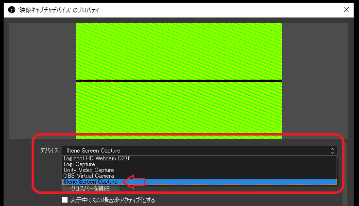
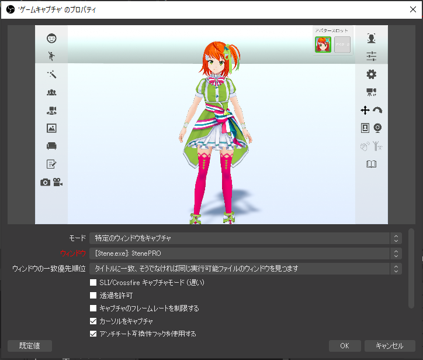
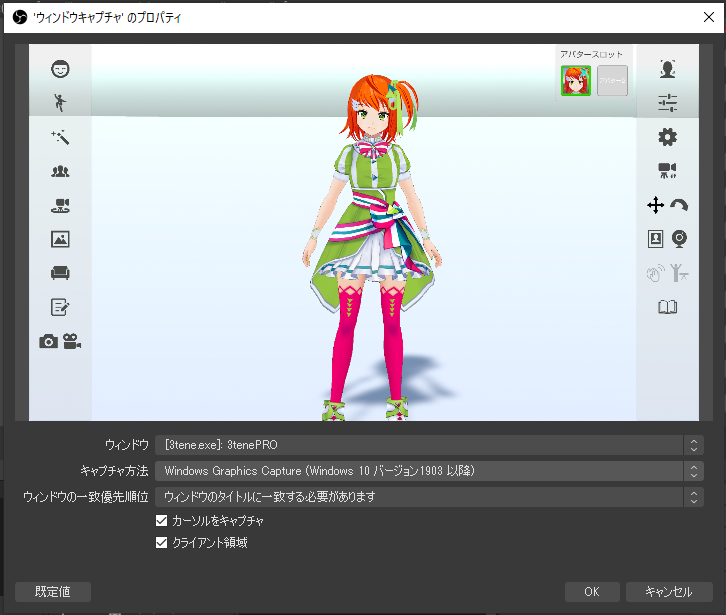
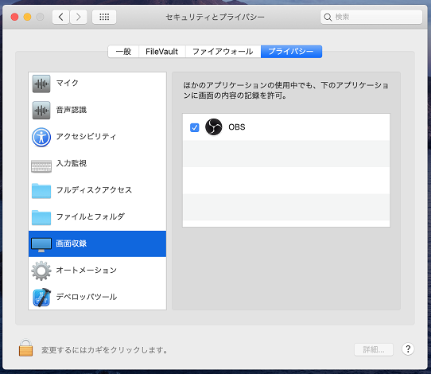

## OBS との連携について

>3tene と OBS を組み合わせて使う事での録画や動画配信を行う事が可能です。

>下記サイトより OBS をダウンロードします。

>OBS (OBS Studio)
>https://obsproject.com/ja

>※OBS Ver 29.1.0 以降で映像キャプチャの一覧に
>　3tene ScreenCapture が表示されない場合は 3tene v3.0.8 以降への更新が必要です。
>　もしくは OBS を Ver 29.0.2 に戻してください。

>OBS の旧バージョンはこちらから
>https://github.com/obsproject/obs-studio/releases

### OBS のキャプチャ方法を決定する

>・Windows で OBS の映像キャプチャを利用する場合は
>　 [仮想ウェブカメラ 3tene Screen Capture](#VirtualWebCamera.md) を使用します。

>・Windows でウインドウをそのまま取り込む場合はゲームキャプチャを使用してください。
>　3tenePRO なら Spout2 が使用可能で、こちらが推奨となります。
>　※OBS に別途 Spout2 プラグインの追加が必要です。

>・Mac で使う場合はウインドウキャプチャを使用してください。
>　3tenePRO ならサイフォンクライントが使用可能で、こちらが推奨となります。

>・NDI は Windows, Mac どちらでも使用可能ですが OBS に追加プラグインが必要です。

#### 注意事項

>・3tene Steam 版で OBS の映像キャプチャを利用するには手動登録が必要になります。
>　[仮想カメラ 3tene Screen Capture](#VirtualWebCamera.md) を参照して手動設定してください。

>・3tene v2.0.6 2020/10/12 以降で映像キャプチャを使う場合は
>　ウェブカメラ一覧で「3tene Screen Capture」を選択してください。
>　「Unity Video Capture」は使用されなくなりました。
>　※旧バージョンの 3tene では UnityCapture を使用します。

>・3tene v1.10.20 2020/02/14 以降で OBS を使う場合は
>　Windows 版はウインドウキャプチャではなくゲームキャプチャを使用してください。
>　Mac 版はウインドウキャプチャを使用してください。

### OBS を管理者権限で起動して利用する場合について

>Windows10 において負荷分散が変化するという事で
>OBS を管理者権限で起動して使用する方法がありますが、
>その場合には 3tene も管理者権限で起動していないと
>OBS で 3tene ScreenCapture が選択できなくなります。

### OBS の設定 (映像キャプチャ)

>OBS の「ソース」の追加で「映像キャプチャデバイス」を選択します。
>新規作成で任意の名前を入力し「OK」をクリックします。
>デバイスの選択欄で「3tene Screen Capture」を選択し、
>「OK」をクリックすると 3tene の画面が表示され録画が可能になります。

>OBS のデバイス一覧に表示されなかったり、3tene を起動しても画面が更新されない等、
>映像キャプチャが正常に動作しない場合は[手動で再登録](#VirtualWebCamera.md)を試してみてください。

### OBS の設定 (ゲームキャプチャ)

>OBS の「ソース」の追加で「ゲームキャプチャ」を選択します。
>新規作成で任意の名前を入力して「OK」をクリックします。

>モードを「特定のウインドウをキャプチャ」に変更し、
>ウィンドウで 3tene を選択し、「OK」をクリックすると
>3tene の画面が表示され録画が可能になります。

### OBS の設定 (ウインドウキャプチャ)

>OBS の「ソース」の追加で「ウインドウキャプチャ」を選択します。
>新規作成で任意の名前を入力して「OK」をクリックします。

>ウィンドウから 3tene を選択し、「OK」をクリックすると
>OBS に 3tene の画面が表示され録画が可能になります。

>Windows でウインドウキャプチャを使う場合は
>キャプチャ方法を「Windows 10 (1903以降)に変更してください。
>※古い OBS では「Windows Graphics Capture」を選択してください。

>macOS Catalina (10.15.x) 以降で OBS を起動すると
>ウインドウキャプチャの一覧に 3tene が表示されない場合があります。

>ウインドウキャプチャの「空の名前でウインドウを表示」にチェックし、
>項目に追加されたアプリを選択すると確認ダイアログが表示されるので
>OBS の「画面収録」の許可(権限の設定) を行うと 3tene が一覧に表示されます。

>macOS Catalina および Big Sur では権限許可が必要です。
>

### 3tenePRO(STUDIO) で使える OBS の設定

>上記の映像キャプチャを使うよりも負荷が少なくなるのでお奨めです。

>メニュー等の2D画像は出力されないので OBS を使う場合にお勧めです。
>アルファチャンネルにも対応しており背景透過が可能です。

>アルファチャンネルの背景透過を行って残像が発生する場合は 3tenePRO の
>設定「カメラ」のアンチエイリアスを無効にするか、
>OBS のクロマキーを使用する方法に変更してください。

>Spout を経由して OBS に画面を出力します。(Windows 専用)
>[Spoutについて](#Spout.md)

>Syphon を経由して OBS に画面を出力します。(Mac 専用)
>[Syphonについて](#Syphon.md)

>NDI を経由して OBS に画面を出力します。
>[NDIについて](#NDI.md)

