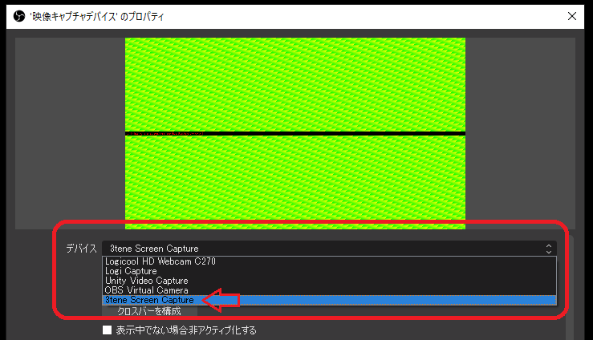
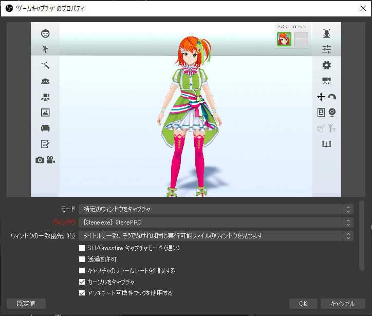
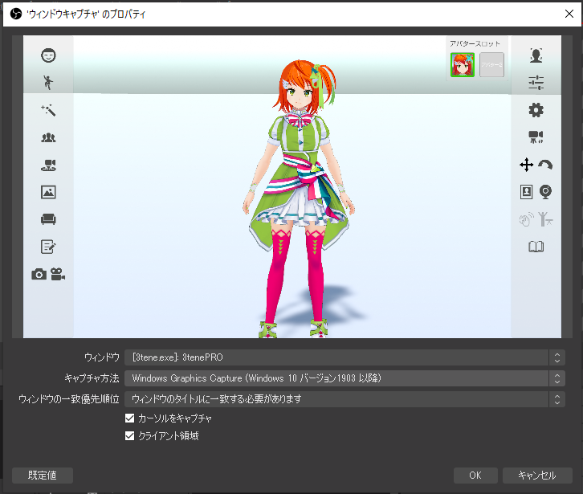
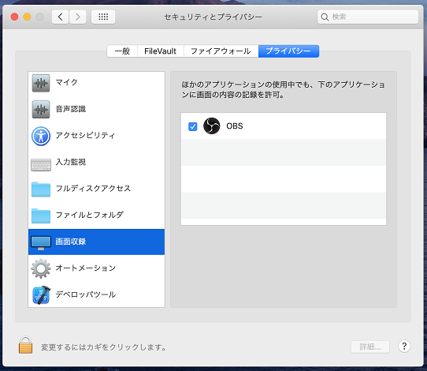

## OBS との連携について

>3tene と OBS を組み合わせて使う事での録画や動画配信を行う事が可能です。

>下記サイトより OBS をダウンロードします。

>OBS (OBS Studio)
>https://obsproject.com/ja

### OBS のキャプチャ方法を決定する

>・Windows で [仮想ウェブカメラ 3tene Screen Capture](#VirtualWebCamera.md) を使用する場合は映像キャプチャ 。
>　※3tene 旧バージョンで UnityCapture を使用する場合も映像キャプチャ。

>・Windows でウインドウをそのまま取り込む場合はゲームキャプチャを使用してください。

>・Mac で使う場合はウインドウキャプチャを使用してください。

#### 注意事項

>・3tene v2.0.6 2020/10/12 以降で OBS の映像キャプチャを使う場合は
>　ウェブカメラ一覧で「Unity Video Capture」ではなく
>　「3tene Screen Capture」を選択してください。
>　※Steam 版で利用するには手動登録が必要になります。

>・3tene v1.10.20 2020/02/14 以降で OBS を使う場合は
>　Windows 版はウインドウキャプチャではなくゲームキャプチャを使用してください。
>　Mac 版はウインドウキャプチャを使用してください。

### OBS の設定 (映像キャプチャ)

>OBS の「ソース」の追加で「映像キャプチャデバイス」を選択します。
>新規作成で任意の名前を入力し「OK」をクリックします。
>デバイスの選択欄で「3tene Screen Capture」を選択し、「OK」を
>クリックすると 3tene の画面が表示され録画が可能になります。

### OBS の設定 (ゲームキャプチャ)

>OBS の「ソース」の追加で「ゲームキャプチャ」を選択します。
>新規作成で任意の名前を入力し「OK」をクリックします。

>モードを「特定のウインドウをキャプチャ」に変更し、
>ウィンドウで 3tene を選択し、「OK」を
>クリックすると 3tene の画面が表示され録画が可能になります。

### OBS の設定 (ウインドウキャプチャ)

>OBS の「ソース」の追加で「ウインドウキャプチャ」を選択します。
>新規作成で任意の名前を入力し「OK」をクリックします。

>ウィンドウから 3tene を選択し、「OK」を
>クリックすると 3tene の画面が表示され録画が可能になります。

>Windows でウインドウキャプチャを使う場合は
>「Windows Graphics Capture」を選択すると動作する可能性はありますが保証外となります。

>macOS Catalina (10.15.x)で OBS を起動すると
>ウインドウキャプチャに 3tene が現れない場合があります。

>ウインドウキャプチャの「空の名前でウインドウを表示」にチェック、
>追加された項目を選択して「画面収録」の許可(権限の設定) を
>行うと 3tene が一覧に現れると思います。

>macOS Catalina および Big Sur では権限許可が必要です。
>

