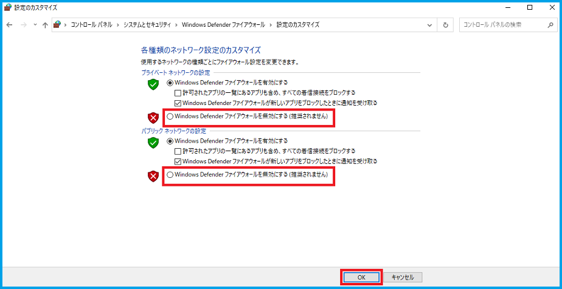
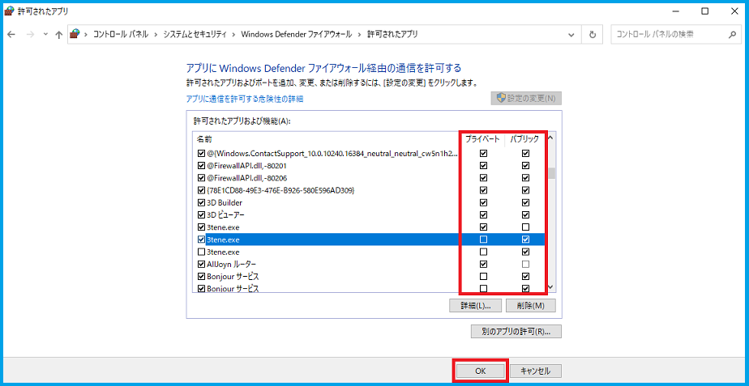
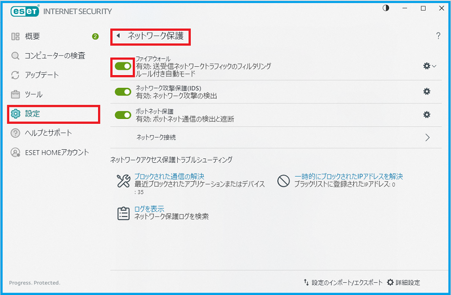
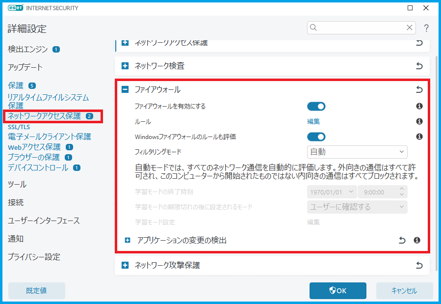
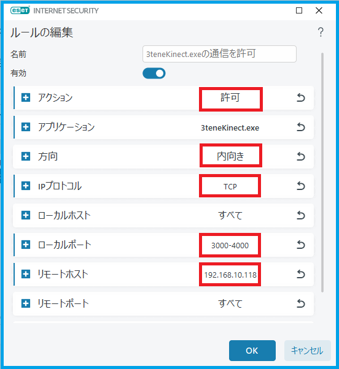
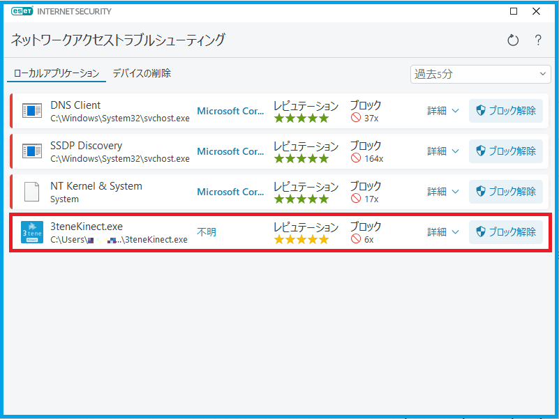

## セキュリティソフトについて

### Windows Defender ファイアウォールの設定

>#### ファイアウォールを無効に切り替える方法

>※この確認方法は初回のみにしてください。

>1. Windows の「スタート」をクリックし、アプリの一覧を表示します。
>2. 「Windows システムツール」フォルダを展開して、「コントロールパネル」をクリックし起動します。
>3. 「コントロールパネル」が表示されます。「表示方法」が「カテゴリ」の場合は「システムとセキュリティ」をクリックします。
>(「表示方法」が「アイコン」の場合は「Windows Defender ファイアウォール」をクリックし5に移ります。)
>4. 「Windows Defender ファイアウォール」をクリックし、起動します。
>5. 「Windows Defender ファイアウォールの有効化または無効化」をクリックします。
>6. 使用しているネットワークの種類に応じて「Windows Defender ファイアウォールを無効にする」
>をクリックし、「OK」ボタンをクリックしてください。
>7. 対象となるモーションアプリ等との接続確認を行います。
>8. ファイアウォールは完全に無効化されていますので、通信の確認後は再度有効化してください。

>※5の時点で「Windows Defender ファイアウォールを介したアプリまたは機能を許可」をクリックすることで
>下記で説明する「アプリにWindows Defender ファイアウォール経由の通信を許可する」が表示されます。

>#### アプリケーション毎に通信を許可する方法

>※推奨する設定方法になります。

>1. Windows の「設定」を開きます。
>2. 「更新とセキュリティ」>「Windows セキュリティ」>「Windows セキュリティを開く」
>をクリックし、「Windows セキュリティ」を起動してください。
>3. 「ファイアウォールとネットワーク保護」>「ファイアウォールによるアプリケーションの許可」をクリックします。
>4. 「Windows Defender ファイアウォール」が起動し、
>「アプリにWindows Defender ファイアウォール経由の通信を許可する」が表示されます。
>5. 「許可されたアプリおよび機能」欄から、ファイアウォール経由の通信を許可するアプリ(今回は 3tene.exe)にチェックを入れ、
>許可しないアプリはチェックを外して「OK」をクリックします。
>また、このときに使用しているネットワークの種類を確認しチェックをいれてください。
>※「詳細」をクリックするとアプリの詳細情報が確認出来ます。

>※ Windows Defender の画像は2022年9月時点でのものになります。

### ESETの設定

>#### ファイアウォールを無効に切り替える方法

>※この確認方法は初回のみにしてください。

>1. ESET の「設定」をクリックし、「ネットワーク保護」をクリックします。
>2. 「ファイアウォール」の項目でファイアウォールを無効にします。無効にする時間を選択して「適用」をクリックします。
>3. 対象となるモーションアプリ等との接続確認を行います。
>4. ファイアウォールは完全に無効化されていますので、通信の確認後は再度有効化してください。
>※ファイアウォールを無効にする時間は「10分」と短めにするのがおすすめです。

>#### アプリケーション毎に通信を許可する方法

>※推奨する設定方法になります。

>1. ESET の「設定」をクリックし、「ネットワーク保護」をクリックします。
>2. 「ファイアウォール」の項目の右端にある歯車のアイコンをクリックするか、画面右下の「詳細設定」をクリックしてください。
>3. 「ネットワークアクセス保護」>「ファイアウォール」をクリックし、「ルール」の項目の「編集」をクリックしてください。
>4. 「追加」をクリックし、項目内で「アクション」を許可に変更した上で、ファイアウォールでブロックされた通信の中で
>許可したいアプリの情報(IPアドレス等)を設定し、「OK」をクリックしてください。
>5. 「ルール」内に設定した通信のルールが追加されるので、問題がなければ「OK」をクリックしてください。
>6. 「詳細設定」の画面に戻るので、設定が完了したら「OK」をクリックしてください。

>※ファイアウォールでブロックされた通信を確認するには、「設定」>「ネットワーク保護」から「ブロックされた通信の解決」をクリックし、
>「ネットワークアクセストラブルシューティング」を確認すると過去5分,15分,60分以内にブロックされた通信を見ることが出来ます。
>また、ここで「ブロック解除」をクリックすることでも許可することが出来ます。それでもブロックされる場合は上記の方法を試してください。

>※ ESET の画像は2023年10月時点でのものになります。