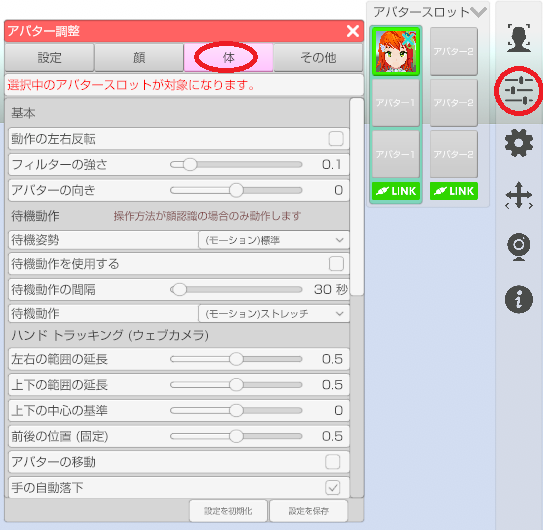

## アバター調整（体タブ）

>アバターのフェイストラッキングの調整や設定を行います。

### アバター調整のウインドウを表示する

>右側メニューのアバター調整のアイコンをクリックします。

>体タブを選択します。

### 待機動作

>アバター調整「設定」タブの操作方法が「顔認識」の場合のみ動作します。

>#### 待機動作を使用する

>オンにすると一定間隔で設定したモーションが動作します。

>#### 待機動作の間隔

>待機動作が発生するまでの時間を変更します。

>#### 待機動作

>ドロップダウンメニューで待機動作で使用するモーションを選択します。

### 呼吸動作 (Live2D) (LIVE2D 版のみ)

>#### 呼吸動作を使用する

>オンにすると一定間隔で呼吸モーションが動作します。

>#### 呼吸動作の間隔

>呼吸動作の発生間隔を変更します。

>#### 呼吸の速さ

>呼吸の速さを変更します。

### LeapMotionの調整 (FREE 版のみ)

>#### 前後の位置

>腕や手を動かす基準値の前後を変更します。

>#### 上下の位置

>腕や手を動かす基準値の上下を変更します。

>#### スケール

>値を大きくすると動きが激しくなります。

### 手の形状  (FREE 版は非対応)

>ボディトラッキング(VRやPerception Neuron)が有効な場合に動作します。

>#### 形状の変化速度

>手の形状が変化し終わるまでの時間を変更します。

### BVH

>BVH ファイルを読み込んだ場合の動作設定を行います。

>#### ループ

>モーションを繰り返し再生します。

>#### 指を操作する

>BVH に指の情報が含まれる場合に適用します。

### キャラクターの角度

>#### キャラクターの角度

>キャラクターの角度を変更します。
>LeapMotion を使用する場合はゼロで使用してください。

