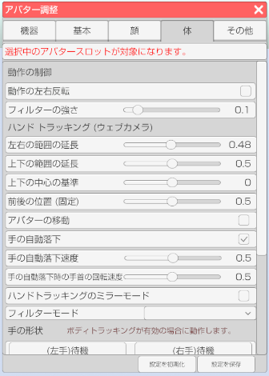

## アバター調整（体タブ）

>アバターのフェイストラッキングの調整や設定を行います。

### アバター調整のウインドウを表示する

>右側メニューのアバター調整のアイコンをクリックします。

>体タブを選択します。

### アバタースロットを選択する (3teneFREE は非対応)

>アバターを複数読み込んでいる場合にどのアバターを対象にするかを選択します。

### 動作の制御

>#### 動作の左右反転

>体の動作を全て左右反転します。
>※モーションやトラッキング等、全ての動作が対象となります。

>#### フィルターの強さ

>標準は 0.1 です。素早い動きを優先したい場合は 0 でフィルターをオフにしてください。
>※モーションやトラッキング等、全ての動作が対象となります。

### ハンドトラッキング（ウェブカメラ）

>準備中。

### LeapMotionの調整 (FREE 版のみ)

>#### 前後の位置

>腕や手を動かす基準値の前後を変更します。

>#### 上下の位置

>腕や手を動かす基準値の上下を変更します。

>#### スケール

>値を大きくすると動きが激しくなります。

### 手の形状  (FREE 版は非対応)

>ボディトラッキング(VRやPerception Neuron)が有効な場合に動作します。

>#### 形状の変化速度

>手の形状が変化し終わるまでの時間を変更します。

