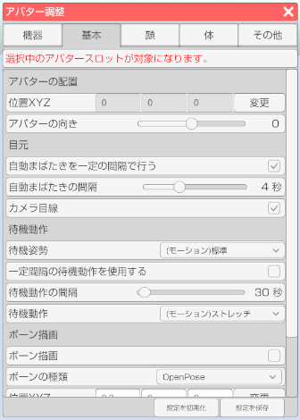

## アバター調整（基本タブ）

>アバターのフェイストラッキングの調整や設定を行います。

### アバター調整のウインドウを表示する

>右側メニューのアバター調整のアイコンをクリックします。

>体タブを選択します。

### アバタースロットを選択する (3teneFREE は非対応)

>アバターを複数読み込んでいる場合にどのアバターを対象にするかを選択します。

### アバターの配置

>#### 位置ＸＹＺ

>アバターの位置を変更します。

>#### アバターの向き

>アバターの向きを変更します。

### 目元

>#### 自動まばたきを一定の間隔で行う

>オンにするとフェイストラッキングが動作していない場合に
>アバターがまばたきをします。

>#### 自動まばたきの間隔

>まばたきをするまでの間隔を変更します。

>#### カメラ目線

>オンにするとカメラの向いている方向に目線を向けます。
>目の移動範囲が狭いモデルデータでは動きが小さくなります。

### 待機動作

>アバター調整「設定」タブの操作方法が「顔認識」の場合のみ動作します。

>#### 待機姿勢 (3teneFREE は非対応)

>待機姿勢を設定します。

>#### 待機動作を使用する

>オンにすると一定間隔で設定したモーションが動作します。

>#### 待機動作の間隔

>待機動作が発生するまでの時間を変更します。

>#### 待機動作

>ドロップダウンメニューで待機動作で使用するモーションを選択します。

### 呼吸動作 (Live2D) (LIVE2D 版のみ)

>#### 呼吸動作を使用する

>オンにすると一定間隔で呼吸モーションが動作します。

>#### 呼吸動作の間隔

>呼吸動作の発生間隔を変更します。

>#### 呼吸の速さ

>呼吸の速さを変更します。

### ボーン描画

>#### ボーン描画

>ボーン描画（表示）の有効、無効を切り替えます。

>#### ボーンの種類

>・Humanoid → VRM の仕様に合わせたボーンを描画します。
>・OpenPose → OpenPose の仕様に合わせたボーンを描画します。

>ボーンの位置を直接数値入力で調整します。
>※小数での入力が可能です。

### BVH

>BVH ファイルを読み込んだ場合の動作設定を行います。

>#### ループ

>モーションを繰り返し再生します。

>#### 指を操作する

>BVH に指の情報が含まれる場合に適用します。

