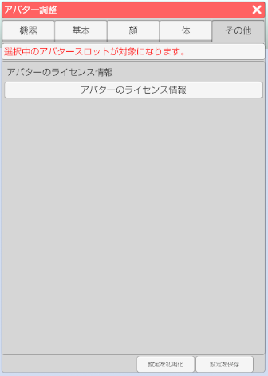

## アバター調整（その他タブ）

>その他の項目を設定します。

### アバター調整のウインドウを表示する

>右側メニューのアバター調整のアイコンをクリックします。

>その他タブを選択します。

### アバターのライセンス情報

>VRM の制作者が設定したライセンスを表示します。

### ボーン描画

>#### ボーン描画

>ボーン描画（表示）の有効、無効を切り替えます。

>#### ボーンの種類

>・Humanoid → VRM の仕様に合わせたボーンを描画します。
>・OpenPose → OpenPose の仕様に合わせたボーンを描画します。

>ボーンの位置を直接数値入力で調整します。
>※小数での入力が可能です。

