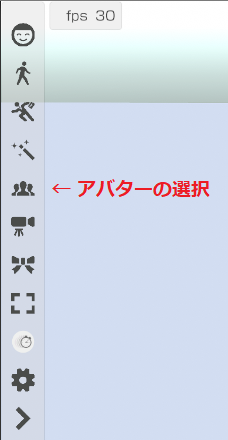
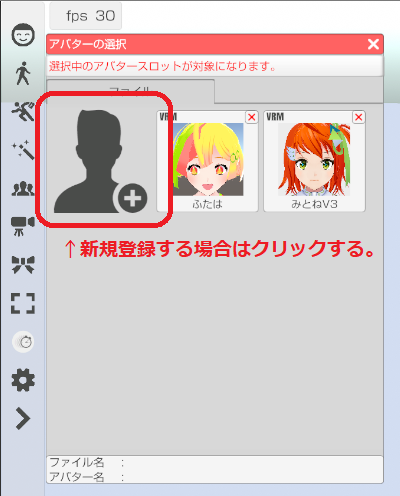
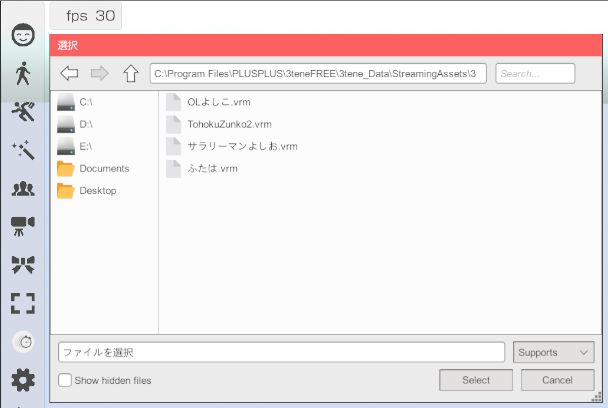
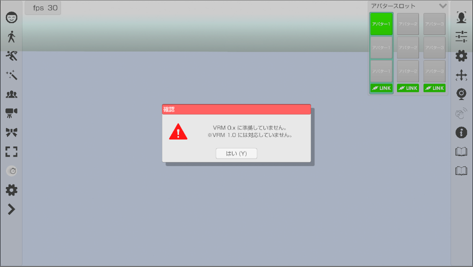
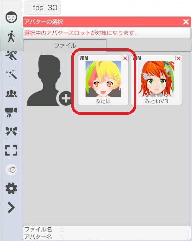
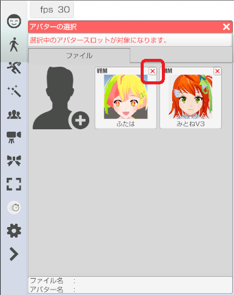

## アバターの読み込み

>アバターを読み込みます。
>１度読み込んだアバターは一覧に登録されます。

### アバターの選択ウインドウを表示する

>左側メニューの「アバター選択」のアイコンをクリックします。

>

### アバターを新規登録する

>既に登録済みのアバターを使用する場合はそのアバターをクリックします。
>新規にアバター登録する場合は一覧の左上のアイコンをクリックします。

>

>#### VRM ファイルを選択する

>読み込みたい VRM もしくは Live2D(json) を選択します。
>一覧から VRM を選択するとアバターとして読み込まれます。

>

>3tene V4 は VRM 1.0 に対応していませんので読み込みに失敗します。
>

### 登録済みアバターを選択する

>登録済みのアバターは一覧に表示されるのでアイコンをクリックすると
>アバターとして読み込まれます。

>

### 登録一覧から削除する

>削除したいアバターアイコンの右上にある「×」をクリックすると
>確認のダイアログが表示されるので「はい」を選択すると削除されます。

>

