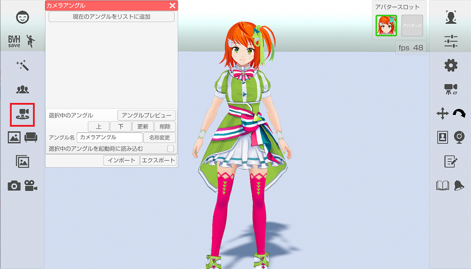
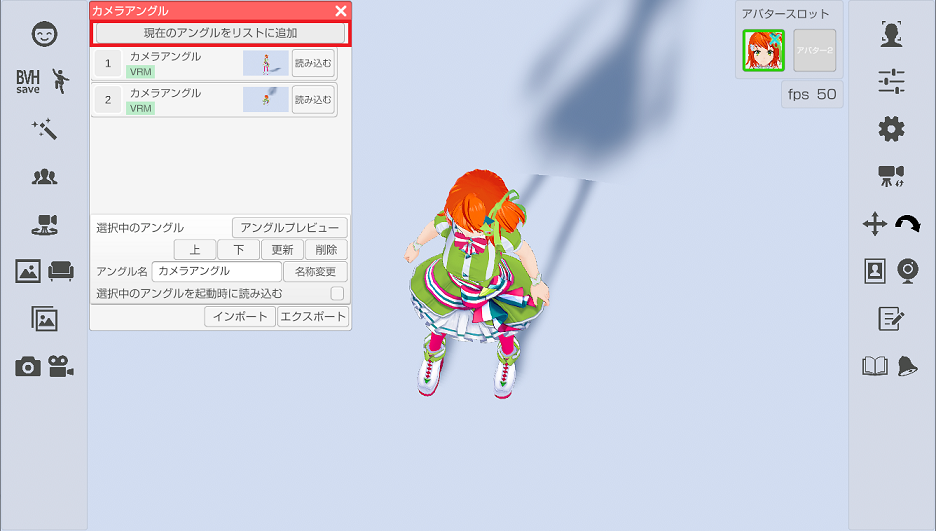
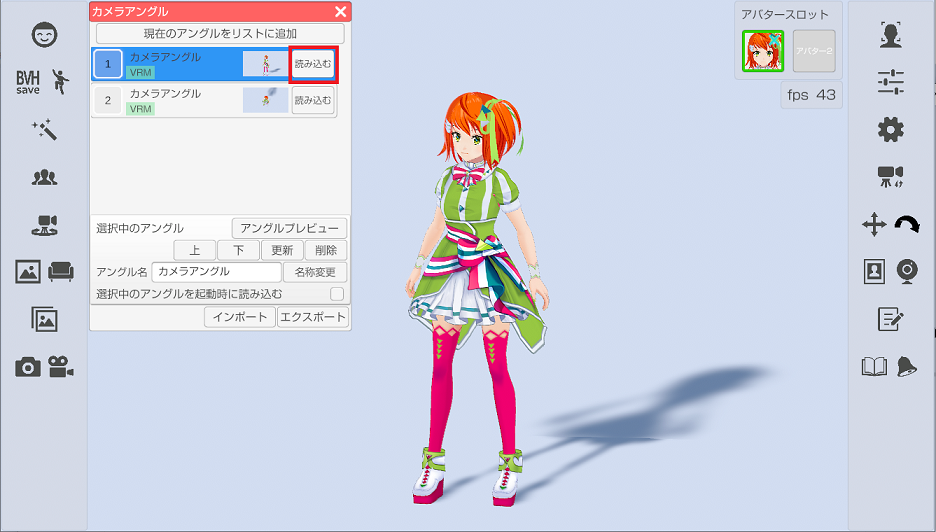
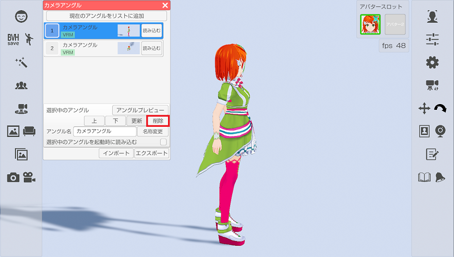
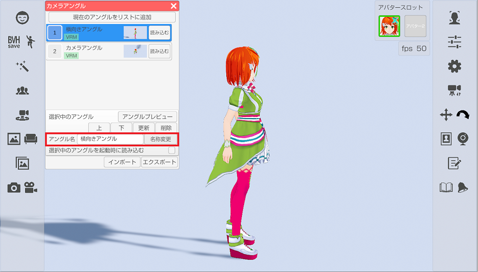
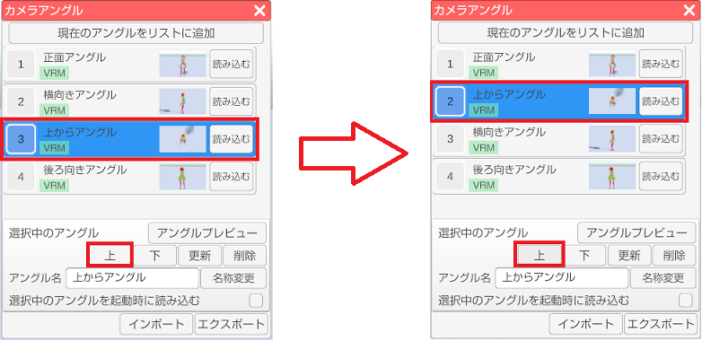
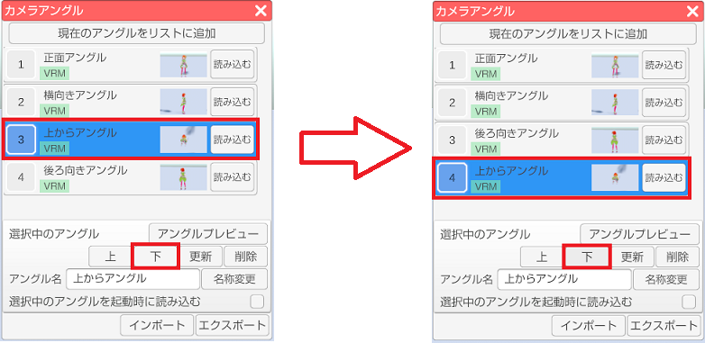
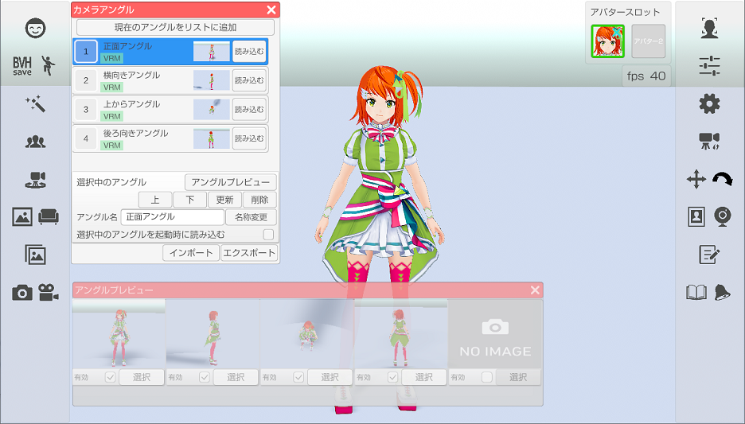
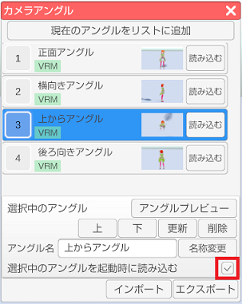

## シーンカメラのアングルについて

>シーンカメラのアングルを保存および復帰を行います。

>※VRM 読み込み時に保存したアングルは Live2D 読み込み時には利用できません。
>（逆も出来ません。）

### シーンカメラのアングルのウインドウを表示する

>左側メニューのシーンカメラのアングルアイコンをクリックします。

### アングルの保存

>「現在のアングルをリストに追加」を選択すると
>現在のシーンカメラの状態が保存され、リストに追加されます。

### アングルの復帰

>リストに登録されているアングルの「読み込む」を選択すると
>保存されているアングルが復帰します。

### アングルの更新、削除

>保存済みのアングルを変更する場合は変更したいアングルを選び（青色状態にする）、
>リスト下の「更新」ボタンを選択します。

>保存済みのアングルを削除する場合は変更したいアングルを選び（青色状態にする）、
>リスト下の「削除」ボタンを選択します。

### アングル名称の変更

>保存済みのアングルの名称を変更する場合は変更したい
>アングルを選び（青色状態にする）、アングル名を編集した後に
>「名称変更」ボタンを選択するとリストの表示名称が変更されます。

### 保存アングルの順番変更

>リストの項目を上下に移動します。
>リストは先頭から５番目までが設定ウィンドウ内のショートカット１と
>アングルプレビューの項目の対象になるので
>よく使うアングルは５番目以内に移動すると使いやすくなるかと思います。

>リスト下の「上」ボタンを押すと選択しているリストとその上のリストの順番を入れ替えます。

 

>リスト下の「下」ボタンを押すと選択しているリストとその下のリストの順番を入れ替えます。

### アングルプレビュー (3tene FREEは非対応)

>リストの先頭から５番目までに保存されたアングルを
>常時確認可能なプレビューウインドウを表示します。
>有効にチェックを付ける事でプレビューを開始しますが、
>その分の処理負荷が増えますので注意してください。

>リストの順番を変更するとプレビューウインドウにも反映されます。

### 起動時に保存したアングルを復帰させる

>起動時に復帰させたいアングルを選び（青色状態にする）、
>「選択中のアングルを起動時に読み込む」のチェックを付けると
>次回、3tene 起動時に保存されたアングルが自動的に復帰されます。

### アングルのインポート、エクスポート

>保存したシーンカメラのアングルをバックアップしたい場合や、
>他の PC にインストールされた 3tene に移したい場合に使います。

>エクスポートでシーンカメラのリストとそれに関連する画像を
>指定されたフォルダに CameraAngle フォルダとして出力します。

>インポートではエクスポートで出力されたフォルダを指定する事で
>保存された情報を取り込みます。

>※インポートするとそれまでのリスト情報は全て破棄されるので
>　使用する場合は注意して使用してください。

