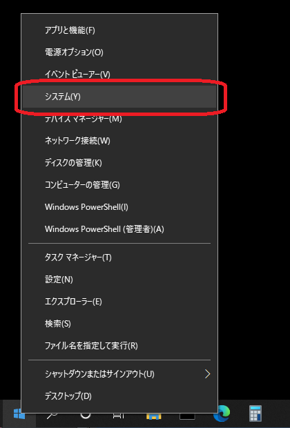
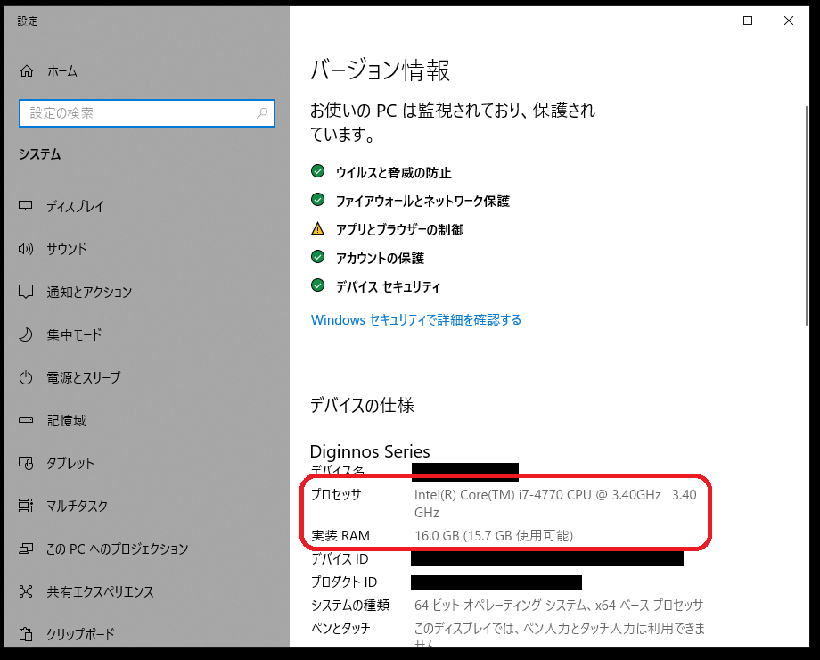
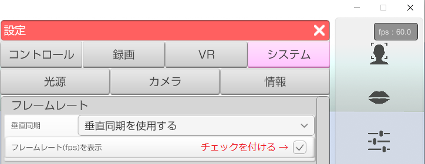

## 性能の確認方法

>3tene を使用する為の性能を満たしているかを確認する方法です。

>要求性能を満たしていないと処理落ちが発生し、快適な操作が行えません。

### Windows の場合

>スタートボタンを右クリックしてメニューの中から「システム」を選択します。

>

>設定のシステム情報が表示されるので「プロセッサ」と「実装RAM」を確認します。
>※Windows のバージョンによっては画像とデザインが異なる場合があります。

>

>i7-4770 の部分がプロセッサの製品名です。
>数字が大きいほど性能が高い傾向にあります。

>3tene の使用に当たっては 最低でも i5-3000 以上のプロセッサを対象としています。
>※4000 番台なら第4世代、7000 番台なら第7世代と4桁目の数字で世代がわかります。

>3.4GHz の部分が動作クロックになります。
>3tene の使用に当たっては 最低でも 2.0GHz 以上のプロセッサを対象としています。

>「実装RAM」は搭載されているメモリの量になります。
>最低でも 2GB 、無理なく動かすには 4GB 以上が必要です。

>3tene と他のソフトウェアを連携して使用する場合は
>上記よりもさらに高い性能が必要になります。

>細かい要求性能は[こちら](#required.md)を参照してください。

### 3tene で性能が足りているか確認する

>フレームレート(画面の更新回数)を表示させて処理速度の確認が可能です。

>下記の操作でフレームレートを表示させます。
>3tene の設定 → 「システム」タブ → フレームレート(fps)の表示
>にチェックを付けてください。

>画面右上にフレームレートが表示されます。
>フレームレートの値が 50～60fps をキープ出来ない場合は
>処理性能が足りていません。

