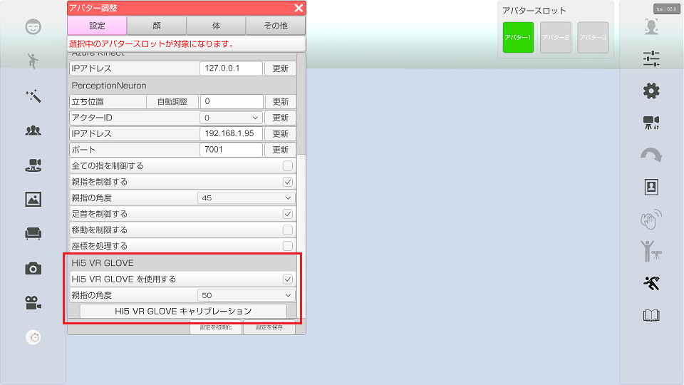

## Hi5 VR GLOVEについて

>センサーを付けたグローブを装着し、指を制御します。

>Hi5 VR GLOVE で腕は動かせないので
>PerceptionNeuron 等の全身操作の機器と合わせて使用します。
>※PerceptionNeuron V2 と合わせて使用する場合は「全ての指を制御する」をオフにしてください。

### Hi5 VR GLOVE の設定

>アバターの調整 - 設定 - Hi5 VR GLOVE から設定、調整を行うことが出来ます。

>・Hi5 VR GLOVE を使用する
>　Hi5 VR GLOVE を使用するかを設定します。

>・親指の角度
>　Hi5 VR GLOVE 使用時の 3tene で表示されているキャラクターの親指の角度を調整します。（40～60 推奨）

>・Hi5 VR GLOVE キャリブレーション
>　Hi5 VR GLOVE のキャリブレーションを行います。
>　「Hi5 VR GLOVE を使用する」が ON の時のみ選択可能

### Hi5 VR GLOVE キャリブレーション

>「Hi5 VR GLOVE キャリブレーション」を選択すると画面が切り替わります。
>画面の指示に従いキャリブレーションを進めてください。
>「キャリブレーション開始」を選択すると Bポーズ、Pポーズの順でキャリブレーションを行います。
>キャリブレーション終了後は「キャリブレーション終了」を選択すると 3tene の画面に戻ります。

>複数のキャラクターにHi5 VR GLOVE の動きを反映することが出来ます。
>「Hi5 VR GLOVE を使用する」のチェックが入っているキャラクター全てに Hi5 VR GLOVE の動きが反映されます。

