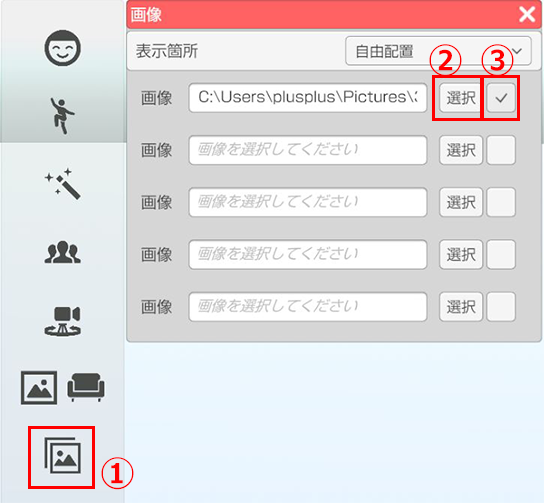
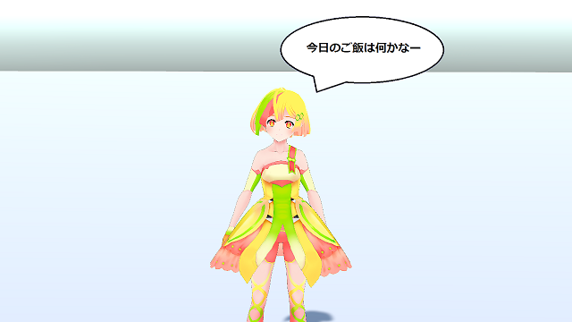

## イメージボードについて

>画面前面に画像を表示します。
>表示された画像の大きさを変更することが出来ます。
>ショートカット操作で表示非表示を切り替えることも可能です。

### イメージボード機能の使い方

>左側メニューのイメージボードのアイコンをクリック（画像①）

>ウィンドウ内の「選択」から読み込みたい画像を選択します。（画像②）  
読み込み可能な画像は「jpg」「png」ファイルです。

>右側のチェックボックスにチェックを入れると画面上に表示されます。（画像③）

>表示された画像をドラックすることで画像の位置を変更できます。

>表示された画像の端をドラッグすると画像の大きさを変更できます。

>透過設定を行った「png」ファイルも使用可能です。

