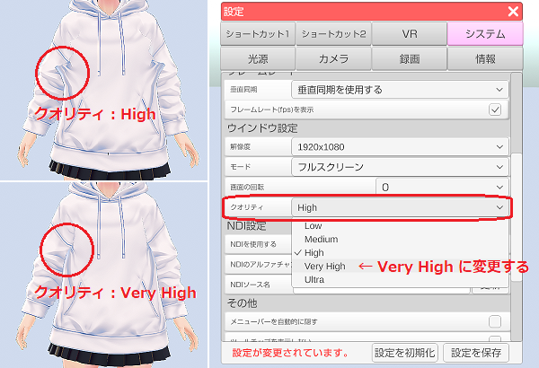
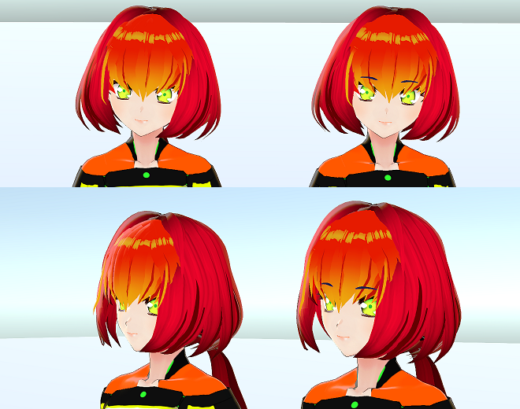

## VRM を作ろう！

>### VRMとは？

>3Dアバター向け汎用規格「VRM（Virtual Railroad Models）」の事で、
>ドワンゴ株式会社から2018年4月に発表されました。

>VRM は Khronos グループによって策定された汎用3Dフォーマット「glTF 2.0」を拡張して
>VRソフトウェアや VTuber 配信に最適化したフォーマットです。

>人型に限定する事によりアバターを扱うソフトウェアで高い互換性を維持しています。

>※Khronos は「OpenGL」や「Vulkan」等、３Ｄ技術を策定する非営利団体の技術コンソーシアムです。

>VRM の公式サイト
>日本語：<a href="https://vrm.dev/" target="_blank">https://vrm.dev/</a>
>英語：<a href="https://vrm.dev/en/" target="_blank">https://vrm.dev/en/</a>

>VRM の技術仕様 (glTF 2.0 との差異および拡張仕様)
><a href="https://github.com/vrm-c/vrm-specification/blob/master/specification/0.0/README.ja.md" target="_blank">日本語</a>　<a href="https://github.com/vrm-c/vrm-specification/blob/master/specification/0.0/README.md" target="_blank">英語</a>

>### どうすれば VRM を作れる？

>２つの方法が存在します。

>①VRoidStudio を使う。
>モデル作成が未経験でも比較的、簡単に作成できます。
>ただし、ベースとなる素体を逸脱したものは作成できない制限があり、ゆるキャラ等は作れない。

>②3Dモデリングソフト(Blender、MAYA等)で作る。
>上級者もしくは3Dモデリング経験者向けで難易度が高いですが、
>思うがままにモデルを作成する事ができます。
>無料で使用できる Blender が使われる事が多いようです。
>※モデルを作成したら FBX で保存し、Unity でインポート後に修正、調整を行なって VRM に変換します。

### VRoidStudio で作成した VRM を無理なく使う！

>「VRM を作成したけど、もっと改良してみたい！！」という場合は
>こちらの[VRoidStudio で作成した VRM を改良する！](#MakeVRM_2.md)を試してみてください。

>一部の服装で描画崩れが発生する場合は 3tene の
>設定「システム」タブでクオリティを「Very High」以上に変更してみてください。
>

### VRM をカスタムする！

>### 口を閉じたバージョンの表情を作ろう！

>3tene 拡張に対応した[口が閉じたバージョンの表情を作ろう！](#MakeVRM_3.md)

>※[iPhone フェイストラッキングの自動表情連携](#ft_iphone_expression.md)にも使えます。

>### アニメ眉毛を作ろう！

>3tene では UnityChan ToonShader に含まれる４種のシェーダーが使用可能です。

>3tene 拡張の Unity Chan Toon Shader を使った
>[アニメまゆ毛の作り方](#UCTShader.md)を参照してください。

>このシェーダーを使う事でアニメ風のまゆ毛（前髪よりも前に描画）が可能となります。
>

>### 外部の参考サイト

>[窓の杜 Blender 関連記事（VRM のカスタム等）](#MakeVRM_4.md)

