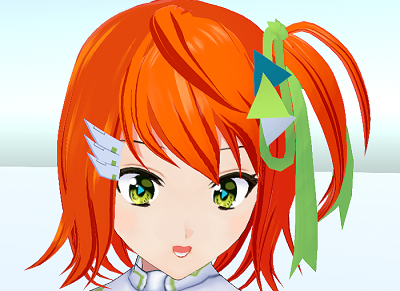

## VRoidStudio で作成した VRM を改良する！

>VRM を改良する場合の注意点を記載します。

### VRoidStudio で作成した VRM を Unity で修正する場合の注意事項

>VRoidStudio で作成した VRM を古い UniVRM で Unity にインポートすると
>目のボーンの設定値が変化してしまい、目の移動範囲が狭くなり、
>VRM へのエクスポート前に目の修正が必要になります。
>※Unity にインポートする場合は UniVRM 0.66 以降を使用してください。

### PerfectSync の対応

>3tene は PerfectSync に対応しています。
>PerfectSync に対応した VRM を使用する事で動作します。
>

>もし使用している VRM が VRoidStudio で作成しているのであれば
>3tenePRO に同封されている FaceForge を使う事で対応できるかもしれません。
>※別途、VRoidStudio で作成され PerfectSync に対応した VRM が必要になります。

>詳しくは[FaceForge について](#AboutFaceForge.md)を参照してください。

### First Person について

>3tene では VR に対応している為、VRM は First Person に対応している必要があります。
>対応していないと目、まぶた、口が２重に表示されるといった現象が発生します。

>VRM を First Person に対応させるか、該当する顔の部位に
>「Third Person Only」に設定変更を行って First Person を無効にしてください。
>※First Person を無効にすると VR 使用時の描画に問題が発生します。

