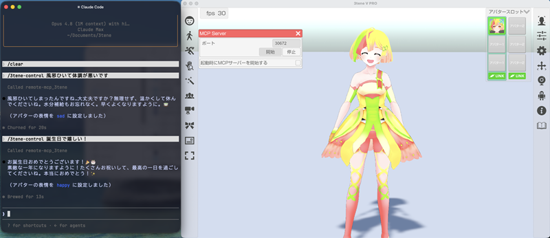
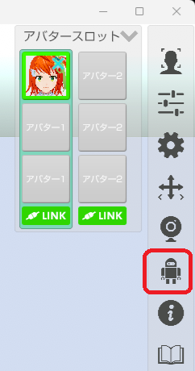
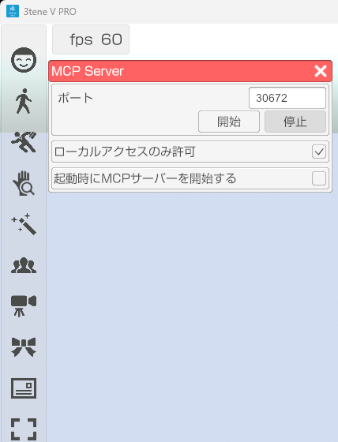

## MCP サーバーについて

>AI エージェントから 3tene を操作する MCP サーバー を搭載。  
>\
>Claude Code と PicoClaw で動作するのを確認をしています。  
>※使用している LLM モデルによっては動作しない場合も有ります。  
>\
>

### AIエージョントの設定

>使用している AI エージョントによって異なるので  
>各ソフトウェアに合わせて設定を行ってください。
>\
>3tene を起動している PC の IP アドレスを設定してください。ポート番号 30672 です。

### 使い方

>1. 3tene を起動する。
>2. メニューから MCP サーバーを選択する。  
>
>3. MCP サーバーを開始する  
>
>4. AI エージョント を起動する。

### ネットワーク経由

>設定が正しく行われてもセキュリティソフトにブロックされ、  
>正常に動作しない場合があります。  
>そのような場合はセキュリティソフトのファイアウォールに  
>通信がブロックされないように設定してください。  
>[セキュリティソフトについて](AboutSecuritySoft.html)

### 公開機能

>・表情変更  
>・モーション  
>・エフェクト  
>・背景変更  
>・スクリーンショット

