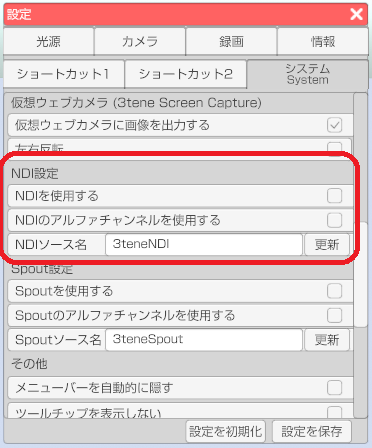
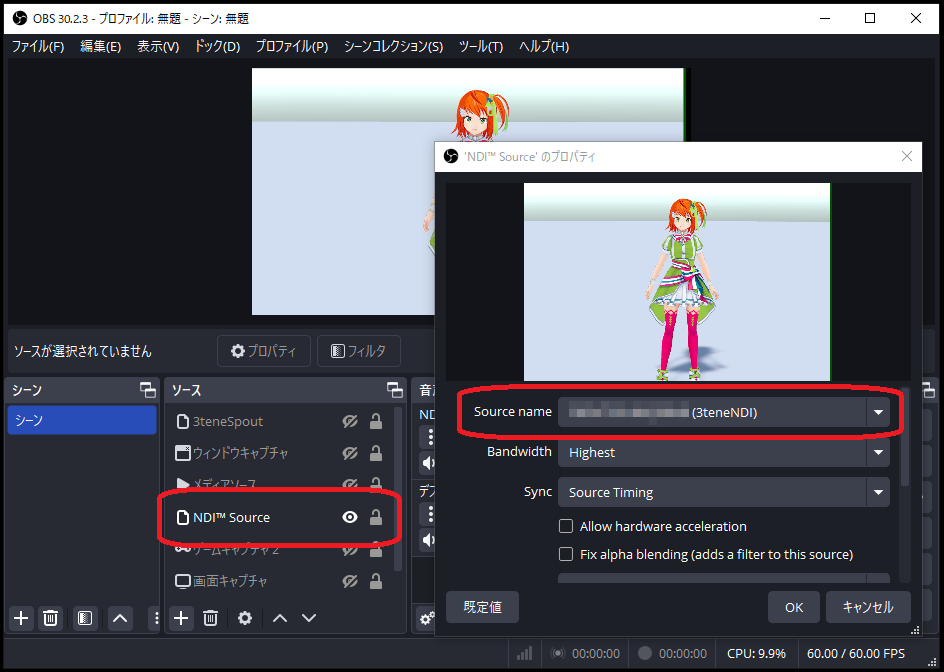
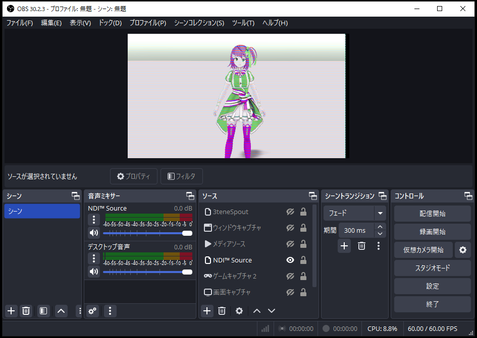

## NDIについて

>NDI（開発元：米国NewTek社）に対応する事により、
>ローカルエリアネットワークでの高機能映像配信に対応しています。
>複数のPCへ同時配信、複数のPCのキャラクター合成などに利用可能です。

>NDI を使用して送信される 3tene の映像は
>仮想カメラ機能と同様にメニューやウインドウが録画対象とならないので
>アバターと背景のみの録画が可能になります。

>この機能を利用するには、映像を受信するソフトウェアが
>NDI に対応している必要があります。

>録画配信ソフトの OBS では別途 NDI プラグインをインストールする必要があります。
>※ Win版、Mac版で動作を確認しています。

### 3tene内の設定

>下記サイトを開きます。

>設定 - システム - 「NDIを使用する」 にチェックを入れると3teneの設定は完了です。
>設定 - システム - 「NDIソース名」 で受信側にソースが表示されます。
>NDIソース名 は変更することが出来ます。デフォルトでは「3teneNDI」です。

>受信側でソース名を3tene内で設定したソース名を選択すると映像が表示されます。

>ソース名を認識しているのに画像が表示されない場合は送信側(3tene)の
>セキュリティソフトのファイアウォールにブロックされている可能性があります。
>3tene がセキュリティソフトにブロックされないように設定を変更してみてください。

### OBS での使用方法

>OBS のプラグインである obs-ndi をインストールします。
>※ Windows用、Mac用があります。
>https://github.com/Palakis/obs-ndi/releases
 
>インストールが完了するとソースに「NDI Source」が追加されます。
>NDI Source を追加し、「Source name」 に 3tene で設定した「NDIソース名」を選択し、
>右下の「OK」をクリックすると 3tene 画面が表示されます。

>下記のように OBS に表示される画像が乱れる場合は
>3tene のウインドウ横サイズを調整して偶数にしてみてください。

