## オブジェクトの読み込みについて
>モデリングソフトで作成した3Dオブジェクトのファイル(以下オブジェクト)を3tene のシーンに配置します。
>3DオブジェクトのファイルはOBJファイル、FBXファイルの読み込みに対応しています。
>※OBJファイルがMTLファイル、テクスチャ画像を参照する場合はファイルを全て含めてください。

### ステージのオブジェクト配置ウインドウを表示する

>左側メニューのオブジェクトアイコンをクリックします。

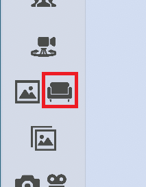 

### オブジェクトファイルを読み込み用フォルダに置く

>ステージのオブジェクト配置ウィンドウ → 「オブジェクトの読み込み」タブ → 「フォルダを開く」をクリックします。
 画像の①, ②
>エクスプローラーが立ち上がるので、読み込みたいファイルを開いたオブジェクトフォルダ内に移動させます。
>3tene画面に戻り「フォルダを読み込む」をクリックします。
 画像の③
>オブジェクトフォルダ内のファイルが3teneに読み込まれ、同タブ内にオブジェクトのリストが表示されます。
 画像の④ 

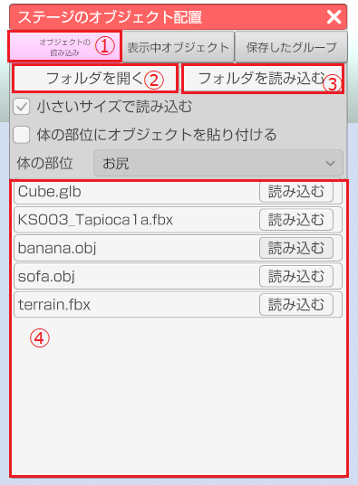

### 3teneのステージ上にオブジェクトファイルを表示する

>表示されたリストの「読み込む」をクリックするとステージ上にオブジェクトが表示されます。
 画像の①
>追加されたオブジェクトは、「表示中オブジェクト」タブ -「ステージ上のオブジェクト」内にリストとして追加されます。
>「体の部位にオブジェクトを貼り付ける」にチェック → 「体の部位」のドロップダウンから貼り付ける部位を選択してから、
上記同様リストの「読み込む」をクリックすると選択した部位にオブジェクトを貼り付けることが出来ます。
 画像の②, ③
>「小さいサイズで読み込む」にチェックを入れたままの場合は、読み込まれるオブジェクトのサイズが
デフォルトで追加されますが、チェックを外した場合はオブジェクトのサイズが大きくなった状態で追加されます。
 画像の④

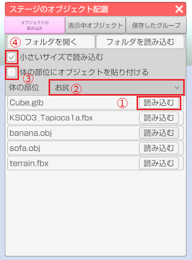

>「体の部位にオブジェクトを貼り付ける」にチェックを入れた場合は、
>「表示中オブジェクト」タブ -「現在のアバターに貼り付いているオブジェクト」内にリストとして追加されます。
 画像の①, ②

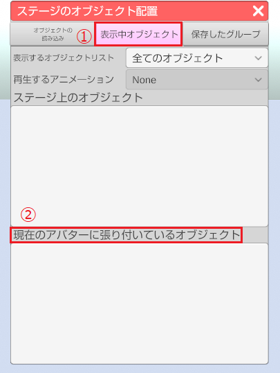

### オブジェクトの調整

>ウィンドウの「表示中オブジェクト」タブ内のリストにある目のアイコンをクリックすると
選択したオブジェクトの表示非表示を切り替えることが出来ます。
 画像の①
>「表示中オブジェクト」タブ内にあるリストをクリックすると、オブジェクトを選択している状態になり、
>選択中の配置されたオブジェクトにオレンジのポイントが表示されます。
 画像の②, ③

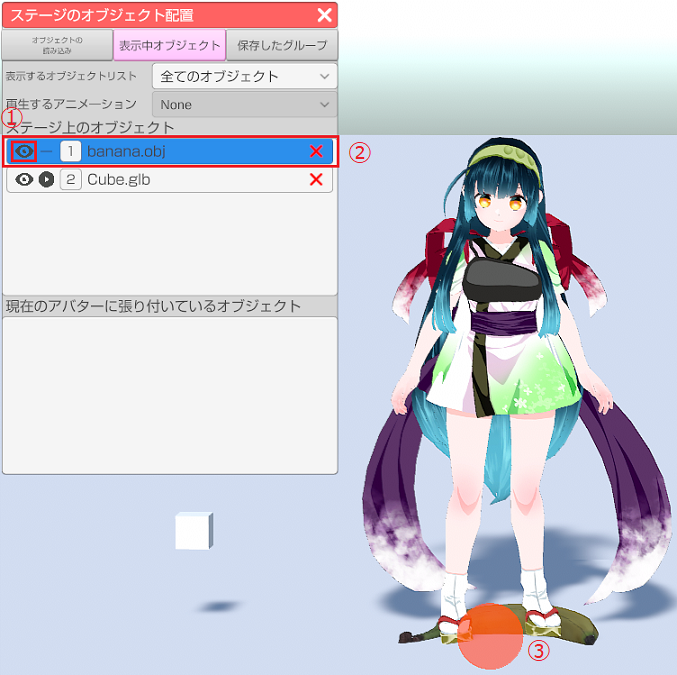

>また、「再生するアニメーション」のドロップダウンはアニメーションを持つオブジェクトを選択しているときだけ有効になり、
オブジェクトが持つアニメーションの切り替えをすることが出来ます。
 画像の①
>リストにある再生ボタンをクリックするとドロップダウンで選択しているアニメーションを再生することが出来ます。
 画像の②
>※フリー版にはこのアニメーションの機能はありません。

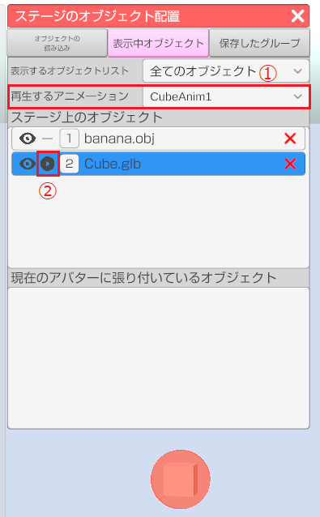

>オブジェクトの選択中に表示されるオブジェクトの調整ウィンドウ上部の
位置、回転、スケールの中で調整したい項目にチェックを入れるとそれぞれを調整することが出来ます。
 画像の①
>また、ウィンドウ内にある赤のポイントをドラッグすることでオブジェクトのx,z軸の座標位置を変えることが出来ます。
 画像の②
>ウィンドウ下部のバーを調整することでウィンドウ内の真上から映した映像をズームイン、ズームアウトすることが出来ます。
 画像の③

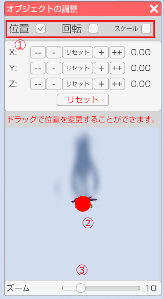

>下記画像はウィンドウ上部の位置、回転、スケールの項目になります。
>「+」「-」ボタン（長押し可能）をクリックする事で値を変更します。
>「+」「-」の間のリセットボタンをクリックすると該当する軸の値を初期値に戻します。
>下部のリセットボタンをクリックすると全ての軸の値を初期値に戻します。（オブジェクトを読み込んだ時の状態）
>※スケールについては「All」のリセットで全ての軸を初期値に戻します。

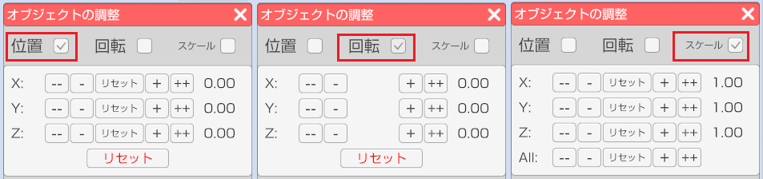

### オブジェクトの削除

>ステージのオブジェクト配置ウィンドウ → 「表示中オブジェクト」タブ内のリストの右側の「x」ボタンをクリックすると
該当のオブジェクトを削除します。

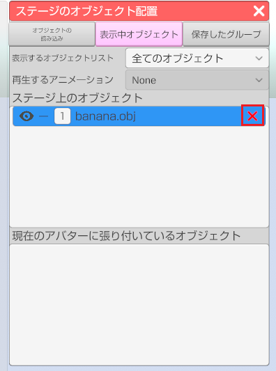

### 読み込んだオブジェクトグループの保存

>「保存したグループ」タブ内の「現在のステージの状態を追加」または「現在の体のオブジェクトを保存」をクリックすると
>ステージ上または体に貼り付けたオブジェクト情報をまとめて保存します。
 画像の①, ②, ④
>保存した場合同タブ内にリストとして表示されます。
 画像の③, ⑤
>
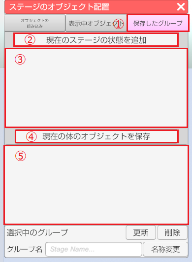

### 読み込んだオブジェクトグループの更新・削除

>「保存したグループ」タブ内に追加されたリストの「読み込む」ボタンをクリックすると保存したオブジェクト情報を読み込みます。
 画像の①
>リストを選択し「更新」をクリックすると同リストのオブジェクト情報を現在表示されているオブジェクト情報に更新します。
 画像の②
>リストを選択し「削除」をクリックすると同リストを削除します。
 画像の③
>リストを選択し「グループ名」のテキストを変更し、「名称変更」をクリックするとリストの名称を変更できます。
 画像の④, ⑤

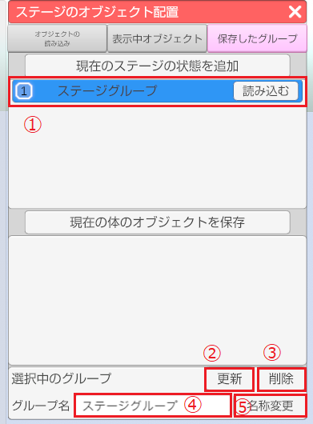

### 既知の不具合

>3teneのオブジェクトの読み込み機能でOBJファイル、FBXファイルであってもオブジェクトを読み込めない場合がございます。
>こちらにつきましては検証中となっております。予めご了承ください。
