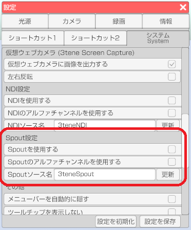
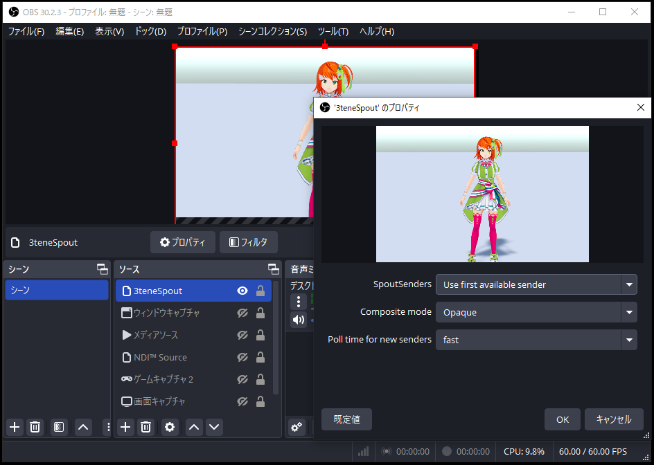

## Spout について

>Spout の経由の画面参照を行う事で他のアプリで 3tene の画面が参照可能になります。
>PC 外部への出力はできませんが仮想ウェブアカメラや NDI を使うよりも
>低負荷、低遅延になります。
>※3teneFREE は対応していません。
>※Windows 版の専用機能です。

>Spout を経由する 3tene の画面は
>仮想カメラ機能と同様にメニューやウインドウが録画対象とならないので
>アバターと背景のみの画面参照となります。

>この機能を利用するには、映像を参照するソフトウェアが
>Spout に対応している必要があります。

>録画配信ソフトの OBS では別途 Spout プラグインをインストールする必要があります。

### 3tene の設定

>下記サイトを開きます。

>設定 - システム - 「Spoutを使用する」 にチェックを入れます。
>Spout ソース名のデフォルトは「3teneSpout」ですが、変更することが可能です。

>受信側で 3tene 内で設定したソース名を選択すると映像が表示されます。

### OBS での使用方法

>OBS のプラグインである obs-spout2-plugin をインストールします。
>https://github.com/Off-World-Live/obs-spout2-plugin/releases
 
>インストールが完了するとソースに「Spout2 Capture」が追加されます。
>Spout2 Capture を追加し、プロパティの「SpoutSenders」 に複数ある場合は
>3tene で設定した「Spoutソース名」を選択してください。

### OBS のアルファチャンネル設定

>3tene の背景設定を「色設定」の「透過背景」に設定します。

>OBS のソースを右クリックして「プロパティ」を選択、
>「Composite mode」の Opaque を Default に変更します。
