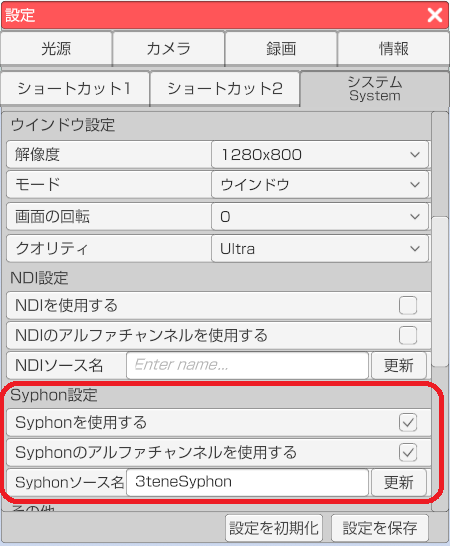
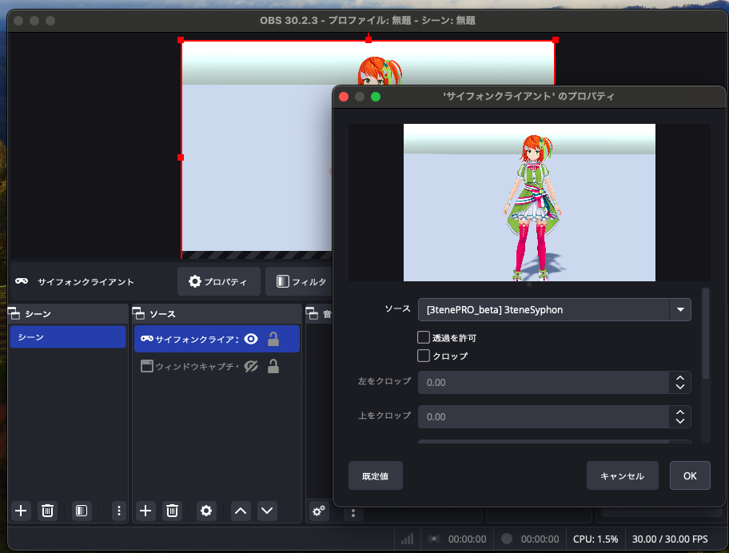
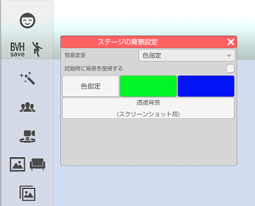

## Syphon について

>Syphon の経由の画面参照を行う事で他のアプリで 3tene の画面が参照可能になります。
>Mac 外部への出力はできませんが NDI を使うよりも低負荷、低遅延になります。
>※3teneFREE は対応していません。
>※Mac 版の専用機能です。

>Syphon を経由する 3tene の画面は
>仮想カメラ機能と同様にメニューやウインドウが録画対象とならないので
>アバターと背景のみの画面参照となります。

>この機能を利用するには、映像を参照するソフトウェアが
>Syphon に対応している必要があります。

>録画配信ソフトの OBS ではプラグイン無しで使用可能です。

### 3tene の設定

>下記サイトを開きます。

>設定 - システム - 「Syphonを使用する」 にチェックを入れます。
>Syphon ソース名のデフォルトは「3teneSyphon」ですが、変更することが可能です。

>受信側で 3tene 内で設定したソース名を選択すると映像が表示されます。

### OBS での使用方法

>ソースの「サイフォンクライアント」を選択して追加します。
>「サイフォンクライアント」のプロパティの「ソース」に
>3tene で設定した「Spoutソース名」を選択してください。

### OBS のアルファチャンネル設定

>3tene の背景設定を「色設定」の「透過背景」に設定します。

>OBS のソースを右クリックして「プロパティ」を選択、
>「透過を許可」をチェック状態にします。

