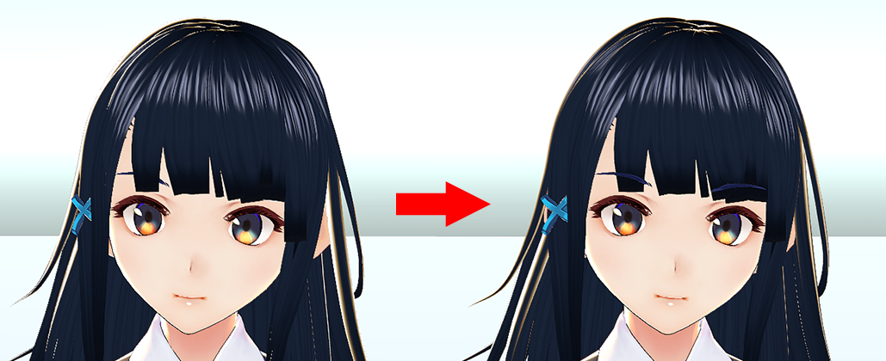
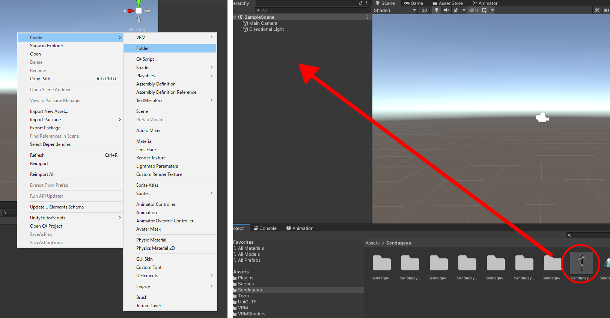
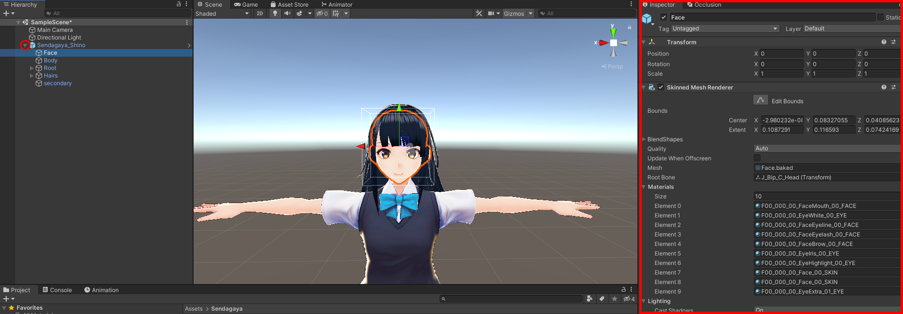
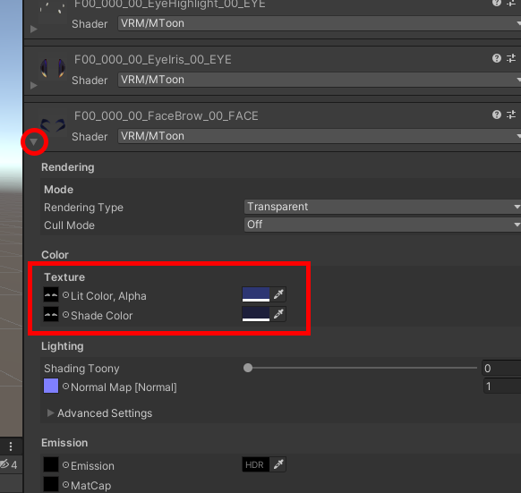
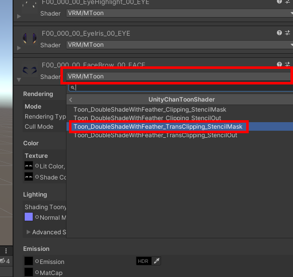
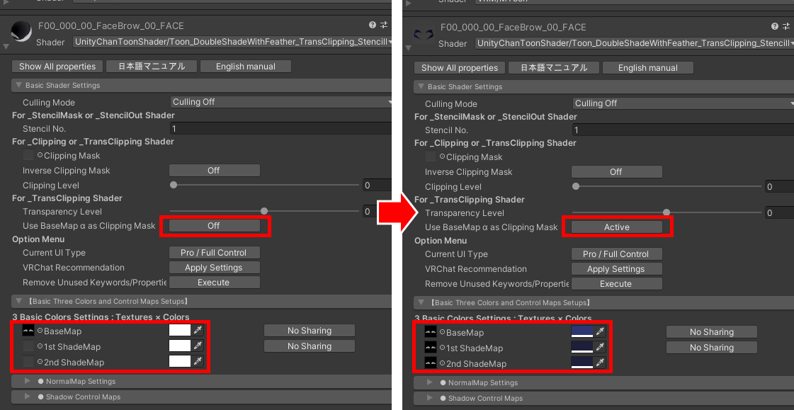
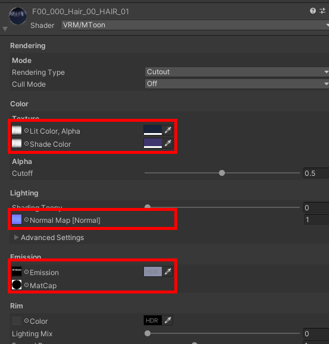
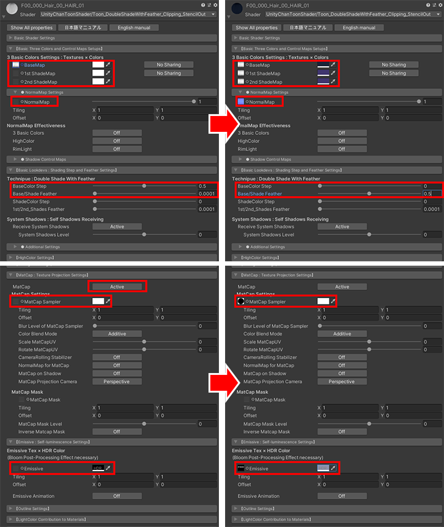

## Unity Chan Toon Shader について

>3tene Ver 2.0.15 以降では VRM 標準のシェ－ダー以外に
>UnityChanToonShader の下記４種のシェーダーが利用可能です。

>・Toon_DoubleShadeWithFeather_Clipping_StencilMask.shader
>・Toon_DoubleShadeWithFeather_Clipping_StencilOut.shader
>・Toon_DoubleShadeWithFeather_TransClipping_StencilMask.shader
>・Toon_DoubleShadeWithFeather_TransClipping_StencilOut.shader

>これによりアニメ風まゆげ（前髪の手前にまゆげが描画される。）等 の
>表現が可能になります。

>下記手順で VRM を作成すると設定されたシェーダーが有効になります。

>1. Unity 2019.4.20 で Vrm3teneExtensionProject を開く。
>2. 対象となる VRM をインポートする。
>3. 下記に記載されているシェーダーの設定を行う。
>4. VRM をエクスポートする。
>5. エクスポートした VRM を 3tene Ver 2.0.15 以降で読み込む。

>※ Vrm3teneExtensionProject は 3tene 公式より配布されている
>　UniVRM を含んだ Unity 用のプロジェクト一式です。

>#### 注意事項

>一般に配布されている通常の UniVRM では
>VRM 標準以外のシェーダー情報を持った VRM をエクスポートできないので
>Vrm3teneExtensionProject を使用する必要があります。

>※エクスポートの手順は通常の UniVRM 0.66 と同じ操作方法になります。
>※3tene の独自拡張機能となるので他ソフトウェアで
>　上記 VRM を読み込んでもシェーダーは無効になります。

>#### 関連リンク

>Vrm3teneExtensionProject への<a href="https://3tene.com//download_Vrm3teneExtensionProject/">直リンク</a>。

>Unity 2019.4.20 のダウンロードは<a href="https://unity3d.com/jp/get-unity/download/archive" target="_blank">こちら</a>から。

>VRoid Studio のダウンロードは<a href="https://vroid.com/studio" target="_blank">こちら</a>から。

>UnityChanToonShader のマニュアルは<a href="https://github.com/unity3d-jp/UnityChanToonShaderVer2_Project/blob/release/legacy/2.0/Manual/UTS2_Manual_ja.md" target="_blank">こちら</a>から。

### 眉毛前面表示の設定方法
>#### 眉毛前面表示設定前後比較
>

>#### 設定方法
>関連リンクからダウンロードした Vrm3teneExtensionProject を Unity 2019.4.20 で開きます。

>（本説明のモデルは VRoid Studio のサンプルモデル Sendagaya Shino を
>　そのまま出力した VRM ファイルを使用しています。）

>Assets（画面中央下部）内で右クリックをし読み込むVRM用フォルダ作成し、
>作成したフォルダ内に対象となる VRM ファイルをドラッグ&ドロップすると
>読み込みが開始されます。

>Hierarchy の Prefab を展開し Face を選択すると Inspector（画面右側）に詳細が表示されます。

>

>・眉毛マテリアルの設定例
>F00_000_00_FaceBrow_00_Face マテリアル を展開し下記情報をメモしておく
>Color > Texture > Lit Color Alpha のテクスチャとカラー
>Color > Texture > Shade Color のテクスチャとカラー

>

>F00_000_00_FaceBrow_00_Face の Shader を選択し
>UnityChanToonShader > Toon_DoubleShadeWithFeather_TransClipping_StencilMask を選択

>

>Basic Shader Settings
>For_TransClipping Shader > Use BaseMap α as Clipping Mask
>の「Off」をクリックし「Active」に変更

>【Basic Thre Colors and Control Maps Setups】
>BaseMap に Lit color Alpha のテクスチャとカラーと同様のものを設定
>1st ShadeMap、2nd ShadeMap に Shade Color のテクスチャとカラーと同様のものを設定

>

>・前髪マテリアルの設定例
>前髪に該当するマテリアルを展開し下記情報をメモしておく
>Color > Texture > Lit Color Alpha のテクスチャとカラー
>Color > Texture > Shade Color のテクスチャとカラー
>Lighting > NormalMap[Normal] のテクスチャ
>Emission > Emission のテクスチャとカラー
>Emission > MatCap のテクスチャ

>

>前髪に該当するマテリアル の Shader を選択し
>UnityChanToonShader > Toon_DoubleShadeWithFeather_Clipping_StencilOut を選択

>【Basic Thre Colors and Control Maps Setups】
>BaseMap に Lit color, Alpha のテクスチャとカラーと同様のものを設定
>1st ShadeMap、2nd ShadeMap に Shade Color のテクスチャとカラーと同様のものを設定

>NormalMap Settings
>NormalMap に NormalMap[Normal] のテクスチャを設定

>【Basic Lookdevs：Shading Step and Feather Settings】
>Technique：Double Shade With Feather
>BaseColor Step を 「0」 に設定
>Base/Shade Feather を 「0.5」 に設定

>【MatCap：Texture Projection Settings】
>MatCap の 「Off」をクリックし「Active」に変更
>MatCap Settings > MatCap Sampler に MatCap のテクスチャを設定

>【Emissive：Self-luminescence Setting】
>Emissive に Emission のテクスチャとカラーを設定

>

>設定前のモデルと見え方が異なる場合は各設定項目の調整をお試しください。
>UnityChanToonShader のマニュアルは<a href="https://github.com/unity3d-jp/UnityChanToonShaderVer2_Project/blob/release/legacy/2.0/Manual/UTS2_Manual_ja.md">こちら</a>

>・VRM 出力
>Hierarchy で 該当モデルを選択し、メニューバーの VRM0 から 「Export UniVRM-0.66.0」を選択
>Export をクリックし編集した VRM を出力します。

>