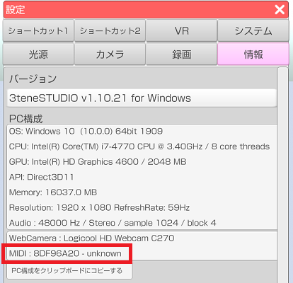

## MIDI について

>MIDI 機器を使ってショートカットを利用します。

>キーボードと違って 3tene のウインドウが非アクティブでも
>ショートカット機能が使えます。

### 対応する MIDI 機器

>ノートオンが発生する MIDI 機器であれば動作可能と思われます。

>MIDIコントローラや鍵盤楽器系がお勧めです。

### MIDI 機器の接続

>USB タイプの MIDI 機器は初回接続時にドライバがインストールされると
>3tene で特に設定しなくても使用可能になります。

>Windows のデバイスマネージャーでは
>「サウンド、ビデオ、およびゲーム コントローラー」に登録されるようです。

### MIDI 機器の確保と解放

>3tene を起動すると MIDI 機器の確保を行い、使用可能になります。

>設定ウインドウの「情報」タブで認識状態を確認できます。
>※機器名称が判別できず「unknown」と表示される場合がありますが
>　正常動作となります。

>3tene を起動すると MIDI 機器を確保するので
>他のソフトから対象となる MIDI 機器は使用できなくなります。
>※他のソフトで MIDI 機器を確保した状態で 3tene を起動した場合も
>　3tene では対象となる MIDI 機器が使用できなくなります。

>3tene を終了すると確保した MIDI 機器は解放されるので
>他のソフトから対象となる MIDI 機器は利用可能になります。

### ショートカットの設定

>キーボードやゲームパッドと同様の設定方法になります。

>[ショートカットタブ](#settingShortcut.md) を参照してください。

