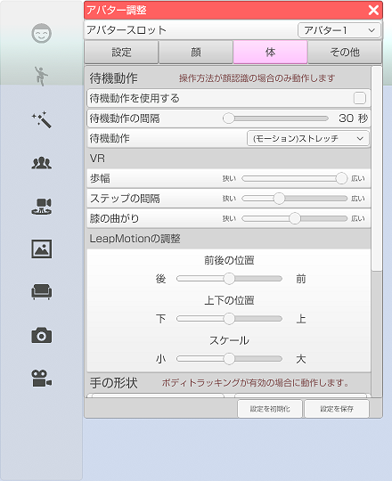

## アバター調整（体タブ）

>アバターのフェイストラッキングの調整や設定を行います。

### アバター調整のウインドウを表示する

>右側メニューの３番目のアバター調整をクリックします。
>※ 3teneSTUDIO は２番目になります。

>体タブを選択します。

### 待機動作

>アバター調整「設定」タブの操作方法が「顔認識」の場合のみ動作します。

>#### 待機動作を使用する

>オンにすると一定間隔で設定したモーションが動作します。

>#### 待機動作の間隔

>待機動作が発生するまでの時間を変更します。

>#### 待機動作

>ドロップダウンメニューで待機動作で使用するモーションを選択します。

### VR

>#### 歩幅

>ステップの移動量を変更します。

>#### ステップ間隔

>ステップの発生間隔を変更します。

>#### 膝の曲がり

>膝の曲がり具合を変更します。

### LeapMotion

>#### 前後の位置

>腕や手を動かす基準地の前後を変更します。

>#### 上下の位置

>腕や手を動かす基準地の上下を変更します。

>#### スケール

>値を大きくすると動きが激しくなります。

### 手の形状

>ボディトラッキング(VRやPerception Neuron)が有効な場合に動作します。

>#### 形状の変化速度

>手の形状が変化し終わるまでの時間を変更します。

### キャラクターの角度

>#### キャラクターの角度

>キャラクターの角度を変更します。
>LeapMotion を使用する場合はゼロで使用してください。

