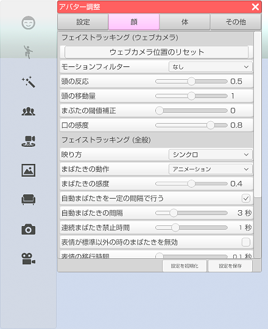

## アバター調整（顔タブ）

>アバターのフェイストラッキングの調整や設定を行います。

### アバター調整のウインドウを表示する

>右側メニューの３番目のアバター調整をクリックします。
>※ 3teneSTUDIO は２番目になります。

>顔タブを選択します。

### フェイストラッキング (ウェブカメラ)

>#### ウェブカメラ位置のリセット

>ウェブカメラの認識位置をリセットします。

>#### モーションフィルター

>ウェブカメラ使用時に動きにフィルターを通します。

>#### 体の前後の動作

>フェイストラッキング時の体の前後の動作を有効にします。
>[ウェブカメラによるフェイストラッキングについて](#ft_webcamera.md)

>#### 頭の反応

>値を大きくすると頭のフェイストラッキングの動き出すタイミングが敏感になります。

>#### 頭の移動量

>値を大きくすると頭の動きが激しくなります。

>#### まぶたの閾値補正

>まぶたの判定に関する値を調整します。
>まばたきの動作を「取得パラメータ」に変更すると確認がしやすいです。

>#### 口の感度

>口を動かした場合の感度を変更します。

### フェイストラッキング (iPhone)

>#### フェイストラッキングモード

>フェイストラッキングのモードを変更します  
>「iPhone位置変動」では iPhone を左右に動かすとアバターの体が左右にねじれます。  
>「iPhone位置固定」では iPhone画面内で顔を動かすとアバターの体が前後左右に動きます。

>#### 顔の回転の感度

>顔を動かしたときのアバターの顔の動きの感度を変更します。

>#### 体の回転の感度

>顔を動かしたときのアバターの体の動きの感度を変更します。

>#### まばたきの感度

>まばたきの感度を変更します。

>#### 口の感度（横幅）

>顔認識のリップシンク使用時の口の横幅の感度を変更します。

>#### 口の感度（縦幅）

>顔認識のリップシンク使用時の口の縦幅の感度を変更します。

>#### 表情自動変更

>表情自動変更機能を有効にします。

>#### 自動表情 - 喜 の感度

>表情自動変更使用時の「喜」遷移時の感度を変更します。

>#### 自動表情 - 怒 の感度

>表情自動変更使用時の「怒」遷移時の感度を変更します。

>#### 自動表情 - 喜 の感度

>表情自動変更使用時の「哀」遷移時の感度を変更します。

### フェイストラッキング (全般)

>#### 映り方

>・シンクロ → アバターが顔認識の結果で動きます。（左を向くとアバターは向かって右を向く。）
>・鏡 → アバターが顔認識の左右逆で動きます。（左を向くとアバターは向かって左を向く。）

>#### まばたきの動作

>まばたきの動作を変更します。
>・アニメーション → まぶたが一定よりも閉じると自動でまばたきをします。
>・取得パラメータ → 顔認識から取得した数値でまぶたを制御します。（じと目も可能になります）

>※取得パラメータ動作はウェブカメラだと精度が足りず望んだ結果にならない場合があります。
>　iPhoneX と 3teneFT 使用時にお勧めします。

>#### まばたきの感度

>まばたきアニメーションの開始判定を変更します。

>#### 自動まばたきを一定の間隔で行う

>オンにするとフェイストラッキングが動作していない場合に
>アバターがまばたきをします。

>#### 自動まばたきの間隔

>まばたきをするまでの間隔を変更します。

>#### 連続まばたき禁止時間

>まばたきをしてから指定されている時間を経過しないとまばたきをしません。
>※自動まばたきは対象となりません。

>#### 表情が標準以外の時のまばたきを無効

>アバターの表情を変更している状態でまばたきをすると
>表示が崩れる場合があるのでオンにするとまばたきを抑制します。

>#### 表情の移行時間

>表情が変化するまでの時間を変更します。

### リップシンク

>#### 入力ゲイン（音声）

>音声認識を使用している場合の音に対する感度を変更します。
>設定「システム」の「マイク入力を再生する」をオンにした場合の音量も変化します。

>#### 応答性（顔認識）

>顔認識のリップシンクの応答性を変更します。

>#### 応答性（音声）

>音声のリップシンクの応答性を変更します。

### 目線

>#### カメラ目線

>オンにするとカメラの向いている方向に目線を向けます。
>目の移動範囲が狭いモデルデータでは動きが小さくなります。

