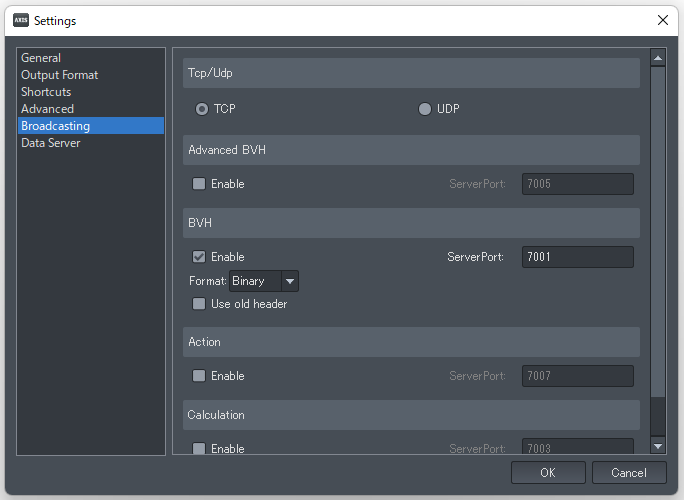
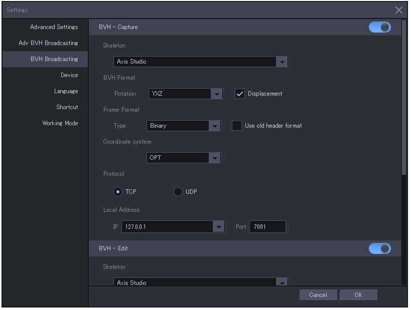

## Perception Neuronについて

### PerceptionNeuron のセンサー(Neuron)の取り扱いについて

>PerceptionNeuron を使い終わったら必ずセンサーを固定ベルトから取り外して
>専用の金属ケースにしまってください！！！

>詳しくは[注意事項 | Perception Neuron by Noitom](https://neuronmocap.com/node/1589)を参照してください。

### 必要機材について

>・Windows10 64bit OS を搭載したPC
>　Core-i7 4770 (４コア、8スレッド) 、メモリ16GB で動作確認しています。
>　CPU内蔵のグラフィック機能でも動作はしますが、処理落ちが発生します。
>　NVIDIA GeForce シリーズもしくは AMD Redeon シリーズの
>　グラフィックボード(GPU)を別途、搭載する事をお勧めします。
>　（Core-i7 4770 と GeForce GTX 1050 Ti の組み合わせで処理落ちは感じられません。）

>・PerceptionNeuron 本体（センサー32個もしくは18個）
>　※PerceptionNeuron Ver 2.0 および Pro で動作を確認しています。

>・モバイルバッテリー (出力 2A 以上が必須。)
>　※モバイルバッテリーが必要になるケース
>　　・指も含めたフルキャプチャー（センサー31+1個モード）を行う。
>　　・PerceptionNeuron と PC を WiFi で接続する。

>　PerceptionNeuron を指センサー無しのセンサー18個モードかつ
>　PCとUSB有線で接続する場合はモバイルバッテリーは不要です。

### ソフトウェアのインストールとセットアップ

>1. 機器に応じた専用ソフトをインストールする。（日本語は未対応）
> ※Perception Neuron (初代) と V2 は Axis Neuron をインストールします。
> ※Perception Neuron PRO は Axis Neuron PRO をインストールします。
> ※Perception Neuron 3 と Studio は Axis Studio をインストールします。
>2. 専用ソフトを起動する。
> ※AxisStudio の起動には USB ドングル が必要です。
>3. 各種設定を行う。

### PerceptionNeuron を装着する前に

>・装着者はスマートフォンや携帯電話など、電波の発生する物を
>　所持していた場合は取り出して離れた場所に置いておく。
>・部屋の電気製品は可能な限り電源を OFF にする。（可能ならコンセントから抜く。）

### PerceptionNeuron を磁気から避ける

>PerceptionNeuron は磁気の影響で精度が低下してしまいます。
>キャリブレーションやキャプチャの精度を上げたい場合は磁気を避ける努力をしましょう。

#### 磁気が発生する物は？

>1. 電気が流れると少なからず磁気が発生する。
>2. 磁石など最初から磁気を発生している物質。
>3. 磁気に長い間さらされて磁化した金属。
>4. 地面（地球）

#### 回避策

>まず１については電気製品を最小限にします。
>消費電力が大きい物はなるべく OFF にしてください。
>特に電気関連の電源回路には近づかないでください。
>パソコンも例外では無いので装着者（アクター）とは別に
>パソコンを操作するオペレーターが居ると良いです。
>※キャリブレーションは必ずパソコンから離れて行ってください！

>２は磁石が使われている製品に近づかないでください。
>スピーカーやマイクにも使われているので使用する場合は
>なるべく小さい物を使えば影響は少ないと思います。

>３は金属に囲まれた環境で使用しない事です。
>鉄骨、鉄筋構造のマンションやビルでは
>部屋の隅や柱など金属が近くにあると思われる場所を避ける。
>鉄道（電車）や鉄塔が近くにあると影響を受けるかもしれません。
>車内などの使用も避けてください。

>４は木材のパレット等を用意してその上で使用すると
>地面からの影響を下げる事ができます。
>構造物の場合は２階以上だと影響は少ないかと思います。

### PerceptionNeuron Ver 2 の装着

> 1. 袋から各部位の固定ベルトを取り出して金属ケースに入っているセンサーを取り付ける。
> 2. 固定ベルト「体頭」を装着する。
> 3. 固定ベルト「体頭」に「ハブ」を固定する。
> 4. 固定ベルト「肩」を装着する。両肩。
> 5. 固定ベルト「体頭」と「肩」をケーブルで連結する。両肩。
> 6. 固定ベルト「足」を装着する。両足。
> 7. 固定ベルト「体頭」と「足」をケーブルで連結する。両足。
> 8. 固定ベルト（グローブ）「手」を装着する。両手。
> 9. 固定ベルト「肩」と「手」をケーブルで連結する。両手。
>10. USBケーブルで PC と「ハブ」を繋いてビープ音が鳴るのを確認する。
>11. モバイルバッテリーを繋ぐ。
>12. Axis Neuron でコネクトボタンを押し、「ハブ」を認識しているか確認する。
>13. 認識していれば一覧に表示されるので「Connect」ボタンで接続を行う。
>14. 固定ベルトの全てのセンサーが赤く点灯もしくは点滅しているのを確認する。
>　　※全て点滅していなければケーブルの抜き差しを試す。
>　　※点灯していないセンサーがある場合は連結ケーブルやセンサーの取り付け部を確認する。
>15. Axis Neuron の右側にある「Sensor Map」でセンサーが全て緑もしくは黄色で認識しているのを確認してください。
>　　センサーが全て点灯しているのに「Sensor Map」で認識していない場合は
>　　「Disconnect」で切断し、「Connect」で再接続後に認識を確認してください。

### PerceptionNeuron Pro の装着

準備中。

### PerceptionNeuron 3 の装着

>参考 <a href="https://www.youtube.com/watch?v=KdryfjN8pvs" target="_blank">Youtube</a>

### PerceptionNeuron Studio の装着

>参考 <a href="https://www.youtube.com/watch?v=WkBLCdhJwC0" target="_blank">Youtube</a>

### Axis Neuron (PRO, Studio) の設定を変更する

>Axis Neuron を起動する。
>メニューの「File → Settings」を選択して設定ウインドウを表示する。
>「Broadcating」タブを選択し、「BVH」の「Enable」にチェックを付ける。

>AxisNeuron (PRO) の設定ウインドウ

>AxisStudio の設定ウインドウ

>※AxisStudio では BVH-Capture と BVH-Edit で二つに分かれているので競合に注意してください。
>（リアルタイムで処理する場合と保存済みモーションでポート番号が異なります。）

### Axis Neuron よる PerceptionNeuron のキャリブレーション

>センサーが完全に認識された状態で右側のセンサーマップの下にあるボディサイズを選択した後に
>キャリブレーションを開始します。
>装着者が各種ポーズをとり、キャリブレーションを行います。

>※ボディサイズはアクターのサイズを予め計測して登録しておく事をお勧めします。

### 3tene でモデルを動かす

> 1. Axis Neuron を起動したまま 3tene を起動します。
> 2. 3tene で VRM のモデルを読み込む。
> 3. アバターの調整ウインドウで「設定」タブを選択。
> 4. 「アバターの操作方法」を PerceptionNeuron にする。
> 5. トラッキングウインドウから体のトラッキングを開始する。(3teneSTUDIO)
>　　アバターが Axis Neuron と同じ動きをするかを確認する。

### 複数の PerceptionNeuron で複数モデルを動かす

>PerceptionNeuron を２つ使用する場合を例とします。

>接続形態は２種類あります。

>・複数台のPCを接続する方法
>PC を２台用意してそれぞれの AxisNeuron(Studio) と接続して使用します。

>この方法は種類の異なる PerceptionNeuron を混在して使用可能です。
>(PerceptionNeuron PRO + PerceptionNeuron 3 など。)

>２台の PerceptionNeuron の空間座標は共有されないので２人が関わらない動作に向いています。
>※２人が自分パートを踊るだけなど。

>・１台のPCで動かす方法
>AxisNeuron(Studio) に PerceptionNeuron ２台を認識させ、
>3tene で ActorID を選択して使用する PerceptionNeuron を指定します。
>ActorID = 0 は１台目、ActorID = 1 は２台目を指定する動作となります。

>AxisNeuron(Studio) は対応している PerceptionNeuron 以外は認識しませんので
>種類の異なる PerceptionNeuron を混在して使用できません。

>２台の PerceptionNeuron の空間座標は共有されるので２人の連携動作も無理ではありません。
>※２人でハイタッチするなど。

