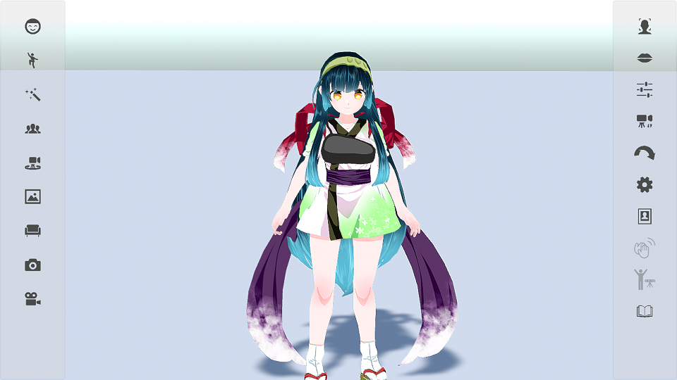
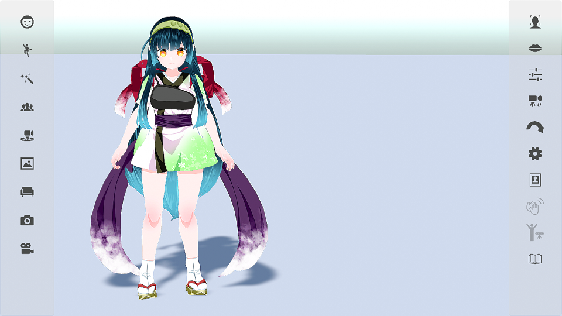
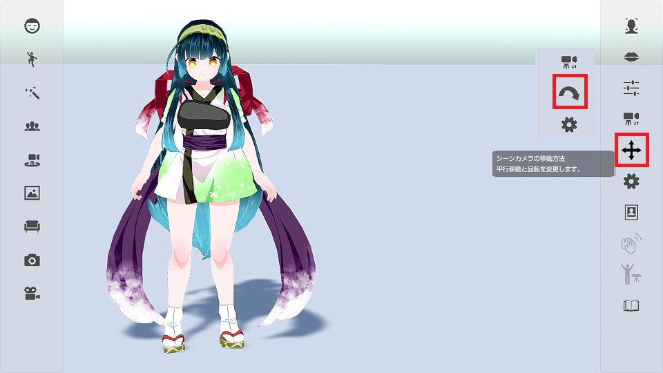
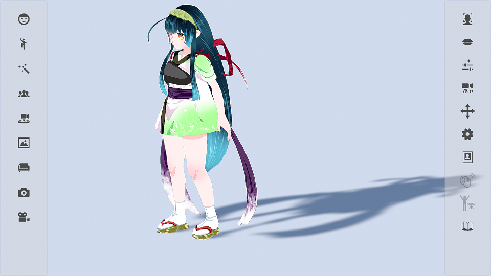

## シーンカメラについて

>シーンカメラを移動させてアバターを見る位置や角度を変更します。

### カメラの平行移動

>シーンカメラは起動時に平行移動に設定されています。
>その状態でマウスの右ボタンをドラッグ操作するとカメラが上下に移動します。

>この状態でマウスの右ボタンを左にドラッグ操作すると…

>左側に移動します。

### カメラの回転移動

>右側メニューのシーンカメラの切り替えをクリックすると回転に切り替わります。

>この状態でマウスの右ボタンをドラッグ操作すると…

>カメラが回転移動します。

