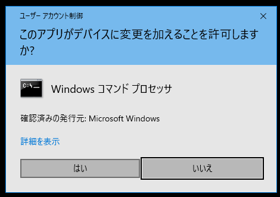
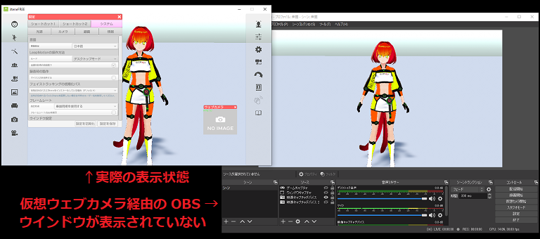

## 仮想ウェブカメラについて

>この機能を利用するには、別途 UnityCapture のインストールが必要です。
>※ Mac版は対応していません。

### UnityCapture を使います

>UnityCapture を使用して 3tene の映像を仮想ウェブカメラに出力する事により
>ウェブカメラ対応の録画、配信ソフト（OBSなど）でキャプチャする事が可能になります。

>また、仮想ウェブカメラを経由した出力ではメニューやウインドウが
>録画対象とならないのでアバターと背景のみが録画可能になります。

### UnityCapture の入手

>下記サイトを開きます。

>schellingb/UnityCapture
>https://github.com/schellingb/UnityCapture

>ページ内の「Clone or download」をクリックし、「DownLoad ZIP」を選択すると
>ZIPファイルのダウンロードが始まります。

>ダウンロード完了後、ZIPファイルを任意の場所に解凍します。
>解凍したファイルは Windows の設定（レジストリ）に登録しますので
>登録作業を行う前に UnityCapture のフォルダを問題のない場所に移動してください。
>※登録後も UnityCapture のフォルダは削除しないで下さい。

### UnityCapture の登録作業

>解凍した「UnityCapture-master」フォルダを問題のない場所に移動後、
>フォルダ内の「Install」を開きます。

>「install.bat」ファイルを右クリックして、「管理者として実行」を実行します。
>※Windows の保護が表示された場合は「詳細情報」をクリック後、
>「実行」を選択してください。

>「デバイスの変更の許可」が表示されるので「はい」を選択してください。

>UnityCaptureFilter32bit.dll および UnityCaptureFilter64bit.dll の
>登録成功が表示されエラーが出なければ登録完了です。

>3tene の画面が仮想カメラに出力されるようになります。
>ウェブカメラ対応ソフトウェアで 3tene の画面を選択可能になります。

### 仮想ウェブカメラを OBS で使用する

>下記サイトより OBS をダウンロードします。

>OBS (OBS Studio)
>https://obsproject.com/ja

>インストールを行い、OBS を起動します。
>「ソース」の追加で「映像キャプチャデバイス」を選択します。
>新規作成で任意の名前を入力し「OK」をクリックします。
>デバイスの選択欄で「Unity Video Capture」を選択し、「OK」を
>クリックすると 3tene の画面が表示され録画が可能になります。

### UnityCapture のソフトウェア相性について

>UnityCapture の仮想ウェブカメラは OBS にて動作確認をしていますが、
>一部のウェブカメラ対応ソフトではウェブカメラとして認識せず、
>「Unity Video Capture」が表示されないのを確認しています。
>※認識しないのは UnityCapture もしくはウェブカメラ対応ソフトの問題となります。

>また、UnityCapture に対応している別のソフトウェアと同時使用すると
>UnityCapture の出力がチラつくのを確認しています。（VDRAW 等）

