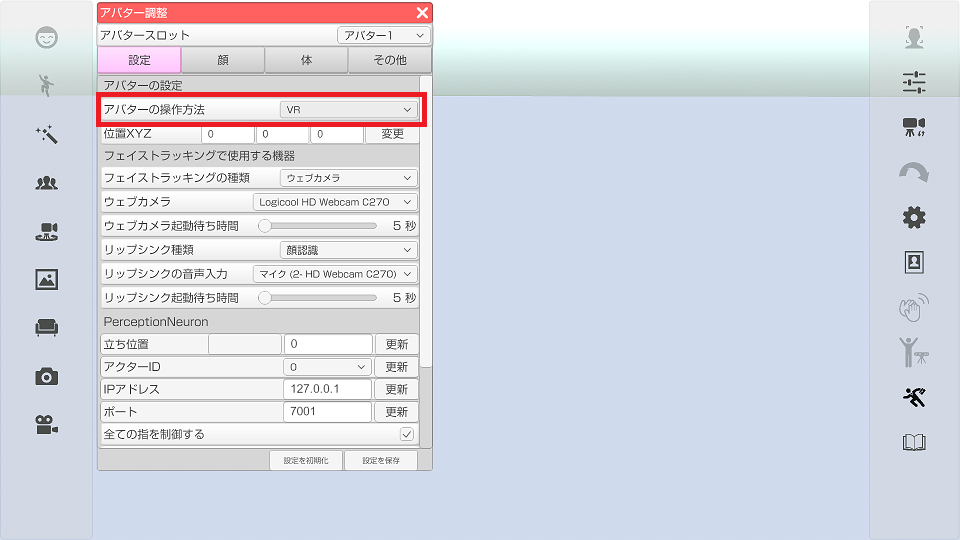
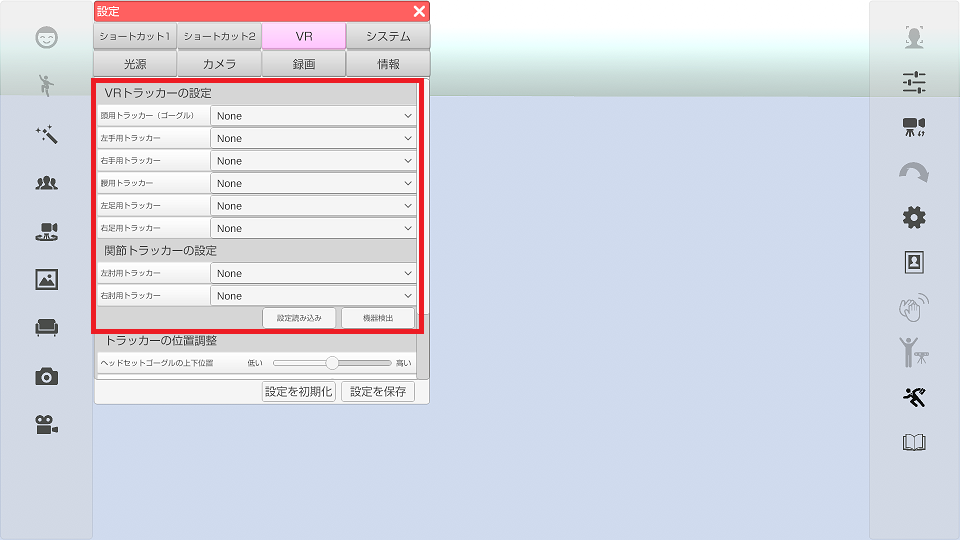
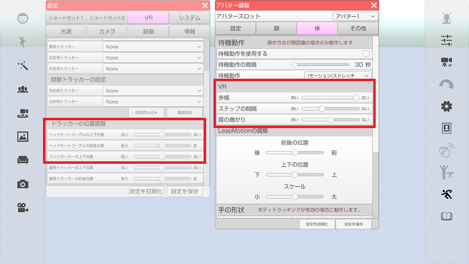
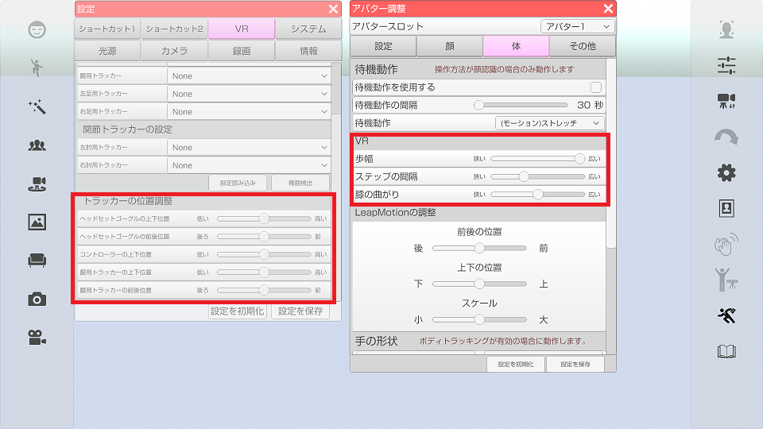
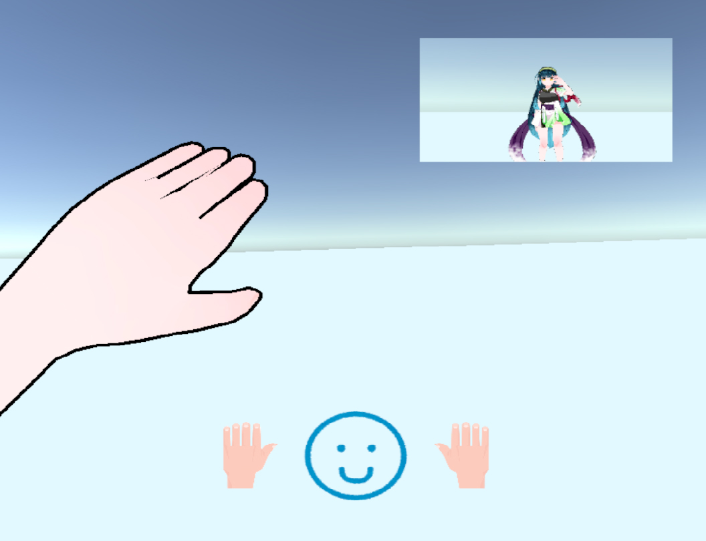

## VRモードの使い方

>HTC Vive や Oculus Rift を使用してアバターを操作します。

>対応しているVR機器については[こちら](#equipment.md)を参照してください。

### 使用環境の注意点

>HTC Vive や Oculus Rift は赤外線センサーを使用して機器の検出を行っています。
>機器の認識率に影響しますのでセンサーの赤外線を邪魔しないように
>下記の項目に気を付けてください。

>・直射日光が当たらない事。
>・大きな鏡や窓ガラス等、赤外線を反射する物が近くに無い事。
>・ストーブ、防犯カメラ等の赤外線を射出する物が無い事。
>・赤外線を吸収しない服装（白色等）は避ける事。

>窓には黒いカーテン等を設置する事をお勧めします。

>USB 3.0 と WiFi は干渉します。
>トラッカーを使う場合にはドングルとヘッドセットのケーブルを近づけないでください。
>また、ドングル同士も 10cm 以上離して設置してください。

>また、使用する PC の USB 端子は USB 3.x 対応が推奨となります。
>UEFI (もしくはBIOS) で USB 2.0 (EHCI) と USB 3.x (XHCI) が自動切換えになっていると
>トラッカーー使用時の認識率が低下する事があるようなので
>自動切り替えではなく USB 3.x もしくは 2.0 に固定する設定だと安定するかと思います。
>※初期設定では自動切換えになっている事が多いようです。

### VRモードの設定

>アバターの調整でアバターの操作方法を「VR」に変更します。

### VRヘッドセット、コントローラ、トラッカーの認識

>設定のVRタブでトラッカーの認識状態の確認および部位の割り当てを行います。

### ヘッドセット + コントローラー2本で操作する（トラッカー無しの場合）

>VR装着者がＴポーズをとり、左右コントローラどちらかのメニューボタンを押すと
>キャリブレーションが行われます。

>その後、設定「VR」タブのトラッカーの位置調整からモデルの大きさに合わせてそれぞれを調整します。
>アバターを調整 から 歩幅、ステップの間隔、膝の曲がり をそれぞれを調整します。
>・歩幅：足の幅
>・ステップの間隔：ヘッドセットの位置への足の追従の大きさ
>・膝の曲がり：膝を曲げた際の曲がり具合（内股、ガニ股）

### ヘッドセット + コントローラー2本 + トラッカー1～3個で操作する

>VR装着者がＴポーズをとり、左右コントローラどちらかのメニューボタンを押すと
>キャリブレーションが行われます。

>設定「VR」タブのトラッカーの位置調整で下記の設定を行います。
>腰用トラッカーの上下、前後を調整します。
>ヘッドセットゴーグルの前後位置 からヘッドセットの位置を調整します。
>アバターを調整 から 膝の曲がり を調整します。
>・膝の曲がり：膝を曲げた際の曲がり具合（内股、ガニ股）を調整します。

### ヘッドセット内の画面

>VRヘッドセット内の下側のアイコンはそれぞれ 左手 , 表情 , 右手 の現在の状態です。
>右上の映像はPCに表示されている映像（録画する事が出来る映像）になります。

### 操作方法

>コントローラーのタッチパッドまたはスティックで手の形を変更可能です。
>右コントローラー：上-自然体 下-握る 左-人差し指 右-ピース
>左コントローラー：上-自然体 下-握る 左-ピース 右-人差し指

>コントローラーのトリガーを引いた状態でタッチパッドまたはスティックを操作すると
>表情の変更が可能です。
>上-平穏 下-喜び 左-怒り 右-悲しい

### トラッキングを開始する (3tene V2 以降)

>3tene でボディトラッキングを VR に設定します。
>
>3tene のトラッキングを開始します。
>

