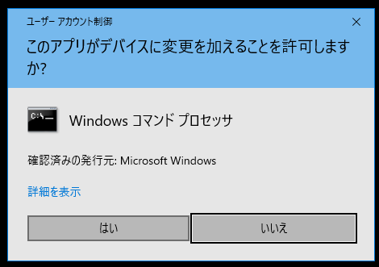
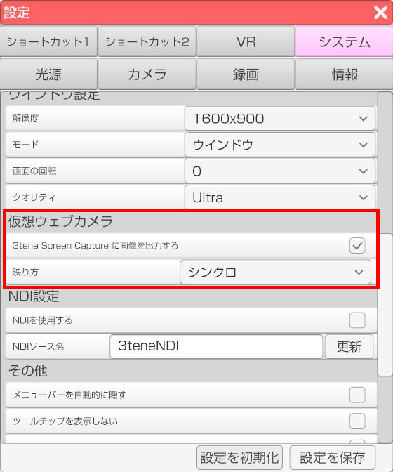

## 仮想ウェブカメラについて

>Windows 版の 3tene は 3tene Screen Captureという
>仮想ウェブカメラ機能を標準搭載しています。

>仮想ウェブカメラを使うと 3tene の画面をウェブカメラ映像として利用する事が可能になります。
>メニューやウェブカメラプレビュー等の2D画像は出力されません。

### 注意事項

>※Steam 版はインストーラが無いので仮想ウェブカメラが自動登録されません。
>　下記の「3tene Screen Capture」の再登録の仕方を参照してください。
>※Mac版は対応していません。

>3tene Ver 2.0.6 以降は UnityCapture を使用しなくなりました。
>旧バージョン(Ver 2.0.5 以前)の[UnityCapture設定](#UnityCapture.md)

>UnityCapture がインストール済みの場合はインストールされたフォルダにある
>Uninstall.bat を実行後、ファイルを削除する事でアンインストールされます。

>3tene インストール後に 3tene のフォルダを移動すると
>「3tene Screen Capture」が動作しなくなります。
>この問題を解決するには、フォルダを元に戻すか、
>手動による「3tene Screen Capture」の再登録が必要になります。

### 「3tene Screen Capture」の再登録の仕方

>3tene のインストールされたフォルダの中に
>「3teneScreenCapture」フォルダがあるので開きます。
>C:\Program Files\PLUSPLUS\3tene〇〇〇

>Steam 版のデフォルトのインストールフォルダは下記になります。
>C:\Program Files (x86)\Steam\SteamApps\Common\3tene\3tene
>※Steam のインストール方法や設定によっては異なる場合があります。

>フォルダの中にある「install.bat」を右クリックして、「管理者として実行」を実行します。
>※Windows の保護が表示された場合は「詳細情報」をクリック後、
>「実行」を選択してください。

>「デバイスの変更の許可」が表示されるので「はい」を選択してください。

>登録成功が表示されエラーが出なければ登録完了です。

>3tene の画面が「3tene Screen Capture」に出力されるようになります。

### 仮想ウェブカメラの使用方法
>設定 - システム - 仮想ウェブカメラ の「3teneScreenCaptureに画像を出力する」にチェックを入れると仮想ウェブカメラを使用することが出来ます。
>映り方を変更すると出力する映像を変更することが出来ます。（シンクロ or 鏡）

### 仮想ウェブカメラの特徴

>ウェブカメラ対応のソフトウェアに 3tene の画面を表示させる事が可能になります。
>OBS (配信ソフト)や、ZOOM（ミーティングソフト）等、いろいろな用途に使えます。

>ウェブカメラ一覧で「3tene Screen Capture」を選択してください。

>また、仮想ウェブカメラに出力される画像は 3tene 画面内にあるメニューやウインドウが
>対象とならないのでアバターと背景のみが表示されます。

### 仮想ウェブカメラを OBS で使用する

[OBS との連携について](#AboutOBS.md) を参照してください。

### 「3tene Screen Capture」のソフトウェア相性について

>仮想ウェブカメラは OBS と ZOOM にて動作確認をしていますが、
>一部のウェブカメラ対応ソフトではウェブカメラとして認識せず、
>「3tene Screen Capture」が表示されない可能性があります。
>※認識しない場合はウェブカメラ対応ソフトに問い合わせてください。

