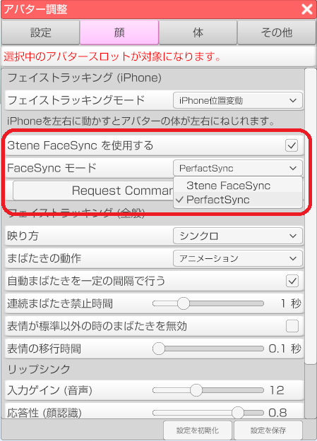

## 3tene FaceSync について

### PerfectSync の利用

>PerfectSync を利用するには 3teneFT と PerfectSync 対応の VRM モデルが必要です。

>3teneFT ver 1.1.2 で舌の動きに対応しています。
>※3teneFT ver 1.1.1 以前でも PerfectSync は使えますが、舌に対応していません。

### 設定

>「3tene FaceSyncを使用する」にチェックします。
>使用するモデルに合わせてモードを選択します。

>#### 3tene FaceSync モード
>PerfectSync に簡易対応した VRoidStusio 製の VRM で使用します。
>まばたき、目などの動きは従来の 3tene と同じ処理、それ以外は PerfectSync で動作します。

>#### PerfectSync モード
>PerfectSync に完全対応した VRM モデルで使用します。
>全ての動作を PerfectSync で行います。

### 制限事項

>3tene FaceSync 利用時は音声リップシンクは使えません。
>※リップシンクが無効状態でも顔認識で動作します。

### PerfectSync 簡易対応の VRM を作成する

>VRoidStudio で作成され、PerfectSync に対応しているベースのVRMモデルを用意します。
>ベース VRM モデルが作成された VRiodStudio と同じバージョンで出力されたモデルを用意します。

>FaceForge を使用してベース VRM モデルから PerfectSync 情報をコピーします。
>生成される VRM モデルの動作保証はされないので注意してください。

