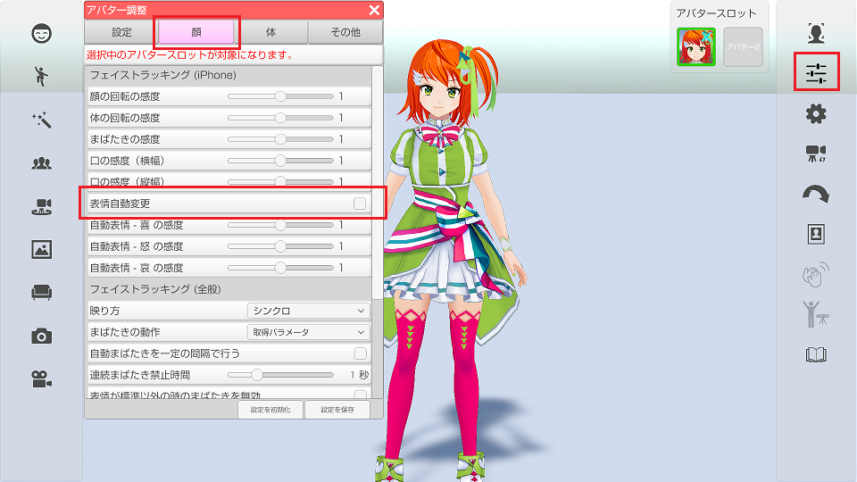
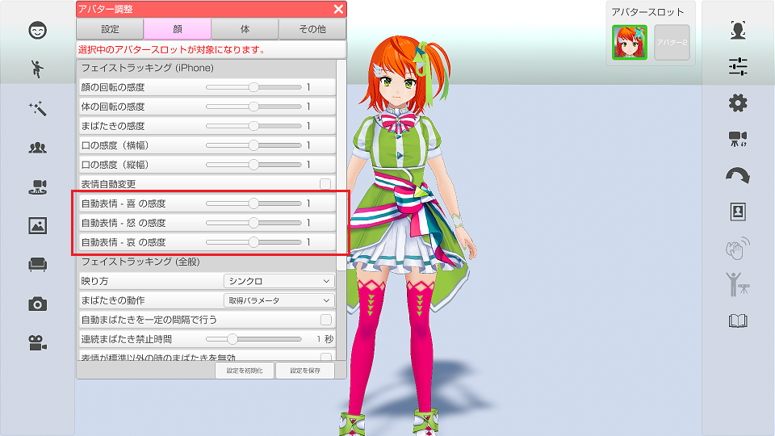
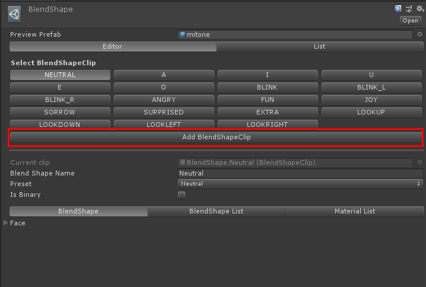
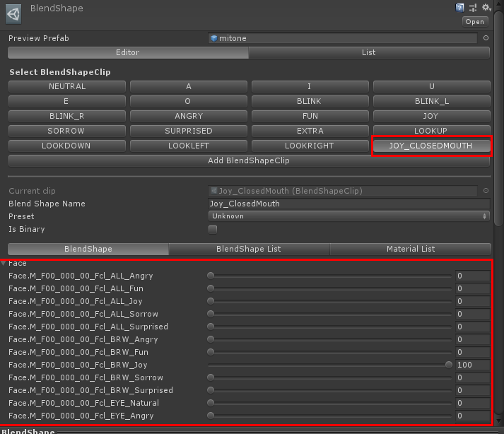

## iPhoneX フェイストラッキングの表情自動変更(表情認識)

### 表情の認識について

>iPhoneX の高精度なフェイストラッキングを使う事で演者の表情を読み取り、
>アバターの表情を「楽しい(Joy)、怒り(Angry)、悲しい(Sorrow)」に変更します。

>VRoidStudio 以外で作成した VRM モデルは
>VRM 標準の Joy、Angry、Sorrow の表情が存在している必要があります。

### 準備と設定

> 最初に iPhone でフェイストラッキングが動作する事を確認してください。
>[iPhoneXによるフェイストラッキングについて](#ft_iphone.md)

>アバター調整 → 「顔」タブ → 「表情自動実行」にチェックを付けます。

### 認識具合を確認する

>iPhoneX フェイストラッキングを開始します。

>表情認識は下記を意識して表情を作ると操作しやすくなります。

>Joy → 広角を広げる
>Angry → まゆげを下げる
>Sorrow → まゆげを上げる

>認識がうまく行われない場合は感度を変更する事で改善します。

### 自動表情変更と口の動きの競合について

>自動表情変更が有効な状態で口を動かすと
>表情の口設定と競合して正常な口の形状にならない場合があります。
>（VRM モデルの作り方によって影響度が違います。）

>VRoidStudio で作成したモデルに対しては対策を行っているので競合は起きませんが、
>モデリングソフトで独自に作成した VRM モデルはこの問題の対象となります。

### 独自の VRM モデルで競合を回避する方法

>自動表情変更で使用する表情のカスタム設定をVRMに追加します。
>Unity で VRM に下記の名前の BlendShape を追加する事によって競合を回避可能となります。
>また、自動表情変更で使用する表情をカスタムしたい場合も下記の名前で BlendShape を作成してください。
>(作成した BlendShape が優先となります。)

>BlendShape名：Joy_ClosedMouth → 口だけを標準にした楽しい
>BlendShape名：Angry_ClosedMouth → 口だけを標準にした怒り
>BlendShape名：Sorrow_ClosedMouth → 口だけを標準にした悲しい

>

### 独自BlendShape追加手順
>1. Unity で読み込んだモデルの BlendShape の設定画面で「Add BlendShapeClip」をクリックすると、
>新しく BlendShape を追加することが出来ます。

>

>2. 追加する際に BlendShape 名を該当の名前で作成します。
>※「Joy_ClosedMouth」「Angry_ClosedMouth」「Sorrow_ClosedMouth」

>

>3. 編集する BlendShape 名を選択し、シェイプキーの値を設定します。
>この時、口の形を大きく変形させると BlendShape「A」「I」「U」「E」「O」と競合し、
>口の形が崩れる場合があります。（3tene内のリップシンク使用時）

>

>4. BlendShape の設定が完了したら、VRMを出力し、3tene で読み込みます。

>5. 表情の変更で「Joy_ClosedMouth」「Angry_ClosedMouth」「Sorrow_ClosedMouth」
>の動きを確認してください。正しく設定されている場合は、設定した表情へ変化します。

>

>6. 表情の設定に問題ない場合は自動表情変更で、設定に追加した表情に変化させることが出来ます。
>※自動表情変更の手順は本ページ上記をご確認ください。

