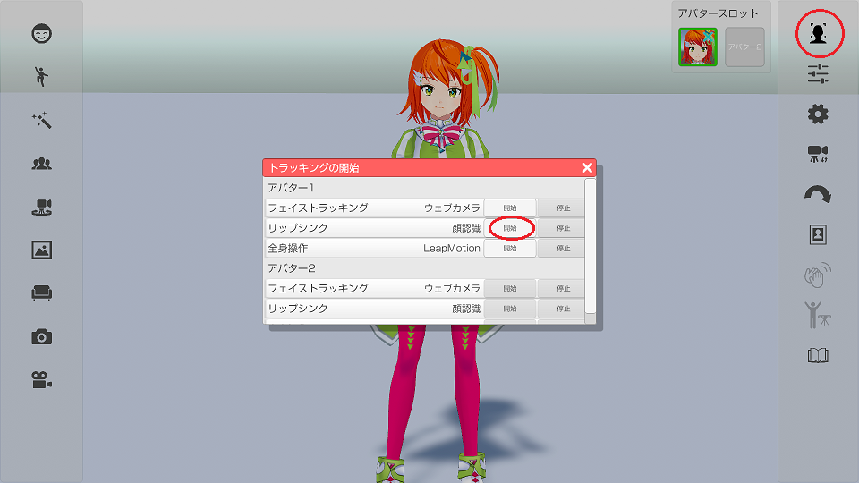

## リップシンクについて

>アバターの口を動かす機能です。２種類のモードがあります。

>アバターの調整「設定」および「顔」タブで設定を確認してください。

### リップシンクの種類

>・「顔認識」：フェイストラッキングで口を認識して動かします。
>　※顔認識は口の大きさや形状など個人差の影響を受けます。

>・「音声認識」：マイクからの入力で口を動かします。
>　※音声認識はマイクが周囲の音（ＢＧＭや騒音）を拾って反応してしまう場合があります。

### 音声入力

>「音声認識」が選択されている場合に使用するマイク等の機器を指定します。
>　「ステレオミキサー」を選択すると他のソフトで再生中の音でもリップシンクが可能です。
>　※環境によって「ステレオミキサー」が無い場合もあります。

### リップシンクの有効、無効を切り替える

>右側メニューのトラッキング開始のアイコンをクリックして
>トラッキング開始のウインドウを表示します。
>リップシンクの開始ボタンをクリックするとリップシンクが開始されます。

