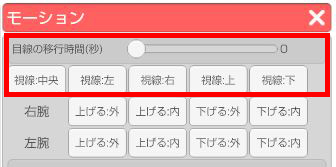
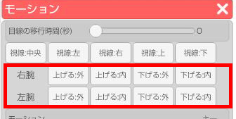
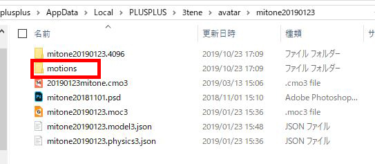
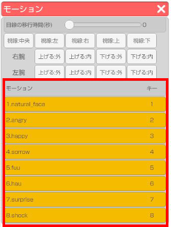
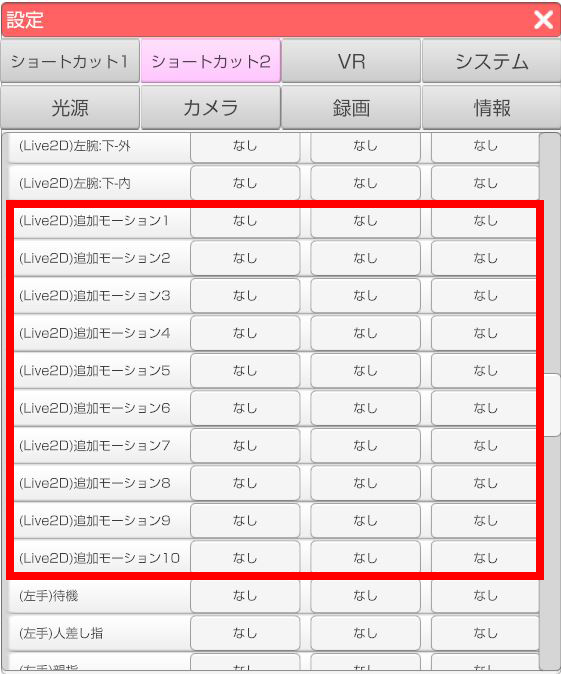

## モーション（Live2D）について

>読み込んでいるアバターがLive2Dの場合、左側メニュー上から2番目の「モーション」アイコンをクリックするとLive2D用モーションウインドウが開きます。
>ウインドウ内のモーションリストのボタンをクリックするとアバターが動きます。
>※デフォルトモーションは入っておりません。

### 目線について

>Live2D用モーションウインドウ上部の「目線の移動時間」でLive2Dモデルの目線の移動時間を設定します。
>「視線：〇〇」ボタンで該当の方向に目線を移動させます。
>※パラメータ「ParamEyeBallX」「ParamEyeBallY」が必要

### 腕の動きについて

>Live2D用モーションウインドウ内の「右腕」「左腕」右側のボタンをクリックすることで該当の方向に腕を動かせます。
>※3tene用パラメーター「ParamArmLX」「ParamArmLY」「ParamArmRX」「ParamArmRY」が必要

### Live2Dモーションの読み込ませ方

>Live2Dモデル読み込み時に「motions」フォルダを作成し、その中に作成したモーションファイルを入れて3teneに読み込んでください。

>3teneに読み込み後は、Live2D用モーションウインドウのリストに追加されます。
>※画像はみとねのモーションデータ

>ショートカットの設定は 設定 - ショートカット2 から行うことが出来ます。
>※ショートカットキーは10個まで対応

