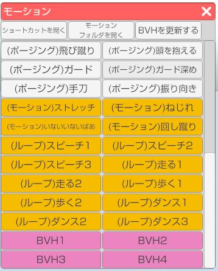
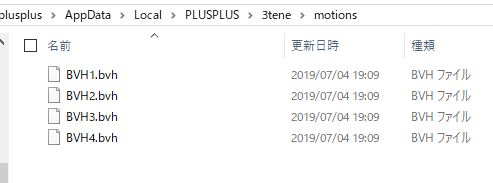
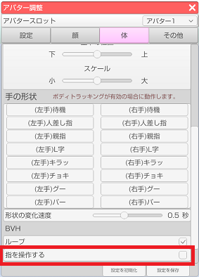
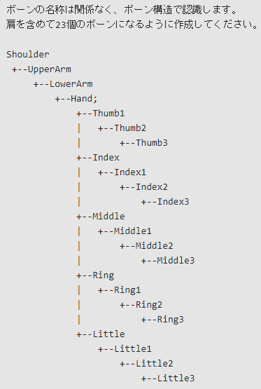

## モーション（VRM）について

>左側メニュー上から2番目の「モーション」アイコンをクリックするとモーションウインドウが開きます。
>※Live2D のアバターを読み込んでいる場合には別のモーションウインドウが開きます。
>ウインドウ内のモーションリストのボタンをクリックするとアバターが動きます。

### モーションデータリスト内のボタン背景別の説明

>白：デフォルトポーズ
>黄色：デフォルトモーション
>ピンク：読み込んだBVHモーション

### ショートカットの設定

>ウインドウ上部の「ショートカットを開く」をクリックするとショートカット設定ウインドウが開きます。
>※3ten右側メニュー上から5番目の「設定」アイコンからも開くことが出来ます。
>ショートカットリストの中から該当のモーションにショートカットキーを設定することが出来ます。

### BVHファイルの読み込み方

>ウインドウ上部中央の「モーションフォルダを開く」をクリックするとフォルダが開きます。
>このフォルダに読み込ませたいBVHファイルを配置します。

>その後、ウインドウ上部右の「BVHを更新する」をクリックするとリストにBVHファイルが追加されます。

### BVH で指を動かす

>アバター調整ウインドウの「体」タブにある、BVH 項目の「指を操作する」にチェックを入れます。
>※設定変更前に読み込んだ BVH には適用されません。
>

>リストから選択した BVH モーションに対応した指ボーンがあれば指も動きます。

>なお、ボーン構成は下記のようになっている必要があります。

>

