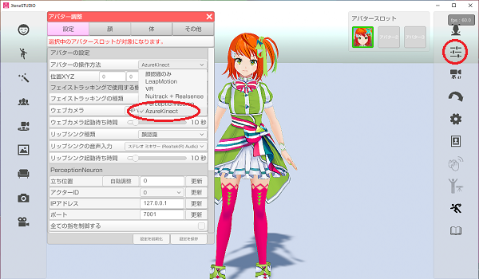
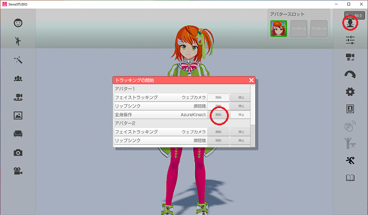

## Nuitrack について

>深度カメラの骨格認識によって全身を操作します。

### 注意事項

>・RealSense には機能が異なる機種が存在しますので[対応機器](#equipment.md)で確認してください。
>・RealSense に演者の全身が写っている必要があります。
>・黒い衣服を着ていると認識率が低下します。
>・Nuitrack のフェイストラッキングも同時に使用している場合に
>　全身を認識する距離まで離れると顔が認識できなくなる可能性が高いです。

### RealSense の関連ソフトウェア

>公式ホームページは<a href="https://www.intel.co.jp/content/www/jp/ja/architecture-and-technology/realsense-overview.html" target="_blank">こちら</a>

>RealSence 初回動作確認やファームウェア・アップデートを行う場合に
>SDK に含まれるソフトウェアが必要になります。

>SDK のダウンロードは<a href="https://www.intelrealsense.com/sdk-2/" target="_blank">こちら</a>から。

>
>SDKダウンロードページの「Download SDK」をクリックします。

>Intel.RealSense.SDK.exe のダウンロードが完了したら実行してインストールします。

### Nuitrack ランタイムの注意事項

>古い Nuitrack ランタイムがインストールされた状態で
>新しいランタイム(v0.35.0 以降？)をインストールすると
>インストールが途中で止まってしまう事があるようです。
>この現象が発生するとアンインストールも途中で止まってしまいます。

>現在インストールされている Nuitrack ランタイムのバージョンは
>C:\\Program Files\\Nuitrack\\nuitrack\\
>components.xml
>をメモ長などのテキストエディタで開くと確認が可能です。

>インストールおよびアンインストールが途中で止まる現象が発生した場合は
>下記の２つのファイルを実行し、

>C:\\Program Files\\Nuitrack\\nuitrack\\
>OpenNI-Win64-1.5.7-Dev.msi

>C:\\Program Files\\Nuitrack\\nuitrack\\
>Primesense-Sensor-5.1.6.6-Win-x64.msi

>インストール、アンインストールを手動で実行した後に
>PC再起動を行い、Nuitrack ランタイムを再度インストールしてください。

### Nuitrack ランタイムのインストールと設定

>公式ホームページは<a href="https://nuitrack.com/" target="_blank">こちら</a>

>ライセンスの購入（ライセンス購入前にトライアルにて動作確認を推奨します。）

>Nuitrack公式マニュアルは<a href="https://github.com/3DiVi/nuitrack-sdk/blob/master/doc/Install.md" target="_blank">こちら</a>

>1. 公式の github から<a href="https://github.com/3DiVi/nuitrack-sdk/blob/master/Platforms/nuitrack-windows-x64.exe" target="_blank">nuitrack-windows-x64.exe</a>をダウンロードします。
>「Download」ボタンをクリックするとダウンロードが開始されます。

>2. nuitrack-windows-x64.exe を実行するとインストールが開始されます。
>「Windows によって PC が保護されました」と表示された場合は、詳細情報 → 実行 をクリックします。
>インストールの途中で強制PC再起動が発生した場合は
>再度、nuitrack-windows-x64.exe を実行して上書きインストールする必要があります。

>>インストール完了後に必ずPCを再起動してください。

>3. Microsoft Visual C++ Redistributable 2015(もしくは2017)をインストールします。
>（Nuitrack公式マニュアルのサイトにリンクがあります。）

>4. システム環境変数が自動設定されていない場合は手動で設定します。
>新しい Nuitrack ランタイム(v0.35.0 以降？)であれば
>インストールの完了後にPC再起動すると環境変数は自動的に設定されているようです。

>>環境変数を設定および変更する場合は下記の操作を行います。
>>コントロールパネル → システムとセキュリティ → システム → システムの詳細設定 → 環境変数 を開く

>>システム環境変数 – 新規 を開き、
>>変数名：NUITRACK_HOME
>>変数値：nuitrack-win64/nuitrackのパス
>>※標準インスト－ルした場合は下記のパスを入力してください。
>>C:\Program Files\Nuitrack\nuitrack\nuitrack

>>システム環境変数 – Path（変数名）を選択 – 編集 – 新規 を開き
>>nuitrack-win64/nuitrack/binのパス
>>※標準インスト－ルした場合は下記のパスを入力して追加してください。
>>C:\Program Files\Nuitrack\nuitrack\nuitrack\bin

>4. アクティベーション
>RealSense を USB 3.0 以上の端子に接続する。
>C:\Program Files\Nuitrack\nuitrack\nuitrack\activation_tool\Nuitrack.exe（デフォルトの場合）
>を管理者として実行（右クリック - 管理者として実行）
>Compatibility test をクリック
>Compatibility test が完了したら 「Enter Activation Key」に Activation Keyを入力し「Activate」をクリック
>（Trial版の場合 Activation Key は "license"から始まる文字列になります。）
>アクティベーションに成功すると下部に「Activation complete!」と表示される。

### Nuitrack の動作確認

>Nuitrack をインストールしたフォルダにあるサンプルプログラムで動作を確認してください。
>サンプルプログラムと 3tene を同時に起動すると競合してしまうので
>正常に動作する事が出来たら必ずサンプルプログラムを終了した後に 3tene を起動します。

>正常に動作しない場合は Nuitrack に関係するソフトウェアを全て終了した後に
>RealSence の USB 端子を抜き差しすると改善する場合があります。

### Nuitrack が正常に動作しない場合

>#### 3tene の Nuitrack プレビューが真っ白になる

>1. Nuitrack アクティベーションが完了していない可能性があります。
>トライアルコードもしくは製品コードでアクティベーションが完了後に
>再度、3tene を起動して試してみてください。

>2. 他の Nuitrack を使用するソフトと競合している可能性があります。
>他のソフトを終了後、 RealSence の USB 接続を外して、再度接続後に
>3tene を起動してみてください。

### Nuitrackによるフェイストラッキングの設定

>Nuitrackによるフェイストラッキングをご利用の際はお手数をお掛け致しますが、下記の手順を行ってください。

>Nuitrackのデフォルトの設定では、Nuitrackのフェイストラッキングはオフになっています。
>nuitrack\data\nuitrack.config
>上記ファイルを開き、「Faces.ToUse」と「DepthProvider.Depth2ColorRegistration」をtrueへ変更してください。

### トラッキングを開始する (3tene V2 以降)

>3tene でボディトラッキングを Nuitrack + Realsense に設定します。
>
>3tene のトラッキングを開始します。
>

