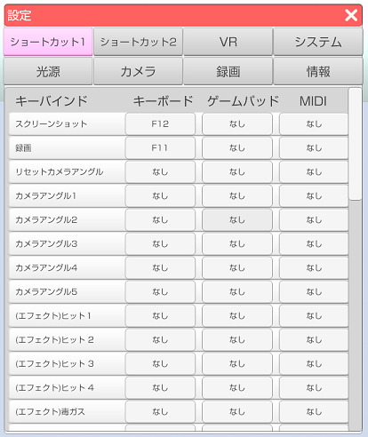
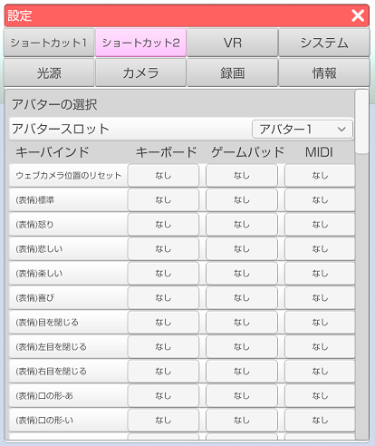
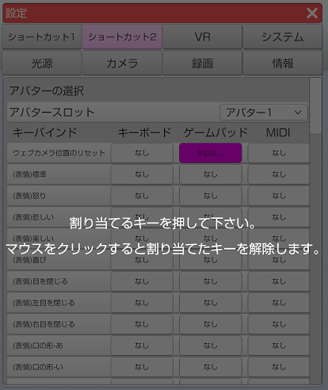

## ショートカットタブについて

>キーボードやゲームパッド、MIDI機器を使用して各種操作を行う機能です。

### ショートカットの設定の仕方

>ショートカットは設定ウインドウの中にあります。

>ショートカット1 はアバターに関連しないショートカットです。

>ショートカット2 はアバターに関連するショートカットです。
>3tenePRO, STUDIO にはアバターを選択するスロットが右上にあり、
>スロットで選択されているアバターにショートカットが送信されます。

>登録した BVH やモデル専用表情など、動的に変化する項目は一覧の下部に追加されます。

>ショートカットしたい項目をクリックすると入力ダイアログが表示されるので
>割り当てたいキーボードのキーかゲームパッドのボタンを押してください。
>キャンセルする場合はマウスのボタンをクリックしてください。

### 注意事項

>手の形状は VR、Nuitrack、PerceptionNeuron が動作時のみ使用可能です。
>顔認識のみ、LeapMotion や Live2D ではこの機能は利用できません。

>PerceptionNeuron で使用する場合は「全ての指を制御する」のチェックを外す必要があります。

>・対象となる項目
>(左手)待機
>(左手)人差し指
>(左手)親指
>(左手)L字
>(左手)キラッ
>(左手)チョキ
>(左手)グー
>(左手)パー
>(右手)待機
>(右手)人差し指
>(右手)親指
>(右手)L字
>(右手)キラッ
>(右手)チョキ
>(右手)グー
>(右手)パー

