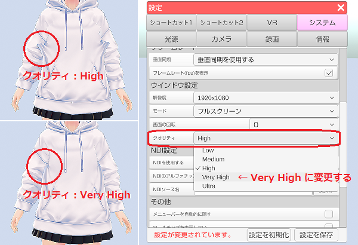

## VRMの作成について

### VRMとは？

>3Dアバター向け汎用規格「VRM（Virtual Railroad Models）」の事で、
>ドワンゴ株式会社から2018年4月に発表されました。

>VRM は Khronos グループによって策定された汎用3Dフォーマット「glTF 2.0」を拡張して
>VRソフトウェアや VTuber 配信に最適化したフォーマットです。

>人型に限定する事によりアバターを扱うソフトウェアで高い互換性を維持しています。

>※Khronos は「OpenGL」や「Vulkan」等、３Ｄ技術を策定する非営利団体の技術コンソーシアムです。

### どうすれば VRM を作れる？

>２つの方法が存在します。

>①VRM 保存に対応したモデリングソフトで作る（VRoidStudio 等）
>②作成したモデルを FBX で保存し、Unity で修正、調整後に VRM に変換する。

>簡単に VRM を作りたいと思うのであれば①(VRoidStudio)をお勧めします。

>②は上級者向けで Unity のダウンロード、インストールを行った後に
>UniVRM をダウンロードして Unity に追加します。

>モデリングソフトで作成済みの FBX 等モデルデータを
>Unity にインポートして VRM の調整を行った後にエクスポートするのが
>基本となりますが難易度は低くはありません。

>最近ではモデリングソフトでも対応しているものが少しずつ増えているようです。

>無料のモデリングソフト Blender では追加プラグインによって
>VRM 用の機能やインポートが追加可能になっています。
>Blender 2.82 以降で VRM_Addon_for_Blender を使います。
>VRM のエクスポートが可能ですが完全対応ではないようで
>出力された VRM を Unity にインポートして再調整が必要となっています。

>また、プロに使われているモデリングソフト MAYA も
>VRM のエクスポートに対応するプラグインがあります。
>※VRM のインポートには対応していません。

### 3tene で使用する VRM を作る場合の注意点は？

>VRM を作成する場合の注意点を記載します。

>#### First Person について

>3tene では VR に対応している為、VRM は First Person に対応している必要があります。
>対応していないと目、まぶた、口が２重に表示されるといった現象が発生します。

>VRM を First Person に対応させるか、該当する顔の部位に
>「Third Person Only」に設定変更を行って First Person を無効にしてください。
>※First Person を無効にすると VR 使用時の描画に問題が発生します。

>#### VRoidStudio で作成した VRM について

>一部の服装で描画崩れが発生する場合は 3tene の
>設定「システム」タブでクオリティを「Very High」以上に変更してみてください。
>

>#### VRoidStudio で作成した VRM を Unity で修正する場合の注意事項

>VRoidStudio で作成した VRM を古い UniVRM で Unity にインポートすると
>目のボーンの設定値が変化してしまい、目の移動範囲が狭くなり、
>VRM へのエクスポート前に目の修正が必要になります。
>※Unity にインポートする場合は UniVRM 0.66 以降を使用してください。

### 3tene 拡張機能

>#### iPhoneX フェイストラッキングの表情自動変更(表情認識)

>こちらの[独自の VRM モデルで競合を回避する方法](#ft_iphone_expression.md)を参考に
>独自の表情を作成すると口の動きの競合を防ぐことが可能になります。

>#### PerfectSync の対応

>3tene は PerfectSync に対応していますが、
>PerfectSync に対応した VRM を使用する事で動作します。
>

>もし使用している VRM が VRoidStudio で作成しているのであれば
>3tenePRO に同封されている FaceForge を使う事で対応できるかもしれません。
>※別途、VRoidStudio で作成され PerfectSync に対応した VRM が必要になります。

>詳しくは[FaceForge について](#AboutFaceForge.md)を参照してください。

>#### ユニティちゃんトゥーンシェーダー2.0 の使用

>3tene では UnityChan ToonShader に含まれる４種のシェーダーが使用可能です。
>※3tene Ver 2.0.15 以降で対応しています。

>このシェーダーを使う事でアニメ風のまゆ毛（前髪よりも前に描画）が可能となります。
>

>詳しくは[Unity Chan Toon Shader について](#UCTShader.md)を参照してください。

### VRM の仕様は？

>下記のサイトより Unity 用のアセット入手や技術仕様の参照が可能です。

>VRM の公式サイト
>日本語：<a href="https://vrm.dev/" target="_blank">https://vrm.dev/</a>
>英語：<a href="https://vrm.dev/en/" target="_blank">https://vrm.dev/en/</a>

>VRM の技術仕様 (glTF 2.0 との差異および拡張仕様)
><a href="https://github.com/vrm-c/vrm-specification/blob/master/specification/0.0/README.ja.md" target="_blank">日本語</a>　<a href="https://github.com/vrm-c/vrm-specification/blob/master/specification/0.0/README.md" target="_blank">英語</a>

