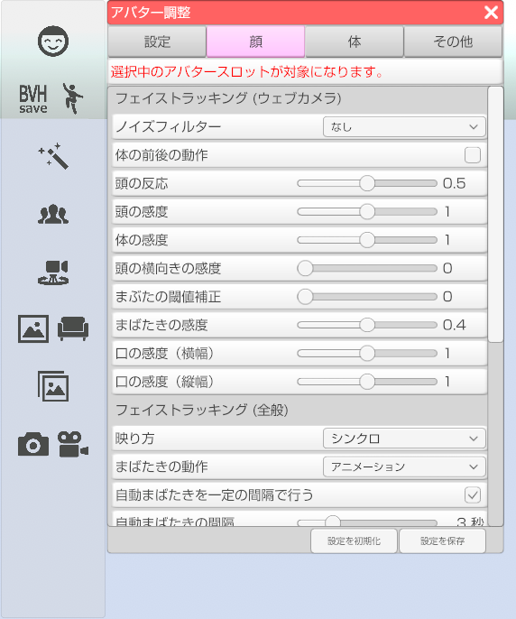

## アバター調整（顔タブ）

>アバターのフェイストラッキングの調整や設定を行います。

### アバター調整のウインドウを表示する

>右側メニューのアバター調整のアイコンをクリックします。

>顔タブを選択します。

### フェイストラッキング (ウェブカメラ)

>#### ノイズフィルター

>ウェブカメラ使用時にノイズフィルターをかけます。

>#### 体の前後の動作

>フェイストラッキング時の体の前後の動作を有効にします。
>[ウェブカメラによるフェイストラッキングについて](#ft_webcamera.md)

>#### 頭の反応

>値を大きくすると頭のフェイストラッキングの動き出すタイミングが敏感になります。

>#### 頭の感度

>頭を動かした場合の感度を変更します。

>#### 体の感度

>体を動かした場合の感度を変更します。

>#### 頭の横向きの感度

>頭を横向きに動かした場合の感度を変更します。

>#### まぶたの閾値補正

>まぶたの判定に関する値を調整します。
>まばたきの動作を「取得パラメータ」に変更すると確認がしやすいです。

>#### まばたきの感度

>まばたきアニメーションの開始判定を変更します。

>#### 口の感度 (横幅)

>口を横に動かした場合の感度を変更します。

>#### 口の感度 (縦幅)

>口を縦に動かした場合の感度を変更します。

### フェイストラッキング (全般)

>#### 映り方

>・シンクロ → アバターが顔認識の結果で動きます。（左を向くとアバターは向かって右を向く。）
>・鏡 → アバターが顔認識の左右逆で動きます。（左を向くとアバターは向かって左を向く。）

>#### まばたきの動作

>まばたきの動作を変更します。
>・アニメーション → まぶたが一定よりも閉じると自動でまばたきをします。
>・取得パラメータ → 顔認識から取得した数値でまぶたを制御します。（じと目も可能になります）

>※取得パラメータ動作はウェブカメラだと精度が足りず望んだ結果にならない場合があります。
>　iPhoneX と 3teneFT 使用時にお勧めします。

>#### 自動まばたきを一定の間隔で行う

>オンにするとフェイストラッキングが動作していない場合に
>アバターがまばたきをします。

>#### 自動まばたきの間隔

>まばたきをするまでの間隔を変更します。

>#### 連続まばたき禁止時間

>まばたきをしてから指定されている時間を経過しないとまばたきをしません。
>※自動まばたきは対象となりません。

>#### 表情が標準以外の時のまばたきを無効

>アバターの表情を変更している状態でまばたきをすると
>表示が崩れる場合があるのでオンにするとまばたきを抑制します。

>#### 表情の移行時間

>表情が変化するまでの時間を変更します。

>#### 眉毛の制御

>チェックを入れることでフェイストラッキングの際に眉毛の制御も行います。

>#### 頭の下向き角度を制限する

>チェックを入れることで頭を下に向けた際の角度を制限します。

### リップシンク

>#### 入力ゲイン（音声）

>音声認識を使用している場合の音に対する感度を変更します。
>設定「システム」の「マイク入力を再生する」をオンにした場合の音量も変化します。

>#### 応答性（顔認識）

>顔認識のリップシンクの応答性を変更します。

>#### 応答性（音声）

>音声のリップシンクの応答性を変更します。

### 目線

>#### カメラ目線

>オンにするとカメラの向いている方向に目線を向けます。
>目の移動範囲が狭いモデルデータでは動きが小さくなります。

