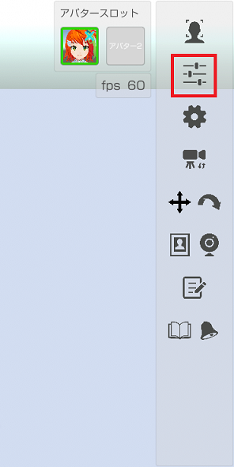

## アバター調整（その他タブ）

>その他の項目を設定します。

### アバター調整のウインドウを表示する

>右側メニューのアバター調整のアイコンをクリックします。

>その他タブを選択します。

### アバターのライセンス情報

>VRM の制作者が設定したライセンスを表示します。

### MToon (3teneSTUDIO は非対応)

>MToon とは、アニメ的表現を目的とした VRM 標準のトゥーンシェーダのことを指します。

### アウトライン (3teneSTUDIO は非対応)

>VRM の輪郭線について設定をします。