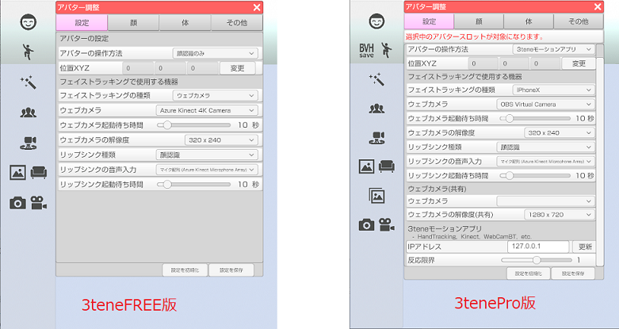
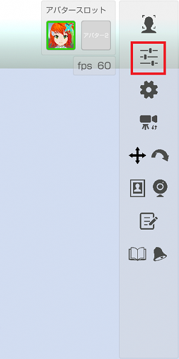

## アバター調整（設定タブ）

>アバターに対する調整や機器設定を行います。

### アバター調整のウインドウを表示する

>右側メニューのアバター調整のアイコンをクリックします。

>設定タブを選択します。

### アバタースロットを選択する (3teneFREE は非対応)

>アバターを複数読み込んでいる場合にどのアバターを対象にするかを選択します。

### アバターの設定

>#### アバターの操作方法

>アバターの操作方法を指定します。
>3tene のエディション(FREE、PRO等)によって対応項目が異なります。
>※どの項目を選択しても常にフェイストラッキングとリップシンクは使用可能です。

>・顔認識のみ → フェイストラッキングを使用します。
>・LeapMotion → LeapMotion を使用します。(FREE版限定)
>・3tene モーションアプリ → 接続した 3tene のモーションアプリを使用します。

>#### 位置ＸＹＺ 

>アバターの位置を直接数値入力で調整します。
>※小数での入力が可能です。

### フェイストラッキングで使用する機器

>#### フェイストラッキングの種類

>使用するフェイストラッキングの種類を指定します。
>3tene のエディション(FREE、PRO等)によって対応項目が異なります。

>・ウェブカメラ → ウェブカメラの映像で顔認識を行います。
>・iPhoneX → iPhoneX 以降に 3teneFT をインストールして使用します。
>・Nuitrack → Nuitrack を使用します。
>・動画ファイル → 動画ファイルで顔認識を行います。

>#### ウェブカメラ

>使用するウェブカメラを指定します。
>認識しているウェブカメラがドロップダウンメニューに表示されます。

>#### ウェブカメラ起動待ち時間

>ウェブカメラ使用開始の初期化で何秒待つかを指定します。
>フェイストラッキングの開始で失敗する場合は長めの時間を指定してください。

>#### ウェブカメラの解像度

>ウェブカメラの解像度を指定します。
>320 x 240, 640 x 480, 800 x 600, 1024 x 768 
>の中から選択できるので好みの解像度を選択してください。

>#### リップシンク種類

>使用するリップシンクの種類を指定します。
>3tene のエディション(FREE、PRO等)によって対応項目が異なります。

>・顔認識 → 「フェイストラッキングの種類」で指定された方法で口を動かします。
>・音声認識 → マイク入力で音声認識を行い、口を動かします。
>・音声ファイル → 音声ファイルで音声認識を行い、口を動かします。

>#### リップシンクの音声入力

>使用する録音機器を指定します。
>認識している録音機器（マイク等）がドロップダウンメニューに表示されます。

>#### リップシンク起動待ち時間

>リップシンク使用開始の初期化で何秒待つかを指定します。
>フェイストラッキングの開始で失敗する場合は長めの時間を指定してください。

### ウェブカメラ(共有) (3teneFREE は非対応)
開発中の機能なので後で記述します。

>#### ウェブカメラ

>#### ウェブカメラの解像度(共有)

### 3teneモーションアプリ - HandTracking, Kinect, WebCamBT, etc. (3teneFREE は非対応)

>#### IPアドレス

>モーションアプリを使用している接続先の PC の IP アドレスを入力します。
>接続するモーションアプリが同じ PC 内で起動されている場合は
>デフォルトの「127.0.0.1」を設定してください。

>#### 反応限界

>モーションアプリでトラッキングした動きの反応速度を調整します。
>値を小さくするとアバターの動きが遅くなりますが、スムーズな動きになります。
>値を大きくするとアバターの動きは早くなりますが、カクカクした動きになります。
>また、 PC の処理速度によって違ってくるので使用している PC に合わせて調整してください。

### Perception Neuron (3teneSTUDIO のみ対応)

>Perception Neuron を使う為の設定をします。

>#### 立ち位置

>使用する録音機器を指定します。
>認識している録音機器（マイク等）がドロップダウンメニューに表示されます。

>#### アクターID

>Axis Neuron で複数の Perception Neuron が接続されている場合に指定します。

>#### IPアドレス

>Axis Neuron が起動されている PC の IPアドレスを指定します。
>3tene と Axis Neuron が同じ PC 内で起動されている場合は
>デフォルトの「127.0.0.1」を設定してください。

>#### ポート

>Axis Neuron が起動されている PC にアクセスするポートを指定します。
>3tene と Axis Neuron が同じ PC 内で起動されている場合は
>デフォルトの「7001」を設定してください。

>#### 全ての指を制御する

>オフにすると指が全て動かなくなります。
>指の調整や状態が良くならない場合はオフにしてください。

>Perception Neuron Pro は指には対応していませんが、オフにする事によって
>アバター調整「体」タブの「手の形状」が使用可能になります。
>※Perception Neuron V2 でもオフにすれば「手の形状」が使用可能です。

>#### 親指を制御する

>オフにすると親指が動かなくなります。
>VRM 規格と Perception Neuron の仕様が合わない為、
>親指が変形する事があります。
>親指の角度を調整しても変形が改善されない場合はオフにしてください。

>#### 親指の角度

>VRM 規格と Perception Neuron の仕様が合わないのを調整します。
>モデルデータによって異なりますが 45～60 くらいが目安です。

>#### 足首を制御する

>オフにすると足首、つま先が動かなくなります。
>足首の調整や状態が良くならない場合はオフにしてください。

>#### 移動を制限する

>アバターの位置が固定されます。
>アバターが画面外に出ると困る等、用途によって使用してください。

>#### 座標を処理する

>有効にするとアバターのモデル表示が崩れるのでオフで使用してください。

### Hi5 VR GROVE (3teneSTUDIO のみ対応)

>Hi5 VR GROVE の操作方法の説明は下のリンク先のページに記述しましたので、そちらを確認してください。
>[Hi5 VR GROVEについて](#Hi5VrGlove.md)