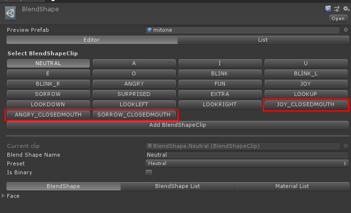
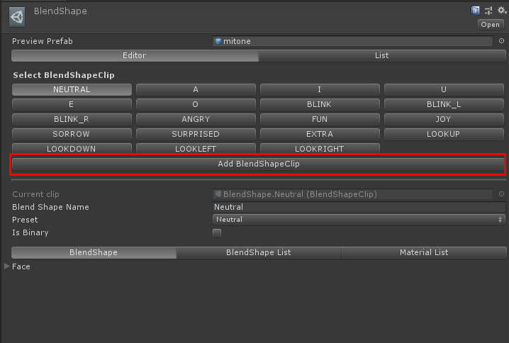
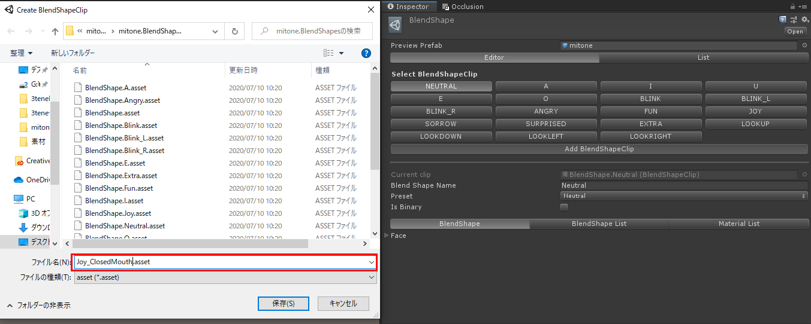
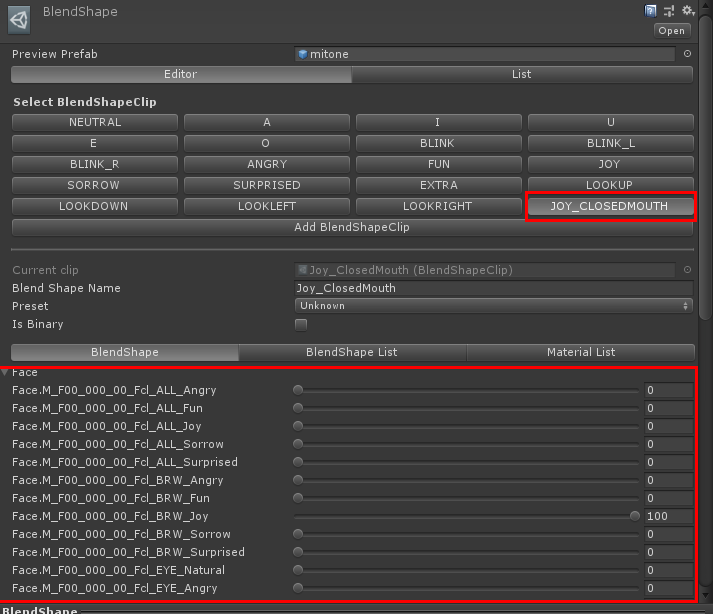
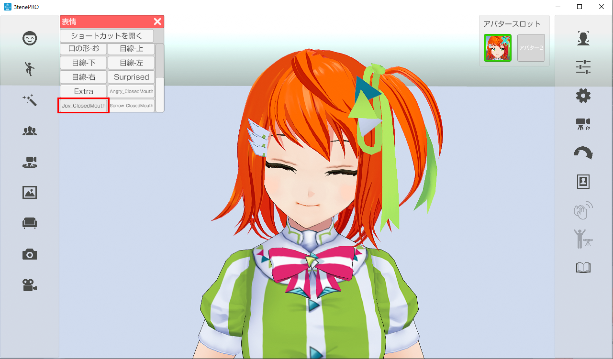

## 口が閉じたバージョンの表情を作ろう！

### 独自の VRM モデル作る

>既存の VRM を編集し、表情 (BlendShape) を追加します。
>(作成した BlendShape が優先となります。)

>BlendShape名：Joy_ClosedMouth → 口だけを標準にした楽しい
>BlendShape名：Angry_ClosedMouth → 口だけを標準にした怒り
>BlendShape名：Sorrow_ClosedMouth → 口だけを標準にした悲しい

>

### 独自BlendShape追加手順
>1. Unity 2019.4 .20 をインストールします。
>※Unity 2019.4.20 のダウンロードは<a href="https://unity3d.com/jp/get-unity/download/archive" target="_blank">こちら</a>から。

>2. UniVRM をインポートした Unity プロジェクトを用意し、Unity で読み込みます。
>※Vrm3teneExtensionProject への<a href="https://3tene.com//download_Vrm3teneExtensionProject/">直リンク</a>。

>3. Unity のメニュー VRM のインポートから対象となる VRM を指定します。

>4. Unity で VRM をインポートしたフォルダの .BlendShapes から選択できる
>BlendShape の設定画面で「Add BlendShapeClip」をクリックすると、
>新しく BlendShape を追加することが出来ます。

>

>5. 追加する際に BlendShape 名を該当の名前で作成します。
>※「Joy_ClosedMouth」「Angry_ClosedMouth」「Sorrow_ClosedMouth」

>

>6. 編集する BlendShape 名を選択し、シェイプキーの値を設定します。
>この時、口の形を大きく変形させると BlendShape「A」「I」「U」「E」「O」と競合し、
>口の形が崩れる場合があります。（3tene内のリップシンク使用時）

>

>7. BlendShape の設定が完了したら、VRMを出力し、3tene で読み込みます。

>8. 表情の変更で「Joy_ClosedMouth」「Angry_ClosedMouth」「Sorrow_ClosedMouth」
>の動きを確認してください。正しく設定されている場合は、設定した表情へ変化します。

>

>9. 表情の設定に問題ない場合は自動表情変更で、設定に追加した表情に変化させることが出来ます。
>※自動表情変更の手順は本ページ上記をご確認ください。

