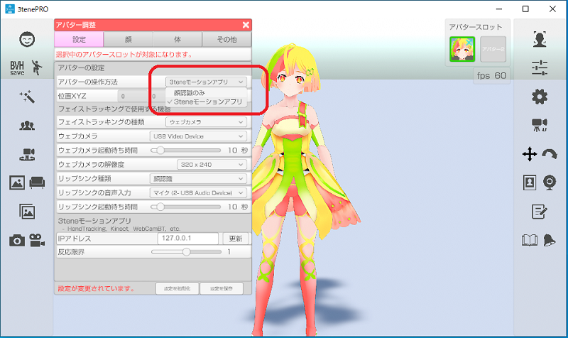
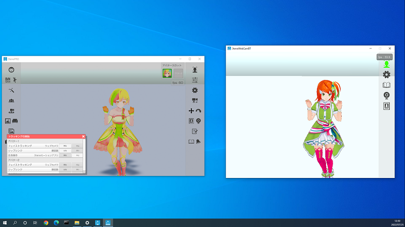

## ウェブカメラ ボディトラッキング (モーションアプリ連携)

>ウェブカメラでボディトラッキングを行います。

>高性能 GPU が必要になりますので注意してください。
>※GeForce GTX 1070, 2060, 3050 以上の性能が必要。

>[モーションアプリのダウンロードの仕方](#buy3tene.md)

### 使い方

>1. モーションアプリを起動します。
>2. モーションアプリのトラッキングを開始して、機器が動作しているのを確認。
>3. 3tene を起動します。
>4. 3tene の「アバターの調整」の「設定：アバターの操作方法」を「3teneモーションアプリ」に変更。
>
>5. 3tene のトラッキングを開始してアバターが動くのを確認する。
>　※モーションアプリとの連携（通信）が確立していればアバターが動きます。
>

