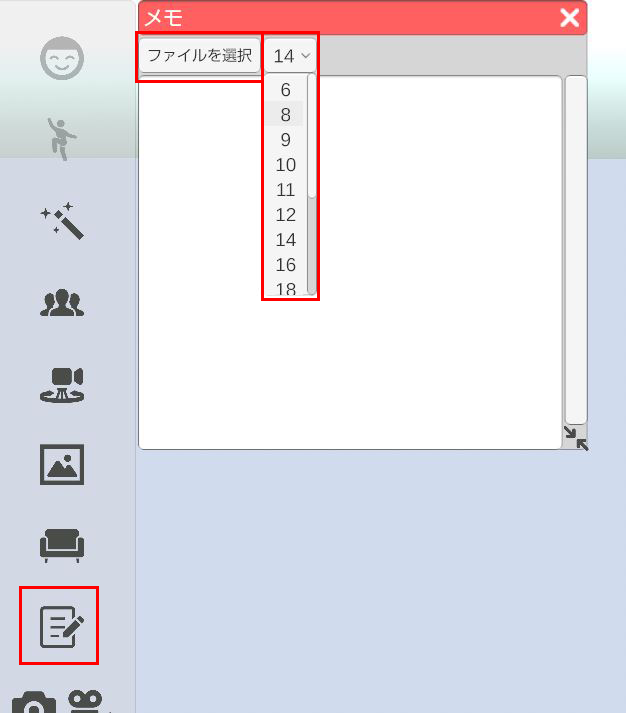

## メモ機能について

>3tene内にテキストを表示させます。
>3teneがアクティブな状態でメモを見ることが出来ますので、ショートカット操作も可能です。
>v2.0.3 時点ではメモ機能はファイルを読み込み表示させる仕様でございます。

### メモ機能の使い方

>左側メニューのメモのアイコンをクリック

>ウィンドウ内の「ファイルを選択」からテキストファイルを選択するとウィンドウ内にテキストが表示されます。

>「ファイルを選択」の隣のドロップダウンから表示されているテキストのフォントサイズを変更できます。

