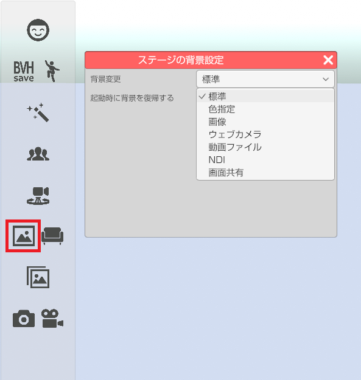
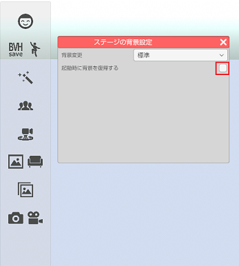
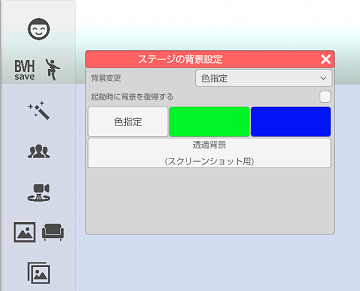
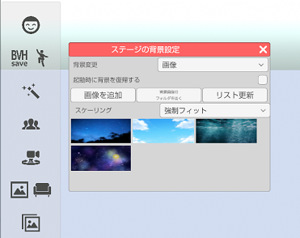
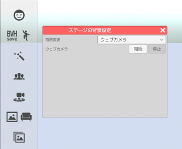
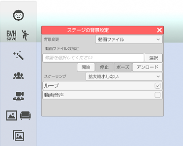
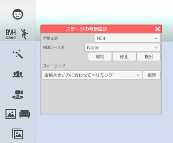
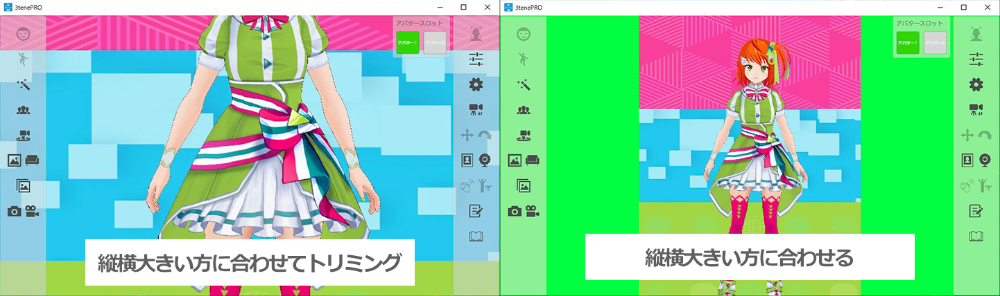
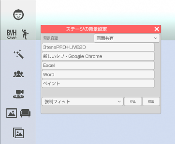

## 背景変更について

>背景表示を変更します。

### 背景変更のウインドウを表示する

>左側メニューの背景変更のアイコンをクリックします。
>ドロップダウンから変更したい背景の種類を選択します。

>また、「起動時に背景を復帰する」にチェックを入れることで次に3teneを起動した際に
ドロップダウンで選択していた背景(一部を除く)に最初から変更した状態に出来ます。

>#### 標準

>背景を変更していない状態です。
>背景を元に戻す場合はドロップダウンメニューで「標準」を選択してください。

>#### 色指定

>背景を単色で塗りつぶします。
>・色指定 → 好きな色を選択して背景に設定します。
>・緑色 → 背景を全て緑色で塗りつぶします。
>・青色 → 背景を全て青色で塗りつぶします。
>・透過色 → スクリーンショットで画面を保存した場合に背景αがゼロで保存されます。
>※動画保存に背景αの変更は適用されません。

>背景を元に戻す場合はドロップダウンメニューで「標準」を選択してください。

>#### 画像

>画像ファイルを背景に設定します。
>対応している画像ファイルは PNG、JPEG となります。

>「画像を追加」ボタンで画像ファイルをリストに登録します。
>リストに登録された画像を選択すると背景に設定されます。

>複数の画像ファイルを登録したい場合「背景画像のフォルダを開く」で
>表示されるフォルダに画像ファイルを置いた後に「更新する」を選択してください。
>画像ファイルの登録を解除したい場合も「背景画像のフォルダを開く」で
>表示されるフォルダの画像ファイルを削除後、「更新する」を選択してください。

>背景を元に戻す場合はドロップダウンメニューで「標準」を選択してください。

>#### ウェブカメラ (3teneFREE は非対応)

>ウェブカメラの映像を背景に表示します。

>使用するウェブカメラは設定の「システム」タブで変更します。
>１つのウェブカメラでフェイストラッキングと同時使用する事はできません。
>複数のウェブカメラを使用する場合はウェブカメラの販売メーカーから
>提供される専用ソフトウェア(ドライバ)が必要になります。

>背景を元に戻す場合は「停止」ボタンをクリックするかドロップダウンメニューで「標準」を選択してください。

>#### 動画ファイル (3teneFREE は非対応)

>動画ファイルを背景に設定します。
>対応している動画ファイルは MP4 (H264) となります。
>動画音声にチェックを入れることで音声も再生されます。

>動画ファイルを選択した直後にメモリ上に読み込まれます。
>ファイルもロックされますので使用しない場合は「アンロード」で解放してください。

>#### NDI (3teneFREE は非対応)

>NDI受信映像を背景に設定します。
>「検出」ボタンをクリックすると受信可能な「コンピュータ名(NDIソース名)」がNDIソース名のドロップダウンに表示されます。
>「開始」「停止」ボタンをクリックすると背景に選択したNDIソースの映像の表示非表示を行います。

>スケーリングを指定することで、受信映像の表示方法が変化します。
>・縦横大きい方に合わせてトリミング - 3tene 画面内全てに映像が表示されるように受信映像をトリミングします。
>・縦横大きい方に合わせる - 受信映像が 3tene 画面内に収まるように表示します。

>#### 画面共有 (3teneFREE は非対応)

>起動しているアプリケーションの画面を背景に設定します。
>「検出」ボタンをクリックするとその時点で起動しているアプリケーション名がリストに表示されます。
>「停止」ボタンをクリックすると背景に選択したアプリケーションの画面表示を停止します。
>また、アプリケーションを閉じるとリストから削除されます。
>※ただし、アプリケーションの画面を最小化しているとリストを選択しても画面の表示はされません。

