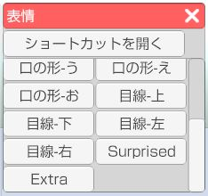
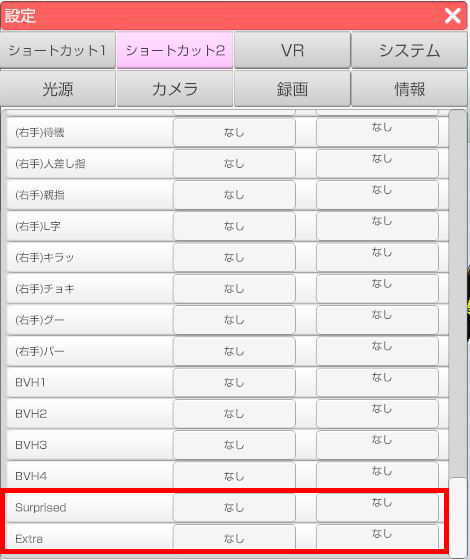

## 表情について

>読み込んでいるアバターがVRMの場合、左側メニュー1番上の「表情」アイコンを
>クリックすると表情ウインドウが開きます。
>ウインドウ内の表情ボタンをクリックしてアバターの表情を変更します。

### 表情ボタンのリスト

>表情ウインドウ内のボタンはモデルに組み込まれた表情が表示されます。
>表情は VRM の既定 BlendShape とモデル専用に作成された BlendShape の
>２種類が存在します。

>既定 BlendShape の表情は下記になります。
>標準、怒り、悲しい、楽しい、喜び、
>目を閉じる、左目を閉じる、右目を閉じる、
>口の形-あ、口の形-い、口の形-う、口の形-え、口の形-お、
>目線-上、目線-下、目線-左、目線-右

>これ以外の表情はモデル専用の表情になります。
>※一部の目線はモデル専用に分類される場合があります。

### ・ショートカット

>表情ウインドウ上部の「ショートカットを開く」をクリックするとショートカット設定ウインドウが開きます。
>※3tene右側メニュー上から5番目の「設定」アイコンから開くこともできます。
>ショートカットリストの中から該当の表情にショートカットキーを設定することが出来ます。
>※モデル専用の表情はショートカットリストの下部に追加されます。

