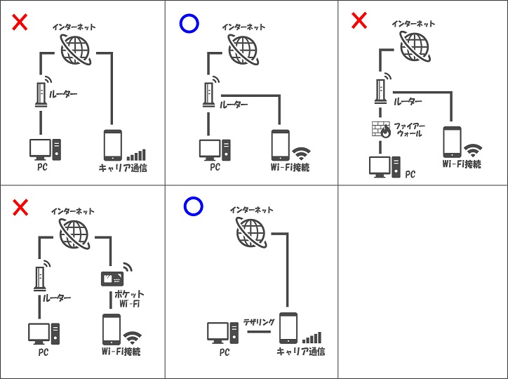
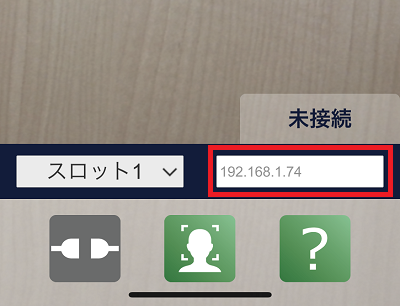
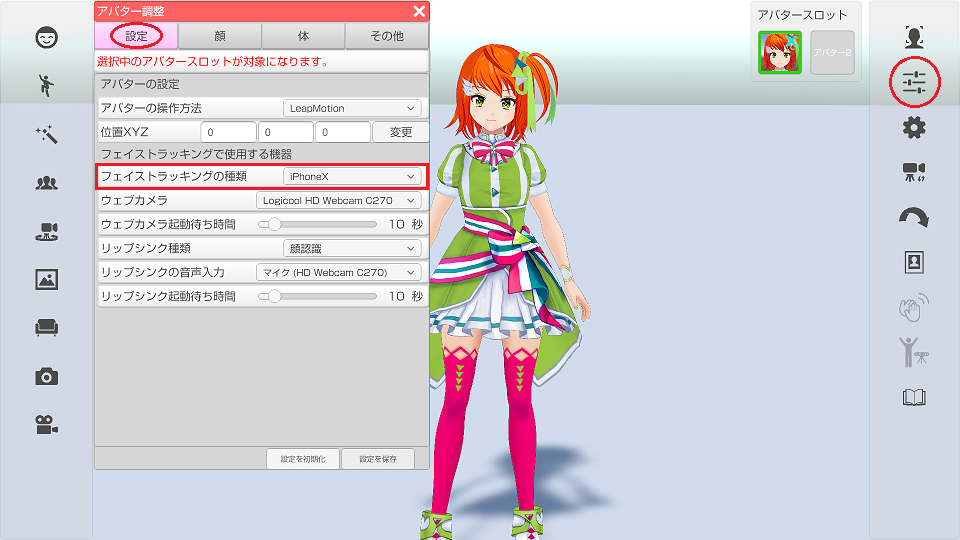
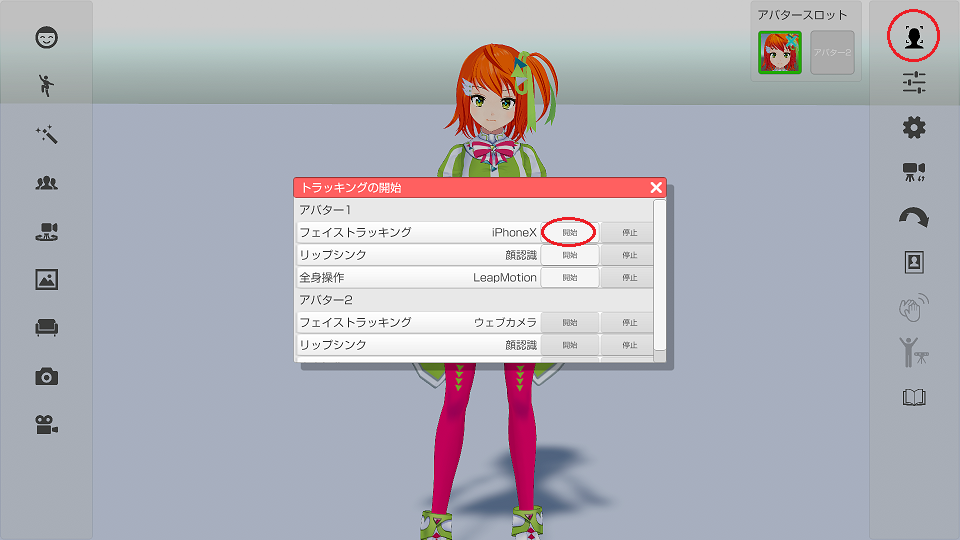
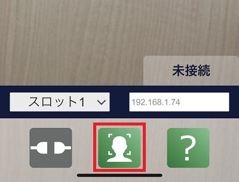
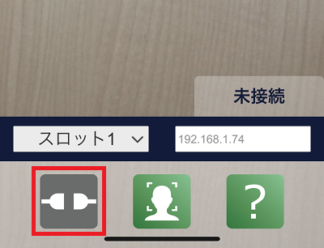
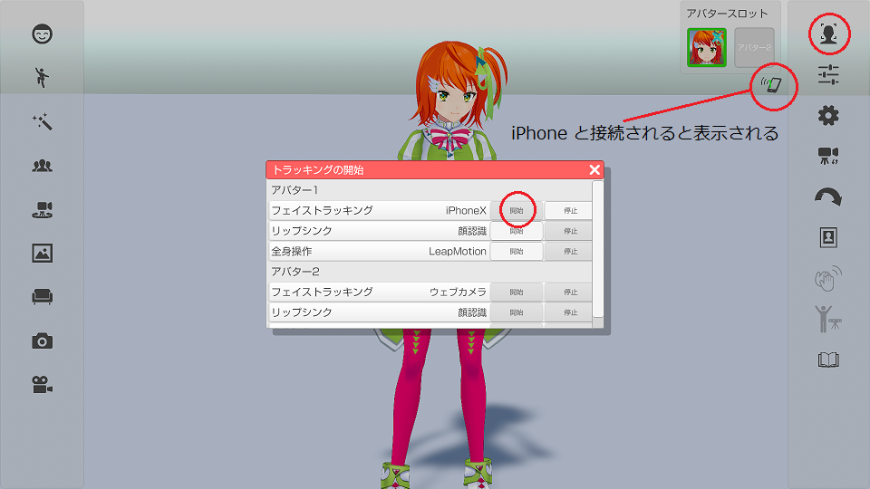
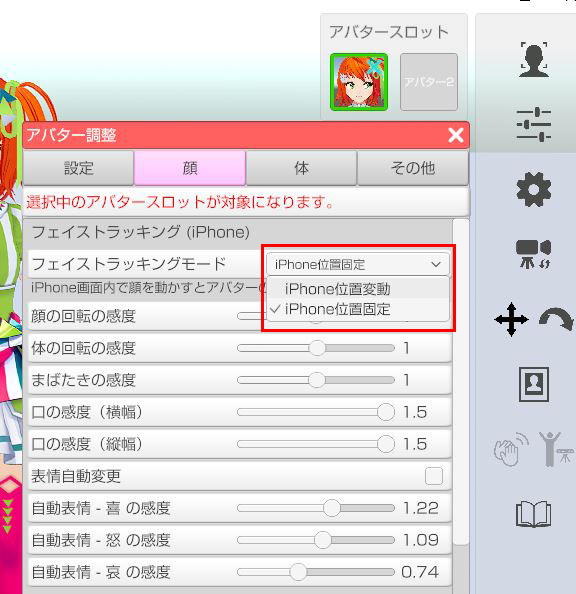

## iPhoneX フェイストラッキングについて

>iPhoneX 以降（TrueDepthカメラ搭載機種）に 3tene と連携する為の
>フェイストラッキング アプリ 3teneFT をインストールする事で
>高精度のフェイストラッキング、アイトラッキングが 3tene (PRO、STUDIO) で利用できます。
>※3teneFREE では利用できません。

>メガネを着用していると精度の低下や認識不能が発生します。
>マスクを着用していると顔認識ができなくなります。

>また、iPhoneX の高精度のフェイストラッキングを利用することにより、
>目線の移動や左右別々でのまばたき以外にも頭の動きも認識して反映します。
>※全身操作時の頭の動きは VR や Perception Neuron が優先されます。

>3teneFT との接続にはネットワークの知識が必要になります。

### iPhone 用アプリ「3teneFT」のインストール

>上記リンクまたは App Store で 3teneFT を検索してインストールをしてください。

>3teneFT 1.1.0 以降は 3tene v1.10.20 2020/02/14 以降との組み合わせで動作します。

### 3tene と 3teneFT の接続について

>3tene と 3teneFT を接続するには iPhone の通信方法を WiFi に切り替える必要があります。
>キャリア通信(docomo、au、SoftBank)のインターネット経由では接続ができません。

>PC とルーターを接続し、そのルーターの WiFi に iPhone を接続してください。
>※3teneFT を利用する iPhone を PC と同じネットワークに接続する必要があります。

>また、 PC のセキュリティソフトのファイアウォールが有効の場合に
>3tene と 3teneFT の接続がブロックされる事があります。
>使用しているセキュリティソフトのファイアウォール設定を変更する事で
>通信が可能になります。

>ファイアウォールの設定には完全に無効にする方法と
>指定したアプリのみブロック対象外にする設定が用意されている場合がほとんどです。

>ファイアウォールの完全無効はリスクを伴うので利用する場合は初回確認時のみとして、
>3teneFT との接続確認が取れてからは 3tene の通信の許可や、ブロック対象外の設定を
>セキュリティソフトに追加して利用するようにしてください。

>#### セキュリティソフト

>Windows Defender ファイアウォール の設定は<a href="https://support.microsoft.com/ja-jp/help/4028544/windows-10-turn-windows-defender-firewall-on-or-off" target="_blank">こちら</a>
>アバスト <a href="https://www.avast.co.jp/" target="_blank">公式サイト</a>
>ウイルスバスター <a href="https://virusbuster.jp/" target="_blank">公式サイト</a>
>カスペルスキー <a href="https://www.kaspersky.co.jp/" target="_blank">公式サイト</a>
>ノートン <a href="https://jp.norton.com/" target="_blank">公式サイト</a>
>マカフィー <a href="https://www.mcafee.com/japan/home/" target="_blank">公式サイト</a>
>ESET <a href="https://eset-info.canon-its.jp/" target="_blank">公式サイト</a>

>#### 各セキュリティソフトのファイアウォールの設定

>それぞれのセキュリティソフトによって方法は異なりますが、
直接アプリケーション毎の通信の許可に 3tene を追加したり、
設定からファイアウォールルールを設定したりすることで
ファイアウォールを有効にしたまま 3tene と 3teneFT の通信が可能になります。

>また、ファイアウォールルールを設定するときは(TCP,UDP等の)プロトコルや
IPアドレス,ポート番号等を指定する必要があります。
>Windows Defender ファイアウォールの設定方法は下のリンク先のページに記述しましたので、
>それ以外の詳しい方法はそれぞれのセキュリティソフトの公式サイトなどを確認してください。
>[セキュリティソフトについて](#AboutSecuritySoft.md)

### 3teneFT側でIPアドレスの設定

>まずは 3teneFT に入力するIPアドレスを 3tene から確認します。
>設定 → 「情報」タブを選択してIPアドレスを表示します。

>3teneFREE は iPhone に対応していないのでIPアドレスの項目は表示されません。

>アダプタが複数ある場合は１つづつ入力して試すか、下記のアプリを試してみてください。

>※PC を再起動するとIPアドレスの値は変わる場合がありますが
>　ルーターから割り当てられるIPアドレスを固定化する事で対策が可能です。

>#### 3tene のIPアドレスが複数ある場合の確認方法

>iPhone にネットワーク検索アプリをインストールします。
><a href="https://itunes.apple.com/jp/app/inet-network-scanner/id340793353?mt=8" target="_blank">iNet – Network scanner</a>
><a href="https://itunes.apple.com/jp/app/fing-network-scanner/id430921107?mt=8" target="_blank">Fing</a>

>上記のアプリでネットワーク検索を行い、3tene 側で表示されているIPアドレスと
>同一のIPアドレスが検索結果にあれば、その値を 3teneFT に入力します。

>みつからない場合は iPhone の接続されているネットワークグループに問題があります。

### 3teneFT側でIPアドレスの入力

>画面下部の Host Address 内に確認したIPアドレスを入力します。

### 3tene と 3teneFT の接続方法

>3tene側
>・アバターの調整 → 「設定」タブ → フェイストラッキングの種類 を iPhoneX に変更します。

>さらに右側メニューの「トラッキングの開始」アイコンをクリックします。
>トラッキングの開始ウインドウの開始ボタンをクリックしてトラッキングを開始します。
>フェイストラッキングが開始されると iPhone からの接続待ち状態になります。

>3teneFT側
>・画面下部の確認ボタン（右側）をタップしマスクが顔を追跡することを確認します。
>　※認識しない場合は顔の認識を妨げるものを外してください。（サングラス、マスク等）

>画面下部の接続ボタン（左側）をタップすると接続を開始します。

>接続ボタンをタップしたタイミングで 3teneFT は中心位置を確定しますので
>下記の位置調整後に接続ボタンをタップしてください。

>**1. iPhone の画面中心に顔が映るようにする。**
>**2. 顔からなるべく iPhone が離れた状態にする。（開始後は近づけても問題ありません。）**
>**3. 接続ボタンをタップする。**

>※開始時の顔と iPhone の距離が近いとちょっとの傾きでもモデルが大きく傾きます。
>　位置調整は接続ボタンでやり直しが可能です。

>接続ボタンをタップすると状態が「未接続 → 接続要求中 → 接続中」の順に変化します。

>未接続 : 接続処理をしていない状態
>接続要求中 : 入力したIPアドレスに接続を試みています。
>接続中 : 接続が完了しています。アバターが動いているはずです。

>3tene と 3teneFT が接続されると 3tene の画面右上に接続アイコンが表示されます。
>3teneFT 側は「接続要求中」が「接続中」に変化します。

>5秒程度待って接続アイコンが表示されない場合は PC のファイアウォールの確認、
>もしくは 3teneFT 側のIPアドレス入力を確認してください。

>※アバターの調整「顔」の感度・倍率・まばたきの感度の設定を変更しても反映されません。

### 3teneFT の接続ができない場合の確認方法

>iPhone に Ping アプリをインストールします。
>IPアドレスに Ping を送信して応答があるかを確認してください。

> → 応答が無い場合はネットワークグループの接続が正しくありません。
>　　1. WiFi 接続やルーターへの接続、ルーター設定を確認してください。
>　　2. ルーターが不要なテザリング接続を試してみてください。

> → 応答がある場合はセキュリティで弾かれている可能性があります。
>　　1. セキュリティソフトの設定（ファイアウォール等）を確認してください。
>　　2. ルーターのセキュリティ関連の設定を確認してください。

### フェイストラッキングモード

>フェイストラッキングモードを変更することで、アバターの動作を変更することが出来ます。

>iPhone位置変動
>>iPhoneを常に顔の前に置き、フェイストラッキングを行うモードになります。
>>iPhoneの位置を左右に動かすことで、アバターの体が左右にねじれます。

>iPhone位置固定
>>iPhoneの位置を固定し、フェイストラッキングを行うモードになります。
>>iPhoneのカメラ映像内で顔を動かすとアバターの体が前後左右に動きます。

