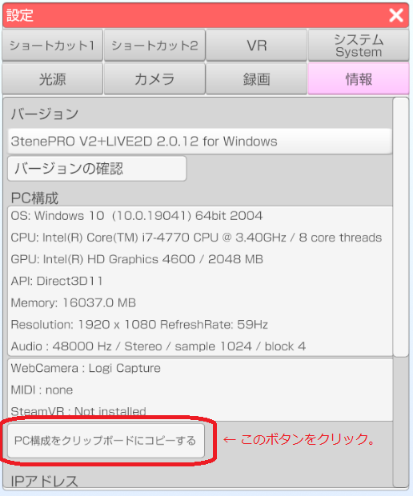
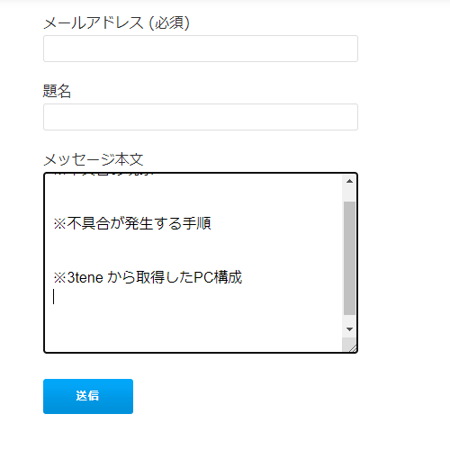

## 不具合の問い合わせ

最初に[FAQ](#faq.md)と[トラブルシューティング](#troubleshooting.md)を参照して
該当する問題が無いかを確認してください。
なお、Windows や Mac の設定等についてはお答えしていません。

### 3tene の問い合わせフォームに記入

>公式サイトの[お問い合わせフォーム](https://3tene.com/contact/)に下記の内容を記入してください。
><font color="red">PC構成の記入が無い場合、問い合わせ内容にお答えできない場合があります。</font>

>1. 不具合の現象
>2. 不具合が発生する手順
>3. 3tene から取得したPC構成

●記入例
```
※不具合の現象
アバターの読み込みでエラーが発生します。
エラーメッセージは「VRMファイルの読み込みに失敗しました」です。

※3tene から取得したPC構成
左側メニュー → アバターの選択 → 自作したVRMを指定する。

※PC構成
3tenePRO V2+LIVE2D 2.0.12 for Windows
OS: Windows 10  (10.0.19041) 64bit 2004
CPU: Intel(R) Core(TM) i7-4770 CPU @ 3.40GHz / 8 core threads
GPU: Intel(R) HD Graphics 4600 / 2048 MB
API: Direct3D11
Memory: 16037.0 MB
Resolution: 1920 x 1080 RefreshRate: 59Hz
Audio : 48000 Hz / Stereo / sample 1024 / block 4

WebCamera : Logicool HD Webcam C270
MIDI : none
SteamVR : Not installed
```

### 3tene でPC構成を取得する手順

>設定ウインドウの「情報」タブを選択します。



>ボタンを押下するとPC構成のテキストがクリップボードにコピーされます。

>テキストを書き込みたい場所で<font color="Blue">右クリックした後に「貼り付け」</font>を選ぶと
>クリップボードにコピーされたPC構成のテキストが入力されます。



