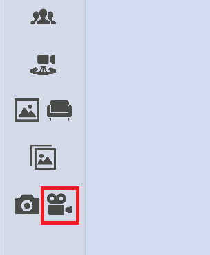
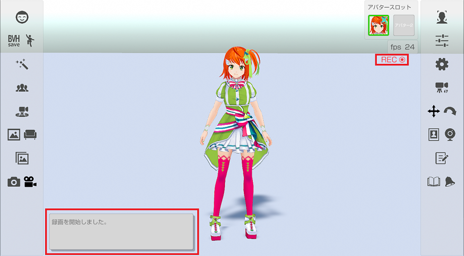
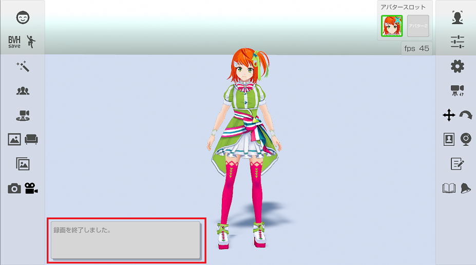

## 録画について

### 録画で動画を保存

>左側メニューのビデオのアイコンを押して録画の開始と終了を行います。

>録画を開始すると、録画開始のメッセージ表示と録画中を示すRECのアイコン表示を行います。

>録画を終了すると、録画終了のメッセージ表示をして、録画中を示すRECのアイコンは非表示になります。

>録画した動画は個人用フォルダーの「ビデオ/3tene」に保存されます。
>メニュー部分は存在しない扱いになるので動画ファイルには保存されません。
>※メニュー部分も保存したい場合はＯＳ標準機能を使ってください。

>録画の細かい設定は設定の「録画」タブから変更できます。
>[設定の「録画」タブ](#settingRecording.md)